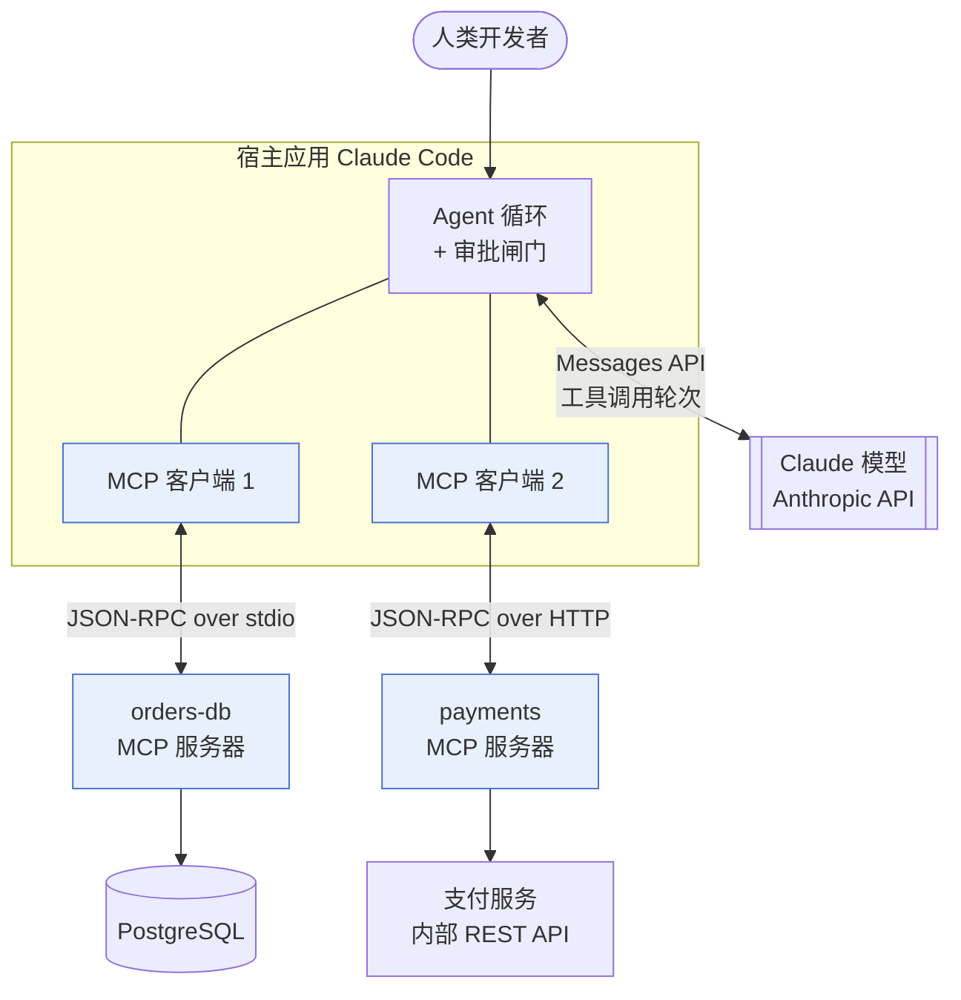

# MCP 模型上下文协议：三、定义、边界与生态位

> 🇬🇧 English version: [mcp-guide/02-what.md](https://github.com/geekchow/mcp-explain/blob/main/mcp-guide/02-what.md) ｜ 📦 GitHub: <https://github.com/geekchow/mcp-explain>

> **你在哪里：** 六个阶段中的第二阶段。你已经知道痛点了，现在给出定义。
> **读完本文你会知道：** 一句话说清 MCP 是什么、它刻意**不做**什么、以及它相对于模型 API、Agent 框架和底层服务分别站在哪个位置。

---

## 一、一句话定义

> **MCP（Model Context Protocol，模型上下文协议）是一个开放的、基于 JSON-RPC 2.0 的客户端—服务器协议。它通过让任意 AI 应用在运行时发现并使用任意外部能力，来压平 N×M 集成问题——能力以三个服务器侧原语（工具、资源、提示）和三个客户端侧原语（采样、征询、根目录）的形式呈现，跑在本地 stdio 或远程 HTTP 传输之上。**

按照重要程度逐词拆解：

- **开放协议，不是产品**——一份规范加若干 SDK（Software Development Kit，软件开发工具包）；不存在一家"MCP 公司"卖给你东西。
- **客户端—服务器**——AI 应用是客户端，每个集成是一个服务器。服务器是一个小程序，未必是网络服务。
- **JSON-RPC 2.0**——一种无聊到早已尘埃落定的消息格式：`{"jsonrpc":"2.0","id":1,"method":"tools/call","params":{…}}`。选它就是为了任何语言都能在一小时内说这门话。
- **运行时**——客户端是在连上之后才问"你能做什么？"；没有任何东西是编译进去的。
- **六个原语**——服务器提供给客户端三样（工具、资源、提示），客户端反过来提供给服务器三样（采样、征询、根目录）。正是这种对称性让 MCP 成为双向协议，而不是一个花哨的 REST（Representational State Transfer，表述性状态转移）API。
- **两种传输**——本地用 stdio，远程用 Streamable HTTP。传输层之上的一切完全相同。

如果只记一句话，记这句：**MCP 是 AI 应用的 USB-C** ——一种接口形状，任何宿主都能插上任何能力。（这个类比来自项目自己，而且和所有类比一样会漏：跟 USB-C 不同，MCP 还承载**信任**决策，这也是本系列相当一部分深度都在讲权限的原因。）

---

## 二、边界：MCP 不是什么

搞错这几条，就是绝大多数 MCP 误用的源头：

| MCP **不是** | 为什么有人这么以为 | 实际意味着什么 |
|---|---|---|
| **……Agent 框架** | 它总出现在 Agent 产品里 | MCP 没有规划循环、没有记忆、没有编排。它从不决定**调用哪个**工具——那是宿主里的模型的事。MCP 只负责让工具**可被发现、可被调用**。 |
| **……模型 API** | 它是"给 AI 用的" | 它从不跟模型说话。Claude 的 API 是宿主去调用的另一样东西。服务器可以**请求**宿主跑一次补全（采样），但 MCP 本身不携带任何模型。 |
| **……你的 REST 或 gRPC API 的替代品** | 它也暴露操作 | 它是**架在你的 API 前面的适配层**，形状是为模型消费而设计的：自然语言描述、粗粒度操作、安全标注。你的服务保留它真正的 API。 |
| **……一套认证体系** | 远程服务器需要鉴权 | MCP 把这件事**委托**出去：HTTP 传输交给 OAuth 2.1，stdio 交给操作系统的进程边界。它规定的是如何使用它们，而不是又发明一套。 |
| **……数据同步或流式管道** | 因为有 `resources/subscribe` | 资源是按需读取上下文用的，不是推数据洪流用的。批量或持续的数据属于你的数据平台；MCP 只取一次对话所需要的那一小片。 |
| **……沙箱** | 它夹在模型和系统中间 | 服务器拥有你赋予它的全部权限。隔离是**宿主**和**部署者**的职责。这是本文最重要的一行——见[授权与信任深入](https://github.com/geekchow/mcp-explain/blob/main/mcp-guide-zh/05-deep-dives/05-auth-and-trust.md)。 |
| **……给人用的 RPC** | 它确实是个 RPC 协议 | 操作的粒度应该匹配一个**任务**，而不是一行数据库记录。`query_orders(status, older_than)` 优于暴露裸 `SELECT`。 |

---

## 三、生态位

*图注：MCP 夹在什么中间——高亮的方框是 MCP；模型 API 和底层服务都不是。*

**MCP 之下：** JSON-RPC 2.0，再往下是传输层（子进程的 stdin/stdout，或者 HTTP + SSE + TLS）。服务器之下：它所包装的任何东西——数据库驱动、REST 客户端、文件系统。

**MCP 之上：** 宿主应用（Claude Code、Claude Desktop、IDE 扩展，或基于 Claude Agent SDK 构建的 Agent），再往上是决定调用什么的模型。

**邻居，一句话一个：**

| 邻居 | 关系 |
|---|---|
| **模型工具调用 / 函数调用** | 互补，在上一层。工具调用是**模型如何表达意图**；MCP 是**宿主一开始如何得到这个工具**。每个 MCP 工具最终都变成模型工具清单里的普通一项。 |
| **LSP（Language Server Protocol，语言服务器协议）** | 模板。同样的 JSON-RPC 形状、同样的"压平 N×M"动机，只是领域不同（编辑器↔语言 vs. AI 宿主↔能力）。 |
| **OpenAPI** | 有重叠但受众不同。OpenAPI 面向程序员描述 HTTP API；MCP 面向模型描述能力，并额外增加了发现、会话与审批语义，并覆盖本地进程。常见做法是**从** OpenAPI 规范生成 MCP 服务器——然后手工精简，因为"一个端点一个工具"的服务器会把模型的上下文淹掉。 |
| **Agent 间协议** | 不同的轴。MCP 把 Agent **向下**连到能力；Agent 间协议把 Agent **横向**连到同伴。两者可以组合。 |
| **Claude Code 插件 / 技能 / 子 Agent** | 宿主本地的扩展机制——它们改变的是 **Claude Code 自己**的行为。MCP 增加的是任何宿主都能用的**外部能力**。一个插件可以打包一个 MCP 服务器；它们不是竞争关系。 |

---

## 四、我该用它吗

**该用 MCP：** 某个能力需要被**不止一个** AI 宿主访问；或者拥有底层系统的团队应该拥有这个集成、按自己的节奏发布；或者你需要在模型宿主和凭据之间隔一道进程/网络边界。

**别用 MCP：** 逻辑只是某个应用内部的私有辅助函数（直接写个函数）；或者你需要高吞吐的数据搬运（用你的数据管道）；或者这个"工具"其实是某个宿主内部的提示词式工作流（Claude Code 的技能或子 Agent 更轻）。

---

## 📦 配套代码仓库

本文是一个开源指南系列的一部分。整个系列、全部图表源码，以及一个可以直接让 Claude Code 连上去的**可运行 MCP 服务器**，都在同一个仓库里：

### → https://github.com/geekchow/mcp-explain

| | |
|---|---|
| 本页源文件 | [`mcp-guide-zh/02-what.md`](https://github.com/geekchow/mcp-explain/blob/main/mcp-guide-zh/02-what.md) |
| 英文原版 | [`mcp-guide/02-what.md`](https://github.com/geekchow/mcp-explain/blob/main/mcp-guide/02-what.md) |
| 可运行示例服务器 | [`mcp-guide/examples/orders-db-server`](https://github.com/geekchow/mcp-explain/tree/main/mcp-guide/examples/orders-db-server) |
| 系列起点 | [`mcp-guide-zh/00-overview.md`](https://github.com/geekchow/mcp-explain/blob/main/mcp-guide-zh/00-overview.md) |

欢迎指正——如果某个协议细节随新版本发生了变化，欢迎提 issue。

