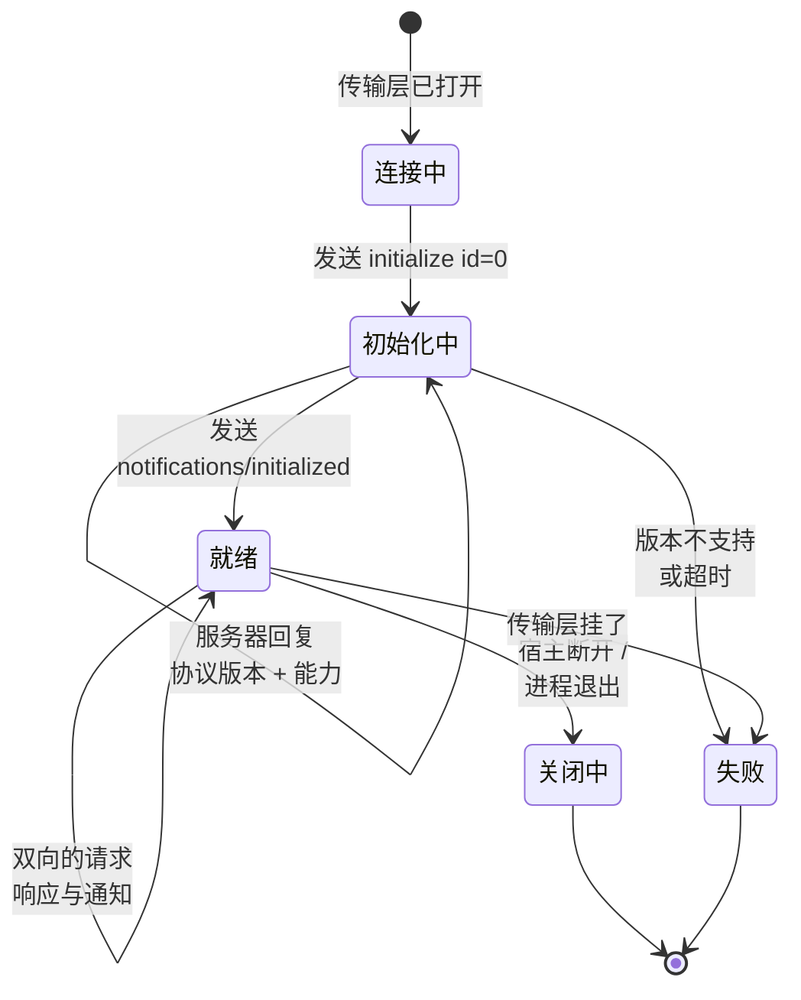
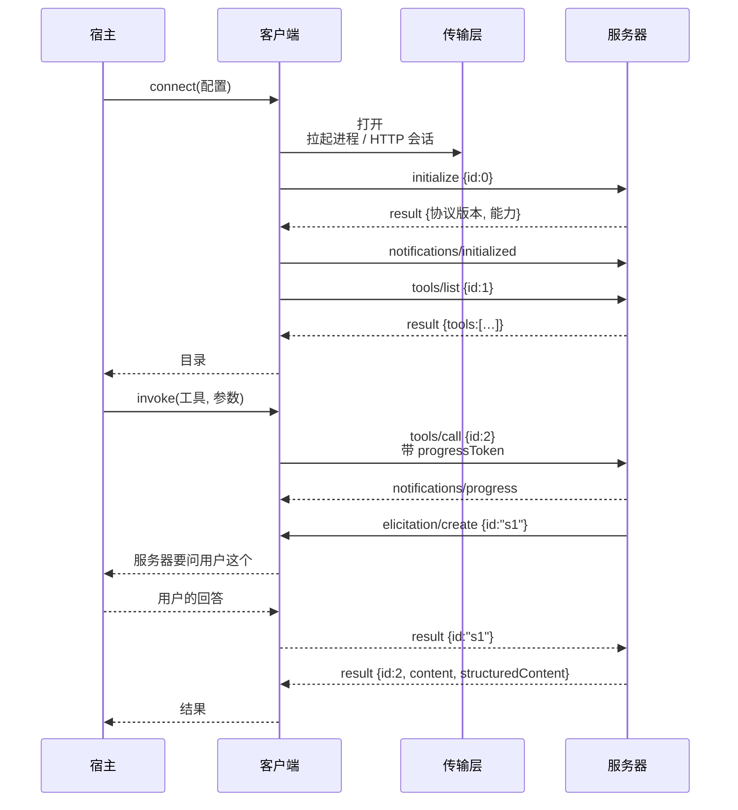

# MCP 模型上下文协议：七、深入客户端 · 握手与能力协商

> 🇬🇧 English version: [mcp-guide/05-deep-dives/02-mcp-client.md](https://github.com/geekchow/mcp-explain/blob/main/mcp-guide/05-deep-dives/02-mcp-client.md) ｜ 📦 GitHub: <https://github.com/geekchow/mcp-explain>

> **你在哪里：** 第五阶段，五篇深入中的第 2 篇。
> **读完本文你会知道：** 一个 MCP 会话的完整生命周期、能力协商到底买到了什么、请求如何关联与取消，以及客户端反过来向服务器提供了什么——并附上贯穿示例第 1 步的真实报文。

---

## 一、职责回顾

一个**客户端**掌管与一个服务器的恰好一个会话：握手、协商出的特性集、请求/响应关联、通知、取消与超时——并在服务器请求时提供三个客户端侧原语（根目录、采样、征询）。

在[贯穿示例](https://github.com/geekchow/mcp-explain/blob/main/mcp-guide-zh/04-running-example.md)中，客户端 A 出现在第 0、1、2、4、5 步；客户端 B 出现在第 0、1、2、6、7 步。它们从不互相通信，彼此也不知道对方存在。这条 1:1 规则不是为了整洁——它就是隔离边界：一个被攻陷的服务器只能看到属于它自己的那个会话。

---

## 二、内部设计

### 2.1 消息词汇表：整个 JSON-RPC 2.0 就这一张表

| 类型 | 形状 | 含义 |
|---|---|---|
| **请求 Request** | 有 `id`、`method`，可选 `params` | 期待恰好一个同 `id` 的响应 |
| **响应 Response** | 有 `id`，以及 `result` 或 `error` 之一 | 答案 |
| **通知 Notification** | 有 `method`，**没有 `id`** | 发完不管；不得回复 |

违反了就会出真 bug 的规则：`id` 在一个会话内必须唯一且**绝不复用**，`null` 不是合法的 `id`，每个请求最终都必须得到一个响应——失败时也一样。从 `2025-06-18` 修订版起，JSON-RPC 的**批量（batching）**被移除了：一帧一条消息。

**两个方向都跑这三种消息。** 这正是 MCP 能做采样和征询的全部原因，也是它与 REST API 最大的结构性差异。

### 2.2 生命周期



*图注：MCP 会话的四个状态——进入"就绪"之前，除了 `initialize` 和 `ping` 什么都不许过。*

**第一步，`initialize`。** 客户端提出它支持的最新协议版本，并声明自己的能力：

```json
{
  "jsonrpc": "2.0", "id": 0, "method": "initialize",
  "params": {
    "protocolVersion": "2025-06-18",
    "clientInfo": { "name": "claude-code", "version": "…" },
    "capabilities": {
      "roots": { "listChanged": true },
      "sampling": {},
      "elicitation": {}
    }
  }
}
```

服务器回复**它将采用**的版本——要么就是这个，要么是它支持的最新版本（如果那个更旧）。如果客户端无法接受这个答案，它就断开；不存在"部分兼容"模式。（在 HTTP 上，协商出的版本之后会通过 `MCP-Protocol-Version` 请求头在每个请求上回带——见[深入 03](https://github.com/geekchow/mcp-explain/blob/main/mcp-guide-zh/05-deep-dives/03-transport.md)。）

```json
{
  "jsonrpc": "2.0", "id": 0,
  "result": {
    "protocolVersion": "2025-06-18",
    "serverInfo": { "name": "orders-db", "version": "1.4.0" },
    "capabilities": {
      "tools":     { "listChanged": true },
      "resources": { "subscribe": false, "listChanged": false },
      "prompts":   { "listChanged": false },
      "logging":   {}
    },
    "instructions": "对商城订单数据库的只读访问……"
  }
}
```

**第二步，`notifications/initialized`。** 这是通知，所以没有回复。只有发出它之后，客户端才可以发普通请求。

**为什么要协商？** 因为这两个程序是各自独立演进版本的。能力协商把"这个服务器支持资源订阅吗？"从一个运行时猜测（调调看会不会炸）变成了在第一次真正调用之前就已知的事实。另外注意 result 里的 `instructions`：这是服务器希望被放进模型上下文的自由格式说明——服务器唯一一次教模型如何用好自己的机会。

### 2.3 发现，以及保持新鲜

```
tools/list · resources/list · resources/templates/list · prompts/list
```

每个都接受可选的 `cursor` 并可能返回 `nextCursor`；大目录会分页。如果服务器声明了 `listChanged: true`，它之后可以发 `notifications/tools/list_changed`，客户端随即重新拉取——这就是一个底层系统发生变化的服务器（新建了一个数据库视图、翻了一个特性开关）如何在**不重启**的情况下更新一个活着的会话。

### 2.4 关联、进度、取消与超时

客户端维护一张按 `id` 索引的在途请求表，每条带一个截止时间和一个可选的进度令牌。

- **进度。** 在请求上带 `_meta.progressToken`，服务器就可以在干活期间流式发送 `notifications/progress`，携带 `progress`/`total`/`message`。行为良好的客户端会在每条进度通知到达时**重置该请求的超时**——这正是进度机制的意义所在。
- **取消。** 客户端发 `notifications/cancelled`，带上 `requestId` 和原因。它是建议性的：服务器应当停止且不得再发迟到的响应，但取消与完成撞车是正常现象，两侧都不许因此崩溃。
- **超时。** 每个请求都有超时，并且有一个不论进度如何都生效的硬上限，否则一个话痨服务器可以让一个请求永远活着。
- **`ping`。** 任何一侧都可以发；用于长时间空闲会话的存活检测。

### 2.5 三个客户端侧原语

这是客户端**提供**出去的东西，也是 MCP 中最多人没读过的那一半：

| 原语 | 方向 | 方法 | 用途 | 为什么它长在客户端 |
|---|---|---|---|---|
| **根目录 Roots** | 服务器问客户端 | `roots/list` | "用户正在哪些目录/URI 下工作？" | 服务器应该能在用户真实的工作区上操作，而不需要宿主把路径硬编码进配置 |
| **采样 Sampling** | 服务器问客户端 | `sampling/createMessage` | "帮我跑一次补全" | 让服务器能用模型，却**不必持有模型 API 密钥、也不必选择模型**——这两件事都由宿主做，宿主还能对请求设闸门 |
| **征询 Elicitation** | 服务器问客户端 | `elicitation/create` | "替我问用户这个结构化问题"（带 JSON Schema；答案是接受/拒绝/取消） | 让服务器能在操作中途拿到缺失输入，而不必自己发明一套界面。`2025-06-18` 引入 |

三者都受**能力门控**：只有客户端在 initialize 时声明支持，服务器才可以发。三者也都由宿主中介：客户端把它们交给宿主，由宿主决定是否给人看任何东西。服务器可以**请求**；它永远无法**强迫**。

> 一条会带到[深入 05](https://github.com/geekchow/mcp-explain/blob/main/mcp-guide-zh/05-deep-dives/05-auth-and-trust.md)的安全提示：采样和征询正是恶意服务器伸向你的模型和你的用户的那两条通道。宿主应当把服务器请求了什么显示出来，并且**永不自动批准**采样请求。

---

## 三、交互契约



*图注：一次完整的请求/响应对，内部还嵌着一个服务器发起的请求——这个形状是文字讲不清的。*

注意 `id:2` 和 `id:"s1"` 在时间上是重叠的。请求在两个方向上都是异步、交错的；任何假设严格请求/响应顺序的客户端，都会在服务器第一次征询时死锁。

---

## 四、⚓ 回到示例

**第 1 步，客户端 A。** 进程被拉起，它 stdin 上的第一批字节就是上面那个 `initialize` 帧。把 [examples/](https://github.com/geekchow/mcp-explain/blob/main/mcp-guide/examples) 里那个真实服务器跑起来，它回复的能力集恰好是：

```json
{"resources":{"listChanged":true},"tools":{"listChanged":true},"prompts":{"listChanged":true}}
```

三个原语都声明了，每个都带 `listChanged`——并且注意**缺了什么**：没有 `resources.subscribe`，这正是我们的示例中从不订阅表结构变化的原因，而且客户端在发出任何一次调用**之前**就知道了这一点，不必靠一次失败去发现。

**第 1 步，客户端 B。** 同样的报文，不一样的旅程：第一个 POST 在 `initialize` 还没被处理之前就返回了 `401 Unauthorized`。客户端不会盲目重试——它把事情交给授权层，拿到令牌，然后在一个全新的 HTTP 会话上重放 `initialize`（[深入 05](https://github.com/geekchow/mcp-explain/blob/main/mcp-guide-zh/05-deep-dives/05-auth-and-trust.md)）。

**第 2 步。** 客户端 A 以 id 1、2、3 发出 `tools/list`、`resources/list`、`prompts/list`，彼此不等待。三个响应按服务器完成的先后任意顺序回来；正是 `id` 字段让这件事是安全的。

**第 6 步。** `get_charge_status` 很慢（网关是第三方）。客户端 B 在调用时带了 `_meta.progressToken: "pg-7"`，于是 `payments` 发来：

```json
{"jsonrpc":"2.0","method":"notifications/progress",
 "params":{"progressToken":"pg-7","progress":1,"total":3,
           "message":"queried gateway for ord_88f21"}}
```

Claude Code 把它显示为运行中工具下方的实时状态，客户端 B 每收到一条就把超时往后推。

**第 7 步。** 在 `tools/call`（`id:2`）进行的中途，`payments` 发出**它自己的请求** `elicitation/create`，`id:"s1"`。客户端 B 之所以被允许接收它，仅仅因为它在第 1 步的 initialize 里声明了 `elicitation`——六分钟前那次能力握手，正是第 7 步得以合法发生的原因。它把请求路由给宿主，宿主询问 Ana，然后返回 `{"action":"accept","content":{"confirm_amount":"49.99"}}`。这之后，`id:2` 的响应才到达。

---

## 五、失败行为

| 失败 | 客户端行为 |
|---|---|
| 服务器提出的协议版本不受支持 | 立即断开并上报宿主。不要试图猜测兼容性 |
| 响应始终不到 | 超时触发 → 发 `notifications/cancelled` → 向上抛错。宿主把它变成给模型的工具错误结果 |
| JSON 畸形 / 未知方法 | 回一个 JSON-RPC 错误（`-32700` 解析错误、`-32601` 方法不存在）。绝不因为一个坏帧就掀翻整个会话 |
| 取消之后迟到的响应 | 静默丢弃；那个 id 已经不在表里了 |
| 客户端没声明 elicitation，服务器却发了 | 回错误——能力违规是协议错误，不是可以商量的事 |
| 传输层挂掉 | 让所有在途请求以错误结束，标记会话死亡，通知宿主。重连是一个**新会话**加一次**新握手**——MCP 会话不能跨越一个已死的传输恢复（HTTP 传输可以在活着的会话内恢复一条断掉的**流**，那是另一回事，见[深入 03](https://github.com/geekchow/mcp-explain/blob/main/mcp-guide-zh/05-deep-dives/03-transport.md)） |

---

## 📦 配套代码仓库

本文是一个开源指南系列的一部分。整个系列、全部图表源码，以及一个可以直接让 Claude Code 连上去的**可运行 MCP 服务器**，都在同一个仓库里：

### → https://github.com/geekchow/mcp-explain

| | |
|---|---|
| 本页源文件 | [`mcp-guide-zh/05-deep-dives/02-mcp-client.md`](https://github.com/geekchow/mcp-explain/blob/main/mcp-guide-zh/05-deep-dives/02-mcp-client.md) |
| 英文原版 | [`mcp-guide/05-deep-dives/02-mcp-client.md`](https://github.com/geekchow/mcp-explain/blob/main/mcp-guide/05-deep-dives/02-mcp-client.md) |
| 可运行示例服务器 | [`mcp-guide/examples/orders-db-server`](https://github.com/geekchow/mcp-explain/tree/main/mcp-guide/examples/orders-db-server) |
| 系列起点 | [`mcp-guide-zh/00-overview.md`](https://github.com/geekchow/mcp-explain/blob/main/mcp-guide-zh/00-overview.md) |

欢迎指正——如果某个协议细节随新版本发生了变化，欢迎提 issue。


