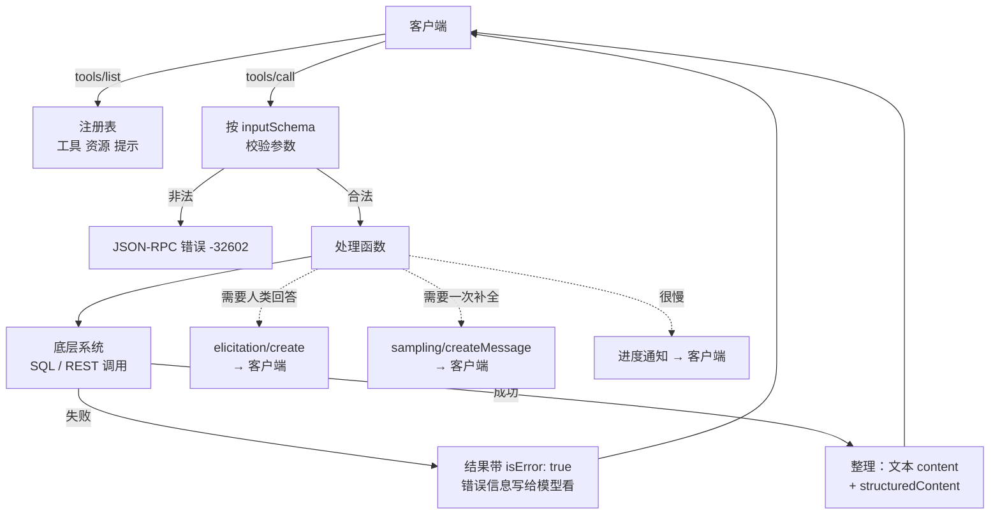

# MCP 模型上下文协议：九、深入服务器 · 工具、资源与提示

> 🇬🇧 English version: [mcp-guide/05-deep-dives/04-mcp-server.md](https://github.com/geekchow/mcp-explain/blob/main/mcp-guide/05-deep-dives/04-mcp-server.md) ｜ 📦 GitHub: <https://github.com/geekchow/mcp-explain>

> **你在哪里：** 第五阶段，五篇深入中的第 4 篇——也是最长的一篇，因为这是你最常需要亲手写的组件。
> **读完本文你会知道：** 三个服务器原语如何声明与响应、什么样的工具能让模型用得好而不是用错，以及贯穿示例第 4–7 步背后的真实代码。

---

## 一、职责回顾

**服务器**掌管一个领域的能力：声明自己的工具、资源和提示；校验输入；对真实系统执行；把结果整理成模型读得懂的形状。它不决定**这个人**是否被允许做某事（它只标注，闸门在宿主），它不持有模型（它通过采样请求），它也不画界面（它通过征询请求）。

在[贯穿示例](https://github.com/geekchow/mcp-explain/blob/main/mcp-guide-zh/04-running-example.md)中，`orders-db` 登场于第 4、5 步；`payments` 登场于第 6、7 步。

---

## 二、内部设计

### 2.1 三个原语，以及各自**为谁而设**

这是最多人忽略的设计轴，而它直接来自规范自己的表述：

| 原语 | 由谁控制 | 含义 |
|---|---|---|
| **工具 Tools** | **模型** | 模型决定何时调用。给它准确的描述和安全标注。 |
| **资源 Resources** | **应用/用户** | 由宿主或人类决定挂载什么（`@orders-db:schema://orders/tables`）。被动上下文，不是动作。 |
| **提示 Prompts** | **用户** | 由人类显式触发（`/mcp__orders-db__triage-stuck-orders`）。服务器作者撰写的专业知识，是"提供"而不是"注入"。 |

一个把所有东西都做成工具的服务器，等于扔掉了协议的三分之二——而且通常还顺手把模型的上下文淹了。

### 2.2 工具

一个工具声明由四部分组成：名字、给模型看的文字、输入模式，以及（可选的）输出模式加标注。

```jsonc
{
  "name": "query_orders",
  "title": "Query orders",                    // 给人看的标签
  "description": "按状态和账龄查找订单。最多返回 `limit` 行，最新在前。要问某个状态下有多少/哪些订单时用这个；已经知道某个订单 id 时用 get_order。",
  "inputSchema": {                            // JSON Schema —— 模型必须满足它
    "type": "object",
    "properties": {
      "status": { "type": "string", "enum": ["PENDING_PAYMENT","PAID","SHIPPED","CANCELLED","REFUNDED"] },
      "older_than_hours": { "type": "number", "minimum": 0 },
      "limit": { "type": "number", "minimum": 1, "maximum": 200, "default": 50 }
    },
    "required": ["status"]
  },
  "outputSchema": { /* structuredContent 的形状 —— 2025-06-18 起 */ },
  "annotations": {
    "readOnlyHint": true,        // 不修改它的环境
    "destructiveHint": false,    // （只有 readOnlyHint 为 false 时才有意义）
    "idempotentHint": true,      // 同参数重复调用 = 同样的效果
    "openWorldHint": false       // 只碰封闭系统，不碰开放互联网
  }
}
```

**标注是提示，不是强制。** 它们来自服务器，没有任何东西去验证；宿主会展示它们，也可以据此设定策略，但**绝不能**把 `readOnlyHint: true` 当成证据。它们诚实的用途，是让一个**诚实的**服务器把危险性传达出来。

`tools/call` 的结果携带模型要读的内容，以及可选的结构化数据：

```jsonc
{
  "content": [                        // 模型看到的；块可以是 text、image、audio 或 resource_link
    { "type": "text", "text": "7 orders in PENDING_PAYMENT older than 24h:\n ord_88f21  49.99 EUR  31h  …" }
  ],
  "structuredContent": { "count": 7, "orders": [ /* … */ ] },   // 机器可读，按 outputSchema 校验
  "isError": false
}
```

**两种失败，区别很要紧。**

| | 协议错误（JSON-RPC `error`） | 工具错误（`isError: true`） |
|---|---|---|
| 含义 | 协议层面这次调用压根没发生：方法未知、工具不存在、服务器坏了 | 工具没能完成它的工作：参数不对、订单不存在、网关超时、下游拒绝授权 |
| 谁来处理 | 客户端 / 宿主 | **模型**——它作为工具结果返回 |
| 设计规则 | 只留给协议级故障 | 凡是模型有可能自行恢复的，都用它，并且**把错误信息写给模型看**：`"没有订单 'ord_9x'。订单 id 形如 'ord_' 加 5 位十六进制字符。可以用 query_orders 列出候选。"` |

值得知道这条线在实践中落在哪里：**模式校验失败落在右边那一列。** 用示例服务器实测，传 `status: "pending"` 回来的不是 JSON-RPC 错误，而是一个工具结果：

```json
{"jsonrpc":"2.0","id":8,"result":{
  "content":[{"type":"text","text":"MCP error -32602: Input validation error: Invalid arguments for tool query_orders: Invalid enum value. Expected 'PENDING_PAYMENT' | 'PAID' | 'SHIPPED' | 'CANCELLED' | 'REFUNDED', received 'pending' at status"}],
  "isError":true}}
```

这是 SDK 的刻意选择：协议错误会送到**客户端**并中止这次调用，而这个结果送到的是**模型**——模型读到允许的取值，下一轮就自己改对了。在你自己的处理函数里也请保持这个直觉：**模型看得见的错误，才是模型能修的错误。**

### 2.3 资源

以 URI 寻址的只读内容，用 `resources/list` 列举、`resources/read` 读取：

```jsonc
{ "uri": "schema://orders/tables", "name": "orders-schema",
  "title": "Orders database schema", "mimeType": "text/plain" }
```

还需要知道的几点：**模板**（`resources/templates/list`）公布形如 `orders://order/{order_id}` 的带参 URI，客户端据此拼出地址；**订阅**（`resources/subscribe` + `notifications/resources/updated`）让客户端能监听会变的内容，前提是服务器声明了 `subscribe: true`；内容可以是文本，也可以是 base64 的 `blob`。另外，工具结果可以返回一个 `resource_link` 块，而不是把大块负载内联进来——"东西在这儿"，而不是往对话里塞 200 KB。

经验法则：**模型需要它来做判断，就是工具结果；由人类或宿主选择挂载，就是资源。** 表结构、风格指南、看板、日志文件是资源。任何有副作用的东西永远不是。

### 2.4 提示

服务器提供的具名带参模板；`prompts/get` 返回真正的对话消息，其中可以嵌入资源：

```jsonc
{ "name": "triage-stuck-orders",
  "description": "支付滞留订单的标准排查流程",
  "arguments": [ { "name": "hours", "description": "账龄阈值", "required": false } ] }
```

这就是领域专业知识随集成一起发布的地方：支付团队知道正确的排查顺序（先查网关**再**退款、已结算的扣款绝不退），于是把它编码一次，而不是指望每个用户的措辞都能碰对。

### 2.5 反过来请求客户端帮忙

在一个请求处理函数内部，服务器可以反向发出自己的请求——**前提是**客户端在 initialize 时声明了对应能力：

- `elicitation/create` —— 一个带 JSON Schema 的问题，问人类。答案是 `accept`（带内容）、`decline` 或 `cancel`，服务器必须处理全部三种。只支持基本类型字段的扁平对象；它是一个表单字段，不是任意界面。
- `sampling/createMessage` —— 借用宿主的模型。让服务器可以做"用用户自己的模型来总结这段日志"，而无需自带 API 密钥、也无需选择模型。
- `roots/list` —— 得知用户的工作目录。

### 2.6 决定模型能否用好的服务器设计规则

1. **按任务切粒度，不要按端点切。** `query_orders(status, older_than_hours)` 优于 `list_orders` + `filter_by_status` + `sort_by_date`。每多一个工具，都要在每一轮消耗上下文，并多出一种出错的方式。
2. **每个服务器的工具数控制在 20 个以内**，领域该拆成多个服务器就拆，不要把一个养肥。
3. **描述就是 API。** 模型手里只有那段文字和那个模式。说清它做什么、什么时候该用它**而不是**隔壁那个、以及它返回什么。
4. **给输出定预算。** 分页、限制 `limit`、截断时留标记。否则 Claude Code 会在 `MAX_MCP_OUTPUT_TOKENS` 处替你截。
5. **把过滤下推到服务器。** 返回 5000 行让模型自己筛，那是 bug，不是灵活性。
6. **在最底层做最小权限。** `orders-db` 用**只读**数据库角色连接。哪怕模型、或者一次提示注入，要求执行 `DELETE`，**数据库**也会拒绝。标注是建议性的，授权不是。
7. **该幂等的地方一定要幂等。** 网络会重试。`create_refund` 接受幂等键，这样重试的退款不会变成第二次退款。

---

## 三、交互契约



*图注：一次 `tools/call` 的内部，包括处理函数反向够回客户端的三种方式。*

---

## 四、⚓ 回到示例

下面是第 4、5 步背后 `orders-db` 的真实代码，使用 TypeScript SDK（带种子数据的可运行版本在 [examples/orders-db-server](https://github.com/geekchow/mcp-explain/blob/main/mcp-guide/examples/orders-db-server)）：

```js
const server = new McpServer({ name: "orders-db", version: "1.4.0" });

// ── 第 4 步：模型在查询前先读的那个资源 ──────────────────────────
server.registerResource(
  "orders-schema",
  "schema://orders/tables",
  { title: "Orders database schema", mimeType: "text/plain" },
  async (uri) => ({ contents: [{ uri: uri.href, text: SCHEMA_DDL }] })
);

// ── 第 5 步：模型调用的那个工具 ──────────────────────────────────
server.registerTool(
  "query_orders",
  {
    title: "Query orders",
    description:
      "按状态和账龄查找订单。最多返回 `limit` 行，最旧在前。" +
      "要问哪些/多少订单处于某状态时用它；已知订单 id 时用 get_order。",
    inputSchema: {
      status: z.enum(["PENDING_PAYMENT", "PAID", "SHIPPED", "CANCELLED", "REFUNDED"]),
      older_than_hours: z.number().min(0).optional(),
      limit: z.number().min(1).max(200).default(50),
    },
    outputSchema: {
      count: z.number(),
      orders: z.array(z.object({
        order_id: z.string(), status: z.string(), amount_cents: z.number(),
        currency: z.string(), created_at: z.string(), age_hours: z.number(),
      })),
    },
    annotations: { readOnlyHint: true, idempotentHint: true, openWorldHint: false },
  },
  async ({ status, older_than_hours = 0, limit }) => {
    const rows = await db.query(                       // 参数化 —— 绝不字符串拼接
      `SELECT order_id, status, amount_cents, currency, created_at
         FROM orders
        WHERE status = $1
          AND created_at < now() - ($2 || ' hours')::interval
        ORDER BY created_at ASC
        LIMIT $3`,
      [status, older_than_hours, limit]
    );
    const orders = rows.map(toOrder);
    return {
      content: [{ type: "text", text: renderTable(orders, status, older_than_hours) }],
      structuredContent: { count: orders.length, orders },
    };
  }
);
```

**第 4 步的全深度。** 客户端 A 发出 `{"method":"resources/read","params":{"uri":"schema://orders/tables"}}`。处理函数把建表语句作为文本返回。它作为上下文进入对话——**不弹审批**，因为读不是动作。模型现在知道字段叫 `created_at` 而不是 `placed_at`，也知道 `status` 是个枚举；这两个事实都避免了第 5 步的一次失败调用。

**第 5 步的全深度。** 参数 `{"status":"PENDING_PAYMENT","older_than_hours":24}` 在处理函数运行**之前**先按输入模式校验——如果模型传的是 `"status":"pending"`，它会拿到 §2.2 里那个 `isError` 结果，里面列着五个合法取值，于是下一轮就自己改对，而一行数据都不会被读取。处理函数在**只读**连接上执行一条参数化查询，返回渲染好的表格（供模型推理）和 `structuredContent`（供下游需要类型化数据的地方使用）。

**第 6–7 步，`payments` 那一侧。** `create_refund` 是 `query_orders` 的镜像：

```jsonc
{
  "name": "create_refund",
  "description": "对一笔扣款退款。仅用于网关报告为「已授权但未扣款」或「误扣款」的情形。",
  "inputSchema": { "type": "object",
    "properties": {
      "order_id": {"type":"string"},
      "amount_cents": {"type":"integer","minimum":1},
      "reason": {"type":"string"},
      "idempotency_key": {"type":"string"}
    },
    "required": ["order_id","amount_cents","reason"] },
  "annotations": { "readOnlyHint": false, "destructiveHint": true, "idempotentHint": true, "openWorldHint": true }
}
```

而它的处理函数做的，正是整个系列一路铺垫过来的那件事——**服务器不肯只凭模型的一面之词行动**：

```js
async ({ order_id, amount_cents, reason, idempotency_key }) => {
  const charge = await gateway.getCharge(order_id);
  if (charge.state === "captured_and_settled") {
    return { isError: true, content: [{ type: "text", text:
      `拒绝执行：${order_id} 的扣款已结算。已结算的扣款要走财务冲正流程，` +
      `不能用 create_refund。未做任何操作。` }] };
  }

  // 服务端确认 —— 与宿主是否已经问过无关
  const answer = await server.server.elicitInput({
    message: `确认为 ${order_id} 退款 ${(amount_cents/100).toFixed(2)} ${charge.currency}？`,
    requestedSchema: { type: "object",
      properties: { confirm_amount: { type: "string", description: "输入金额以确认" } },
      required: ["confirm_amount"] },
  });

  if (answer.action !== "accept" ||
      answer.content.confirm_amount !== (amount_cents/100).toFixed(2)) {
    return { content: [{ type: "text", text: "用户取消了退款；没有发生任何扣回。" }] };
  }

  const refund = await gateway.refund({ order_id, amount_cents, reason,
                                        idempotency_key: idempotency_key ?? `${order_id}:${amount_cents}` });
  return {
    content: [{ type: "text", text: `已退款 ${(amount_cents/100).toFixed(2)} ${charge.currency} → ${refund.id}` }],
    structuredContent: { refund_id: refund.id, order_id, amount_cents, state: refund.state },
  };
}
```

注意同一次调用上那两道彼此独立的闸门：宿主的审批弹窗（[深入 01](https://github.com/geekchow/mcp-explain/blob/main/mcp-guide-zh/05-deep-dives/01-host-claude-code.md) 第四节）保护的是 **Ana 不被模型坑**，而这次征询保护的是**支付系统不被任何人坑**——包括一个被配置成自动批准的宿主。纵深防御之所以在这里成立，是因为这两道闸门属于**不同的责任方**。

---

## 五、失败行为

| 失败 | 服务器行为 |
|---|---|
| 参数非法 | SDK 在处理函数运行之前就拒绝，并返回携带 `-32602` 校验信息的 `isError` 结果，于是**模型**看到约束并改对重试 |
| 底层系统宕机 | `isError: true`，配一条模型能据此行动的信息（"网关不可达，一分钟后重试；未发起退款"）——绝不要甩裸堆栈，那会把内部实现泄进对话 |
| 处理函数抛异常 | SDK 转成错误结果；会话存活。一个因单次坏调用就崩掉的服务器会把整个会话一起带走 |
| 客户端拒绝了征询 | 当作"否"：干净地中止操作，并在结果里说明。收到 `decline` 或 `cancel` 绝不能继续 |
| 客户端根本没声明征询 | 降级：改为要求在工具入参里带上确认字段。服务器必须能在一个最小客户端上工作 |
| 结果太大 | 分页或截断并留下明确标记，让模型知道后面还有，而不是在残缺集合上默默推理 |
| 会话中途结束 | 什么都不会回滚——MCP 没有事务。幂等键和服务端记录才是恢复机制 |

---

## 📦 配套代码仓库

本文是一个开源指南系列的一部分。整个系列、全部图表源码，以及一个可以直接让 Claude Code 连上去的**可运行 MCP 服务器**，都在同一个仓库里：

### → https://github.com/geekchow/mcp-explain

| | |
|---|---|
| 本页源文件 | [`mcp-guide-zh/05-deep-dives/04-mcp-server.md`](https://github.com/geekchow/mcp-explain/blob/main/mcp-guide-zh/05-deep-dives/04-mcp-server.md) |
| 英文原版 | [`mcp-guide/05-deep-dives/04-mcp-server.md`](https://github.com/geekchow/mcp-explain/blob/main/mcp-guide/05-deep-dives/04-mcp-server.md) |
| 可运行示例服务器 | [`mcp-guide/examples/orders-db-server`](https://github.com/geekchow/mcp-explain/tree/main/mcp-guide/examples/orders-db-server) |
| 系列起点 | [`mcp-guide-zh/00-overview.md`](https://github.com/geekchow/mcp-explain/blob/main/mcp-guide-zh/00-overview.md) |

欢迎指正——如果某个协议细节随新版本发生了变化，欢迎提 issue。


