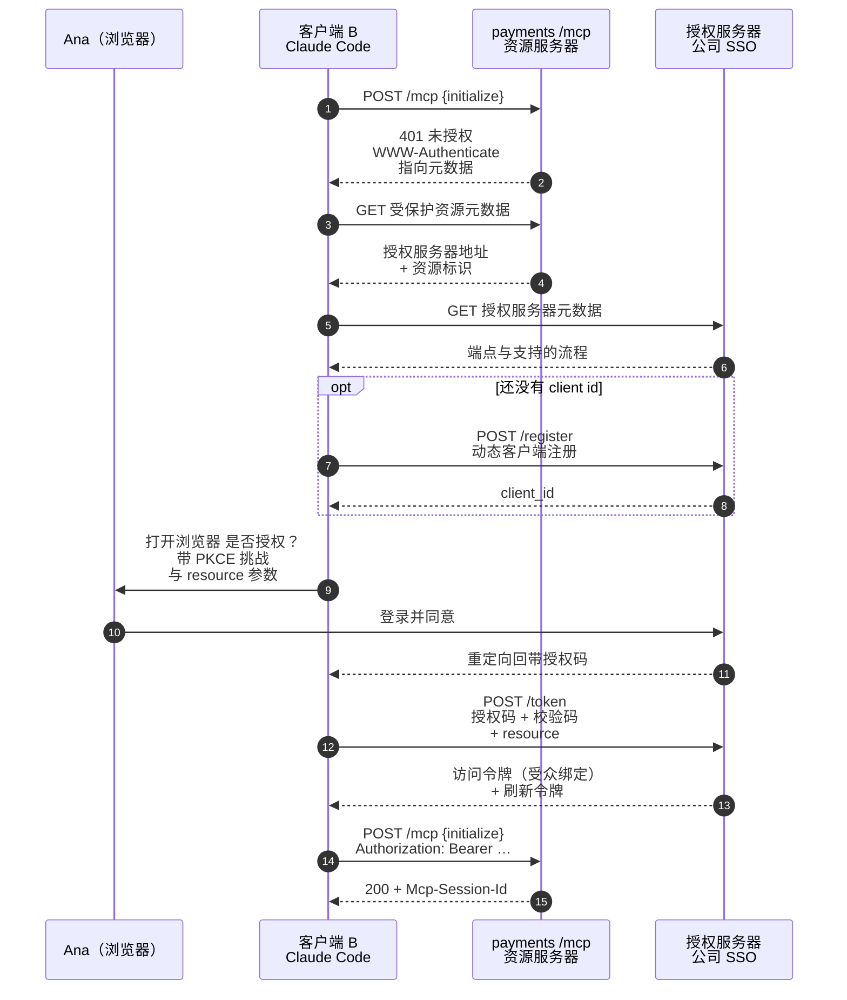

# MCP 模型上下文协议：十、授权与信任边界 · OAuth 2.1

> 🇬🇧 English version: [mcp-guide/05-deep-dives/05-auth-and-trust.md](https://github.com/geekchow/mcp-explain/blob/main/mcp-guide/05-deep-dives/05-auth-and-trust.md) ｜ 📦 GitHub: <https://github.com/geekchow/mcp-explain>

> **你在哪里：** 第五阶段，五篇深入中的第 5 篇——描述起来最短，搞砸起来后果最严重的一篇。
> **读完本文你会知道：** 远程服务器如何用 OAuth 2.1 认证用户、本地服务器为什么完全没有鉴权以及靠什么保护，以及 MCP 部署真正会遭遇的攻击类型——锚定在贯穿示例的第 1 步。

---

## 一、职责回顾

**授权层**掌管证明**是谁**在调用远程服务器：发现授权服务器、带 PKCE（Proof Key for Code Exchange，授权码交换证明密钥）的授权码流程、令牌签发与刷新，以及最常被跳过的那一步——把令牌绑定到它被签发给的那个具体服务器。

对 **stdio** 服务器，它根本不存在。这是刻意的设计决定，不是遗漏：一个本地子进程以你的身份运行，用你的环境。安全边界是操作系统的，于是关键问题从*"这个请求认证过吗？"*变成了*"我一开始就该不该装这个服务器？"*

在[贯穿示例](https://github.com/geekchow/mcp-explain/blob/main/mcp-guide-zh/04-running-example.md)中，正是这一层让第 1 步停下来打开了浏览器。

---

## 二、内部设计

### 2.1 远程流程

MCP 不发明认证。它规定：HTTP 上的 MCP 服务器是一个 **OAuth 2.0 资源服务器（Resource Server）**，MCP 客户端是一个 **OAuth 客户端**，身份来自资源服务器所指向的一个独立的**授权服务器**。从 `2025-06-18` 修订版起，这套管线是被规定好的，而不是各自即兴发挥：



*图注：一个 Claude Code 会话如何拿到一个只对一个 MCP 服务器有效的令牌——"浏览器弹出来了"背后的流程。*

五个承重细节：

1. **`401` 是发现的触发器。** 客户端不需要预先配置；`WWW-Authenticate` 头指向元数据（RFC 9728，受保护资源元数据），元数据里写着授权服务器是谁。
2. **PKCE 是强制的。** OAuth 2.1 移除了隐式流和密码流，并要求授权码流程必须用 PKCE。被偷走的授权码，没有校验码就是废纸。
3. **动态客户端注册**（RFC 7591）让一个任意客户端——支付团队从没听说过的某台笔记本上的 `claude` 命令行——无需人工提工单就能拿到 `client_id`。它是可选的，但对采用度是决定性的。
4. **资源标识（Resource Indicators，RFC 8707）** 把令牌的受众绑定到**这一个** MCP 服务器。这是**混淆代理（confused deputy）**问题的解法：没有它，为某个服务器签发的令牌可以被拿去重放到另一个信任同一签发方的服务器上。
5. **禁止令牌透传。** MCP 服务器**不得**接受不是签发给它的令牌，也**不得**把用户的令牌当作自己的转发给下游服务。它先校验受众，然后用**自己的**凭据访问下游。仅这一条规则就挡掉了一整类权限提升链。

### 2.2 stdio 服务器靠什么保护

| 控制手段 | 作用 |
|---|---|
| **进程边界** | 服务器只能看到宿主给它的环境、参数和工作目录。传一个权限狭窄的只读 `ORDERS_DATABASE_URL`，永远不要传你的管理员凭据 |
| **最小权限授权** | `orders-db` 以只读 PostgreSQL 角色连接。没有任何标注、弹窗或模型行为，能把这条连接变成一次 `DELETE` |
| **安装时的信任** | 项目作用域的 `.mcp.json` 随 `git pull` 到达，并且可以执行任何东西。Claude Code 在信任某个项目的服务器之前先问你，这是一道**供应链**控制：批准前请审阅那行命令，尤其是 `npx some-package@latest`，那在设计上就是远程代码执行 |
| **`deny` 名单** | 在宿主侧，绝对生效，正是那些"绝不能无人值守运行"的工具该待的地方 |

### 2.3 值得点名的攻击类型

协议只是你威胁模型的一部分。下面这些是实践中真会出现的：

| 攻击 | 形态 | 缓解 |
|---|---|---|
| **经由工具结果的提示注入** | 服务器返回的内容（一行数据库记录、一个网页、一个 issue 标题）里含有指令，模型把它当成了命令 | 把每一个工具结果都当作**不可信数据，而非指令**。对破坏性工具保留人工闸门。绝不要自动批准一条"先读外部内容再写入"的调用链 |
| **拔地毯（rug pull）** | 服务器通过了审核，在被信任之后改掉工具描述或行为 | 固定服务器版本；变更时重新审核；凡是涉及特权的场景，优先用你自己或你组织构建的服务器 |
| **工具遮蔽 / 命名冲突** | 两个服务器提供名字相近的工具，模型挑错了 | `mcp__server__tool` 命名空间让来源变得显式——在审批弹窗里请读**服务器名**，而不只是工具名 |
| **混淆代理** | 给服务器 A 的令牌被重放到服务器 B | 受众绑定令牌（RFC 8707），每个请求都校验受众 |
| **爆炸半径过大** | 一个服务器持有所有系统的凭据 | 一个领域一个服务器、最小授权、令牌分离 |
| **采样 / 征询滥用** | 服务器征询一个看起来像系统提示词的东西，或用采样把上下文偷运出去 | 宿主中介两者，显示服务器名字和确切文本，并且绝不自动批准。Ana 知道**是哪个服务器**要她确认金额，这就是全部防线 |
| **经由参数的数据外泄** | 一次工具调用的参数把对话内容带出本机 | 在审批弹窗里审阅参数——Claude Code 完整打印它们，正是为了这个 |

### 2.4 部署核对清单

- [ ] 远程服务器只走 TLS；校验 `Origin`；本地 HTTP 服务器绑 `127.0.0.1`
- [ ] 每个请求都校验令牌受众；绝不把用户令牌转发给下游
- [ ] 一个信任域一个 MCP 服务器，各自使用最小权限凭据
- [ ] 对任何不可逆的操作配 `deny` 规则；会写数据的服务器附近绝不用 `--dangerously-skip-permissions`
- [ ] 像审查 CI 脚本一样在代码评审里审查 `.mcp.json` 的 diff——因为它本来就是
- [ ] 在服务端记录每一次工具调用及其认证用户；宿主的会话记录不是你的审计日志
- [ ] 密钥通过环境变量/`${VAR}` 展开或密钥管理服务注入，绝不内联进提交的配置

---

## 三、交互契约

向上：客户端申请令牌并在 `401` 时重试；宿主掌管浏览器跳转和令牌存储（Claude Code 把令牌放在操作系统的凭据存储里，并在 `/mcp` 下提供重新认证）。向下：服务器校验令牌，然后用**它自己的**凭据访问支付网关。两个凭据域，刻意永不混用。

---

## 四、⚓ 回到示例

**第 1 步的全深度。** 客户端 B 向 `https://payments.internal.acme.com/mcp` POST `initialize`，得到：

```http
HTTP/1.1 401 Unauthorized
WWW-Authenticate: Bearer realm="payments",
  resource_metadata="https://payments.internal.acme.com/.well-known/oauth-protected-resource"
```

Claude Code 在终端里打出一行——

```
  payments  ⚠ 需要认证 —— 正在打开浏览器…
```

——Ana 的浏览器落到公司 SSO，她已经登录过，于是在一个写着 **Claude Code** 和 `payments.read`、`payments.refund` 两个权限范围的同意页上点了*允许*。授权码回到本地回环重定向地址，连同 PKCE 校验码和 `resource=https://payments.internal.acme.com/mcp` 一起换成访问令牌，`initialize` 随即重放。全程耗时约八秒，这个月就这一次。

**到了第 7 步，这个令牌开始兑现价值。** 退款请求带着 `Authorization: Bearer …`；支付服务器校验受众，解析出 `ana@acme.com`，检查 **Ana** 是否拥有 `payments.refund` 角色——这项检查与模型、宿主、MCP 都毫无关系——然后写下一行署名为她的审计记录。模型从来没有退款的权限；**Ana** 才有，而模型是在一个承载着她身份的会话里行动。

这句话就是 MCP 安全姿态的全部：**模型没有权限；人有。宿主和服务器各自独立地为以人之名所做的事把关。**

**假如 Ana 的令牌在会话中途过期了**（第 6 或第 7 步）：服务器返回 `401`，客户端 B 不会盲目重试，宿主显示 `payments ⚠ 令牌已过期 —— 运行 /mcp 重新认证`，而那次挂起的工具调用会作为错误结果回到模型，而不是干挂着。Ana 重新认证后让它继续；退款的幂等键保证重跑不会退两次款。

---

## 五、失败行为

| 失败 | 行为 |
|---|---|
| 任意请求返回 `401` | 发现元数据 → 走授权 → 重试一次。反复 `401` 说明这是真实的权限问题而非令牌问题——上报，不要打转 |
| `403` | 用户已认证但缺少角色。作为工具错误报给模型，让它去解释而不是重试 |
| 刷新令牌过期 | 通过 `/mcp` 走完整重新授权；其余仍在认证状态的服务器照常可用 |
| 授权服务器不可达 | 只把那一个服务器标为未认证；会话的其余部分继续——绝不要为了一个集成掀翻整个 Claude Code 会话 |
| 服务端发现令牌受众不匹配 | 以 `401` 拒绝。这是混淆代理防线在生效；记录下来，它可能是一次攻击 |
| 拉取到不受信任的 `.mcp.json` | Claude Code 在运行这些新服务器之前会先问你；把"批准"理解为"批准执行代码" |

---

## 📦 配套代码仓库

本文是一个开源指南系列的一部分。整个系列、全部图表源码，以及一个可以直接让 Claude Code 连上去的**可运行 MCP 服务器**，都在同一个仓库里：

### → https://github.com/geekchow/mcp-explain

| | |
|---|---|
| 本页源文件 | [`mcp-guide-zh/05-deep-dives/05-auth-and-trust.md`](https://github.com/geekchow/mcp-explain/blob/main/mcp-guide-zh/05-deep-dives/05-auth-and-trust.md) |
| 英文原版 | [`mcp-guide/05-deep-dives/05-auth-and-trust.md`](https://github.com/geekchow/mcp-explain/blob/main/mcp-guide/05-deep-dives/05-auth-and-trust.md) |
| 可运行示例服务器 | [`mcp-guide/examples/orders-db-server`](https://github.com/geekchow/mcp-explain/tree/main/mcp-guide/examples/orders-db-server) |
| 系列起点 | [`mcp-guide-zh/00-overview.md`](https://github.com/geekchow/mcp-explain/blob/main/mcp-guide-zh/00-overview.md) |

欢迎指正——如果某个协议细节随新版本发生了变化，欢迎提 issue。


