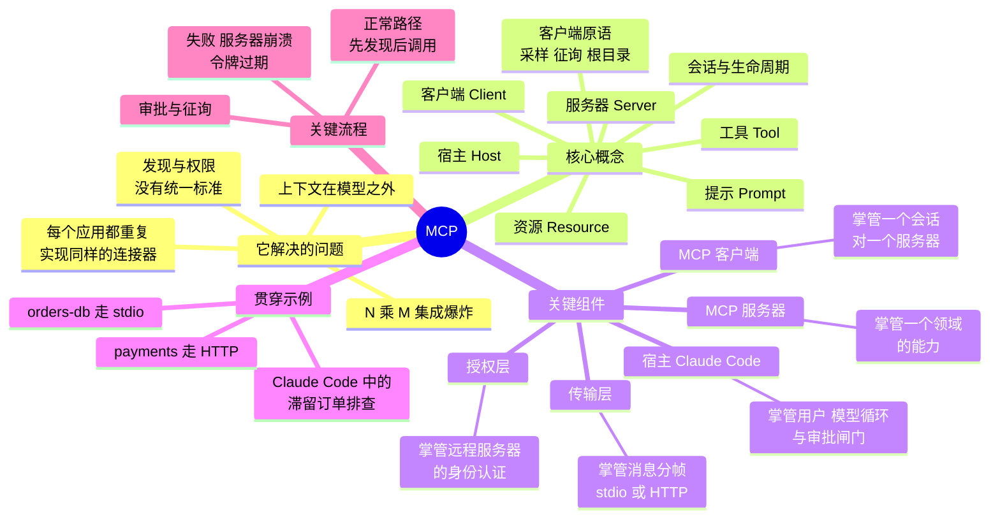

# MCP（Model Context Protocol，模型上下文协议）学习指南

> 🇬🇧 English version: [mcp-guide/00-overview.md](../mcp-guide/00-overview.md) ｜ 📦 GitHub: <https://github.com/geekchow/mcp-explain>

> **你在哪里：** 整个系列的入口。
> **读完本文你会知道：** 这份指南覆盖了什么、一张图看清全部概念、以及应该按什么顺序阅读。

这份指南解释 **MCP（Model Context Protocol，模型上下文协议）**：不是从定义讲起，而是先重建"它为什么必须被发明出来"的推理链条，然后逐层深入每一个组件——全程以一个**真实的 Claude Code 工作场景**作为贯穿始终的主线。

---

## 缩写对照表

| 缩写 | 英文全称 | 中文含义 |
|---|---|---|
| MCP | Model Context Protocol | 模型上下文协议：本文主题，让 AI 应用与外部工具、数据对话的标准协议 |
| LLM | Large Language Model | 大语言模型（本文场景中即 Claude） |
| JSON-RPC | JavaScript Object Notation — Remote Procedure Call | MCP 的底层消息格式（2.0 版） |
| API | Application Programming Interface | 应用程序编程接口 |
| SDK | Software Development Kit | 软件开发工具包，此处指 MCP 官方库（TypeScript、Python 等） |
| CLI | Command-Line Interface | 命令行界面，即终端里敲的 `claude` 命令 |
| stdio | Standard Input / Standard Output | 标准输入/标准输出：本地传输方式，服务器作为子进程，消息走它的 stdin/stdout |
| HTTP | HyperText Transfer Protocol | 超文本传输协议，远程传输方式的载体 |
| SSE | Server-Sent Events | 服务器发送事件：MCP 用它把服务器→客户端的消息推过来 |
| URI | Uniform Resource Identifier | 统一资源标识符，MCP 用它命名资源，如 `schema://orders/tables` |
| OAuth | Open Authorization | 开放授权框架（2.1 版），远程 MCP 服务器的鉴权方式 |
| RPC | Remote Procedure Call | 远程过程调用 |
| SQL | Structured Query Language | 结构化查询语言，示例服务器用它访问数据库 |
| TLS | Transport Layer Security | 传输层安全协议，HTTP 传输的加密层 |
| PKCE | Proof Key for Code Exchange | 授权码交换证明密钥，保护 OAuth 授权码流程的扩展 |
| DDL | Data Definition Language | 数据定义语言，即建表语句 |
| CI | Continuous Integration | 持续集成 |
| LSP | Language Server Protocol | 语言服务器协议，MCP 的直系精神前辈 |

---

## 一张图看清全部疆域



*图注：本指南覆盖的全部概念、组件与流程——在深入任何一处之前，先把这张图装进脑子里。*

---

## 阅读顺序

| # | 文件 | 阶段 | 你会得到什么 |
|---|---|---|---|
| 1 | [01-why.md](01-why.md) | WHY 为什么 | MCP 出现之前的痛点；为什么插件和函数调用还不够 |
| 2 | [02-what.md](02-what.md) | WHAT 是什么 | 一句话定义、边界、生态位 |
| 3 | [03-concept-map.md](03-concept-map.md) | 概念地图 | 全部概念 + 关键组件 + 它们如何协作 |
| 4 | [04-running-example.md](04-running-example.md) | 贯穿示例 | 滞留订单排查场景，先浅层走一遍 |
| 5 | [05-deep-dives/](05-deep-dives/) | 深入 | 每个关键组件一篇，每篇都锚回示例 |
| 6 | [06-walkthrough.md](06-walkthrough.md) | 完整走查 | 同一个示例，端到端全深度重跑一遍 |
| 7 | [07-next-steps.md](07-next-steps.md) | — | 自测题、练习、源码入口、延伸阅读 |
| — | [examples/](../mcp-guide/examples/) | — | **可运行**的 MCP 服务器 + Claude Code 配置 |

第一遍请按 01→06 顺序读。之后每篇深入文章都可独立阅读——每篇开头都会回顾组件职责，结尾都会锚回示例。

---

## 关于协议版本的说明

MCP 用日期字符串作为版本号。本指南描述的是 **`2025-06-18`** 修订版，也是当前 Claude Code 与官方 SDK 默认协商的版本；凡是某个特性在特定版本才引入的（Streamable HTTP 在 `2025-03-26`、征询（elicitation）与结构化工具输出在 `2025-06-18`），正文都会点明。之后还有更新的修订版并增加了特性，但本指南中的每一个概念在各版本间都是稳定的。当某个细节对你的实现真的重要时，请查阅 `modelcontextprotocol.io` 上你的 SDK 所协商的那个版本——以及你自己握手时实际返回的 `protocolVersion`（见[客户端深入](05-deep-dives/02-mcp-client.md)）。

---

## 📦 配套代码仓库

本文是一个开源指南系列的一部分。整个系列、全部图表源码，以及一个可以直接让 Claude Code 连上去的**可运行 MCP 服务器**，都在同一个仓库里：

### → https://github.com/geekchow/mcp-explain

| | |
|---|---|
| 本页源文件 | [`mcp-guide-zh/00-overview.md`](https://github.com/geekchow/mcp-explain/blob/main/mcp-guide-zh/00-overview.md) |
| 英文原版 | [`mcp-guide/00-overview.md`](https://github.com/geekchow/mcp-explain/blob/main/mcp-guide/00-overview.md) |
| 可运行示例服务器 | [`mcp-guide/examples/orders-db-server`](https://github.com/geekchow/mcp-explain/tree/main/mcp-guide/examples/orders-db-server) |

克隆下来跟着做：

```bash
git clone https://github.com/geekchow/mcp-explain.git
cd mcp-explain/mcp-guide/examples/orders-db-server && npm install && node index.js
```

欢迎指正——如果某个协议细节随新版本发生了变化，欢迎提 issue。

→ 下一篇：[01-why.md](01-why.md)
