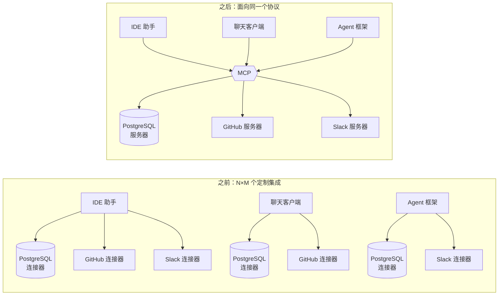

# 第一阶段 WHY：MCP 解决的问题

> 🇬🇧 English version: [mcp-guide/01-why.md](../mcp-guide/01-why.md) ｜ 📦 GitHub: <https://github.com/geekchow/mcp-explain>

> **你在哪里：** 六个阶段中的第一阶段，还没到定义。
> **读完本文你会知道：** 在 MCP 出现之前做一个 AI 集成是什么感受、为什么那些显而易见的前辈方案不够用、以及哪些约束塑造了 MCP 的形状。读完你应该能说出那句话：*"如果 MCP 不存在，也一定会有人把它发明出来。"*

---

## 一、在这之前，世界是什么样的

LLM（Large Language Model，大语言模型）本质上是一个文本进、文本出的函数。它不知道你的 PostgreSQL 数据库、不知道你的 Jira 看板、不知道你的支付网关，也不知道你九十秒前改了哪个文件。因此，每一个有用的 AI 应用，骨子里都是一个**上下文管道**应用：取到正确的数据、描述可用的动作、执行模型选中的那个、再把结果喂回去。

2023–2024 年，行业收敛到了**工具调用**（tool calling，也被包装成 function calling，函数调用）：你把一组带 JSON Schema 类型的函数交给模型，模型吐出一个调用，然后**由你的应用**去执行它。这解决了模型侧的那一半问题，却对应用侧的那一半毫无帮助——而工作量恰恰在应用侧。

具体来说，在 MCP 之前：

**集成代码长在应用里。** 你想让 IDE 里的 Claude 读 PostgreSQL，就得往 IDE 插件里写一个 PostgreSQL 连接器。你同事想在聊天应用里用同样的能力，就得用另一种语言、配另一套鉴权，把它再写一遍。这个连接器搬不动。

**N×M 爆炸。** 有 *N* 个 AI 应用（IDE 助手、聊天客户端、Agent 框架、内部 copilot）和 *M* 个要接入的系统（PostgreSQL、GitHub、Slack、Sentry、内部支付服务），生态就需要 N×M 个定制集成。每一个都在重复解决同样的五个问题：发现（"我能做什么？"）、模式定义、调用、错误上报、凭据管理。

**运行时没有发现机制。** 工具清单是编译进应用的。增加一个能力，要发布的是**客户端**的新版本，而不是**集成**的新版本。一个拥有某个服务的团队，没法只是发布一句"AI Agent 这样跟我们对话"就完事。

**权限是临时拼凑的。** 每个应用都自己发明一套"我可以执行这个吗？"的问法、自己定义哪些调用算危险、自己找地方存密钥——通常就是应用的配置文件，于是那个文件里躺着 M 个系统的凭据。

**上下文靠复制粘贴。** 现实中大量的使用，其实是人把表结构、日志片段、堆栈信息粘进聊天窗口，因为没有一个协议能让模型的宿主**自己去取**。

*图注：为什么这个痛点是平方级的，以及把它降到线性需要什么——中间那一个协议。*

---

## 二、为什么已有的答案不够用

| 前辈方案 | 它给了什么 | 它欠缺什么 |
|---|---|---|
| **裸的工具/函数调用**（各家模型 API） | 模型侧吐出类型化调用的约定 | 完全没说**工具从哪来**、怎么被发现、谁来执行、怎么授权。每个宿主还是得把每个集成写一遍。 |
| **ChatGPT Plugins / OpenAPI 描述** | 远程 HTTP API 的运行时发现 | 厂商私有且单向：HTTP API 无法反过来问客户端任何事，无法把进度流式推进对话，也无法把"只读上下文"和"动作"区分开。本地资源（文件、本地数据库）更是完全没有着落。 |
| **LangChain 之类的工具抽象** | **单个框架内部**的共同词汇 | 那是进程内的库抽象，不是线上协议。为某个框架/语言写的工具，别的宿主用不了；也没有进程边界来隔离凭据和爆炸半径。 |
| **LSP（Language Server Protocol，语言服务器协议）** | 证明了一个 JSON-RPC 协议可以压平编辑器×语言的 N×M 问题 | 它为另一个领域而生（给编辑器提供代码智能），不涉及模型驱动的能力发现、人工审批、Agent 循环。但它是 MCP 的直系精神前辈——答案的形状就长这样。 |
| **裸的 REST/gRPC API** | 你的服务本来就暴露的一切 | 那是写给程序员的，不是写给模型的：没有自然语言描述、没有统一的"列出你能做什么"、不区分"读着安全"和"会毁掉钱"、也没有会话的概念。 |

差距非常精确：所有人都有办法**执行**一个工具，但没有人有办法**分发**一个工具。

---

## 三、塑造了这个方案的约束

MCP 的设计不是随意的——下面每一条约束都在它身上留下了可见的指纹（方括号里是你能看到这枚指纹的那一篇）：

1. **本地优先必须和远程一样好用。** 现实中大量工作是针对本地事物的：一个工作目录、一个本地数据库、一个正在跑的开发服务器。所以协议必须能跑在一个普通子进程上，不要端口、不要 TLS、不要授权服务器。→ *stdio 传输* [[传输层深入](05-deep-dives/03-transport.md)]
2. **远程和多租户也必须成立。** 企业需要一个托管服务器服务多个用户，并带真实身份。→ *Streamable HTTP 传输 + OAuth 2.1* [[传输层深入](05-deep-dives/03-transport.md)、[授权与信任](05-deep-dives/05-auth-and-trust.md)]
3. **发现发生在运行时，而不是编译期。** 增加一个能力不应该要求发布一个新宿主。→ *`tools/list`、`resources/list`、`prompts/list` + `list_changed` 通知* [[服务器深入](05-deep-dives/04-mcp-server.md)]
4. **人必须留在回路里。** 模型会犯错；有些调用会动真金白银。协议必须给宿主留出一道**由宿主掌管**的审批闸门，并让服务器能标注哪些调用是破坏性的。→ *工具标注 + 宿主审批* [[宿主深入](05-deep-dives/01-host-claude-code.md)]
5. **双向，而不是请求/响应。** 服务器可能需要反过来问**客户端**：要一次模型补全（*采样 sampling*）、要一个缺失的输入（*征询 elicitation*）、要用户的工作目录（*根目录 roots*）。这是普通 REST API 做不到的。→ *双向 JSON-RPC* [[客户端深入](05-deep-dives/02-mcp-client.md)]
6. **传输无关、语言无关。** 线上格式必须在任何地方都能轻易实现。→ *JSON-RPC 2.0，按行分帧或按 SSE 分帧*
7. **小到一个下午就能实现完。** 被采用就是全部意义；没人实现的协议解决不了任何问题。用 SDK 写一个最小可用服务器大约 40 行——见 [examples/orders-db-server](../mcp-guide/examples/orders-db-server/)。

---

## 四、检验一下

假设 MCP 不存在，而你接到了这个任务：

> "支付团队希望 Claude——在 IDE 里、在聊天应用里、在夜间 Agent 里——都能查询一笔扣款的状态并发起退款，且退款必须有人工确认。这个集成应该由支付团队自己拥有并独立发布。"

你最后一定会发明出：一种**描述**这两个操作及其类型化输入的方式、一种让任意客户端在运行时**列出**它们的方式、一种既能用于本地进程又能用于托管服务的线上格式、一个"退款是破坏性的所以要问人"的标记，以及一种让支付服务能反过来追问用户的通道。那就是 MCP。

而这个任务在本指南里并非假设——它就是整个系列所依托的贯穿示例。

---

## 📦 配套代码仓库

本文是一个开源指南系列的一部分。整个系列、全部图表源码，以及一个可以直接让 Claude Code 连上去的**可运行 MCP 服务器**，都在同一个仓库里：

### → https://github.com/geekchow/mcp-explain

| | |
|---|---|
| 本页源文件 | [`mcp-guide-zh/01-why.md`](https://github.com/geekchow/mcp-explain/blob/main/mcp-guide-zh/01-why.md) |
| 英文原版 | [`mcp-guide/01-why.md`](https://github.com/geekchow/mcp-explain/blob/main/mcp-guide/01-why.md) |
| 可运行示例服务器 | [`mcp-guide/examples/orders-db-server`](https://github.com/geekchow/mcp-explain/tree/main/mcp-guide/examples/orders-db-server) |
| 系列起点 | [`mcp-guide-zh/00-overview.md`](https://github.com/geekchow/mcp-explain/blob/main/mcp-guide-zh/00-overview.md) |

欢迎指正——如果某个协议细节随新版本发生了变化，欢迎提 issue。

→ 下一篇：[02-what.md](02-what.md) · ↑ 返回[总览](00-overview.md)
