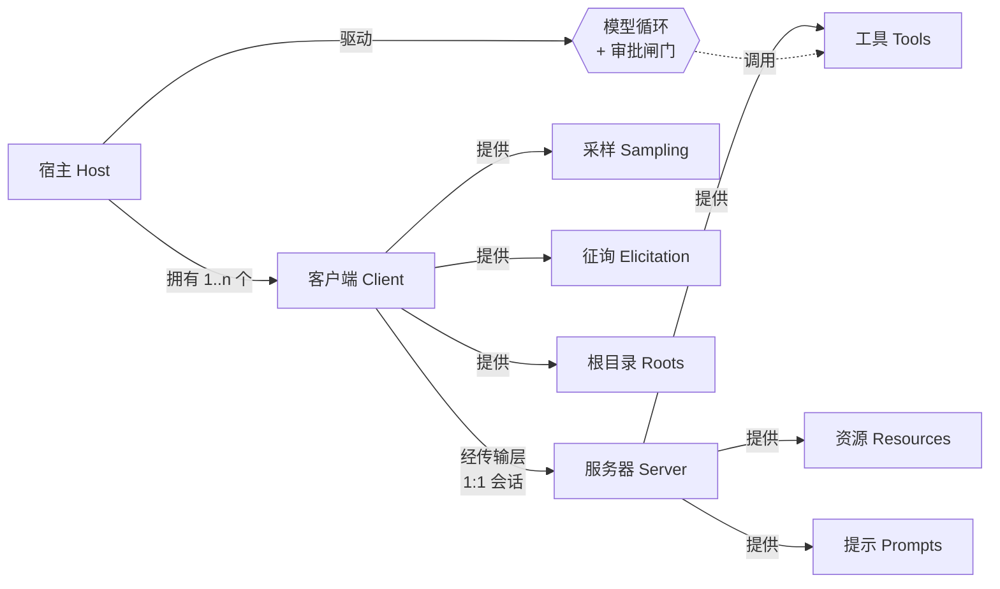
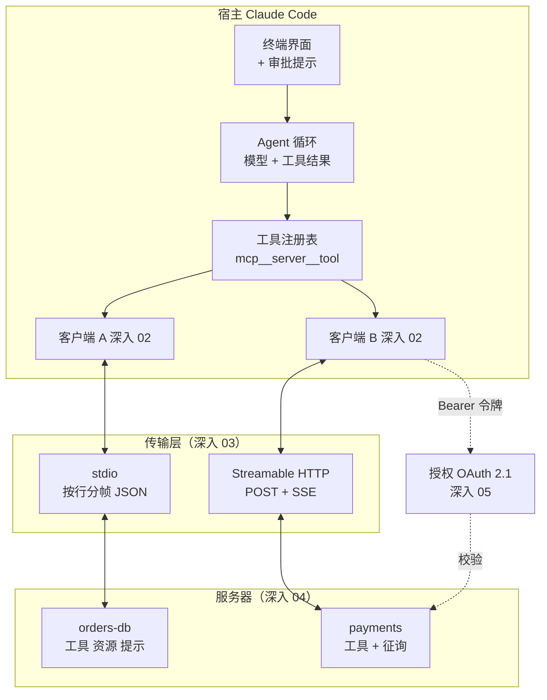
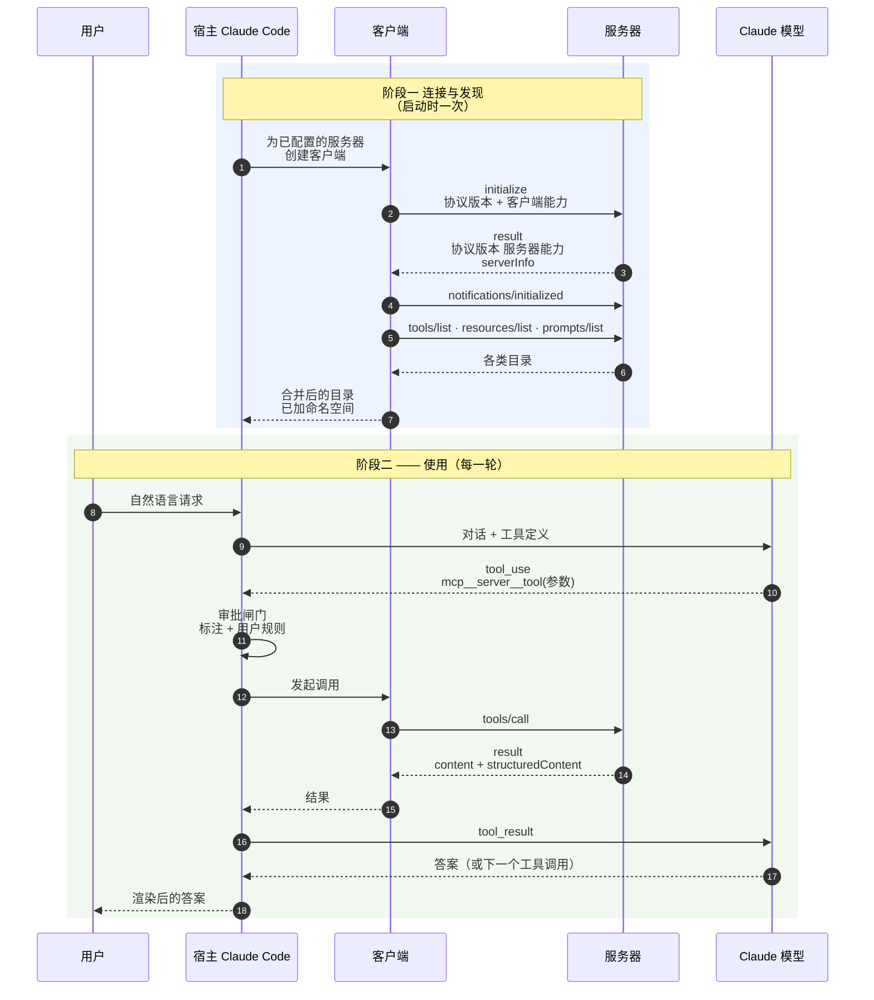

# 第三阶段 概念地图：广度优先，先看全境

> 🇬🇧 English version: [mcp-guide/03-concept-map.md](../mcp-guide/03-concept-map.md) ｜ 📦 GitHub: <https://github.com/geekchow/mcp-explain>

> **你在哪里：** 六个阶段中的第三阶段——下潜之前先画地图。
> **读完本文你会知道：** 每一个 MCP 核心概念、每一个关键组件（各自**掌管什么、知道什么、刻意不做什么**），以及它们如何端到端协作。这里还没有内部细节——那是第五阶段。
> **合格标准：** 读完你应该能在白板上把整个架构画出来，并说清每个方框存在的理由。

---

## 3.1 领域映射：从问题到概念

MCP 把 [01-why](01-why.md) 里那个杂乱的现实问题，映射到了八个概念上。请自上而下读：每个概念只用到它上面已经定义过的词。

| 现实问题中的要素 | MCP 概念 | 一句话定义 | 为什么要这个抽象 |
|---|---|---|---|
| "人真正在用的那个 AI 应用" | **宿主 Host** | 拥有用户交互、模型对话和安全决策的那个程序 | 总得有人对人类负责。把这个角色命名出来，能让审批与凭据策略集中在**一处**，而不是散落在每个集成里 |
| "对一个集成的一条连接" | **客户端 Client** | 宿主内部的协议连接器，与恰好一个服务器维持恰好一个会话 | 1:1 配对意味着一个行为异常的服务器看不到也污染不了另一个服务器的会话；隔离是结构性的，不是靠纪律 |
| "拥有能力的团队所发布的那个集成" | **服务器 Server** | 一个独立程序，通过 MCP 暴露某一个领域的能力 | 解耦发布节奏：支付团队发布支付服务器，完全不用碰 Claude Code |
| "一段协商好特性的连续对话" | **会话与生命周期** | 从 initialize 到运行再到关闭的一段跨度，其中协议版本与能力集是双方约定好的 | 两个独立演进版本的程序，必须在第一次真正调用**之前**就对彼此支持什么达成一致，否则每次调用都得做特性探测 |
| "一个有后果的动作" | **工具 Tool** | 一个具名的、带 JSON Schema 类型的操作，模型可以调用它；附带人类可读的描述与安全标注 | 模型需要类型才能**调对**，需要文字才能**选对**；宿主需要标注才知道该拦什么 |
| "供阅读的参考材料" | **资源 Resource** | 以 URI 标识的、可寻址的只读内容（如 `schema://orders/tables`），可列举、可读取 | 把"读这个"和"做这个"分开，宿主才能缓存它、**用户**才能显式挂载它、并且跳过审批——读不是动作 |
| "一种已知好用的提问方式" | **提示 Prompt** | 服务器提供的、具名的、可带参数的消息模板，以命令形式呈现给用户 | 服务器作者比模型更清楚自己领域里的正确问法；提示让这份专业知识随集成一起发布 |
| "服务器需要客户端回给它点什么" | **客户端原语：** 采样、征询、根目录 | 服务器→客户端的请求：跑一次模型补全（*采样*）、向用户要一个结构化输入（*征询*）、列出用户的工作目录（*根目录*） | 让模型和人类都留在**宿主**那一侧。服务器永远不用持有模型 API 密钥，也永远不用自己画界面 |

还有两个派生概念，后面会遇到，但别和上面八个核心概念混淆：**通知 notification**（没有 `id` 因而无需回复的 JSON-RPC 消息，用于 `list_changed`、进度、取消、日志）和**能力 capability**（在 initialize 时交换的标志位，声明双方各自支持上述哪些东西）。

*图注：哪个概念归谁——服务器向外提供三个原语，客户端反向提供三个。*

---

## 3.2 关键组件：也是第五阶段的目录

真正干活的是五个组件。每一个在 [05-deep-dives/](05-deep-dives/) 里都有且仅有一篇深入文章，顺序就是它们在贯穿示例中首次登场的顺序。

### 1. 宿主 —— Claude Code → [深入 01](05-deep-dives/01-host-claude-code.md)

- **掌管：** 与人的关系。服务器配置与生命周期、模型对话、工具命名空间，以及——最关键的——每一次工具调用之前的**审批闸门**。
- **知道：** 配置了哪些服务器、在什么作用域、跨所有服务器合并后的工具/资源/提示目录、用户的权限规则、到目前为止的对话。
- **刻意不做：** 它自己不说 MCP。它从不写一个 JSON-RPC 帧，而是把每条连接委托给一个客户端。它也从不决定**一个工具是什么意思**——那是服务器的事。

### 2. MCP 客户端 → [深入 02](05-deep-dives/02-mcp-client.md)

- **掌管：** 与一个服务器的一个会话：initialize 握手、能力协商、按 `id` 做请求/响应关联、通知、取消、超时，以及把客户端侧原语反向提供给服务器。
- **知道：** 协商后的协议版本、服务器声明的能力、在途请求的 id、服务器公布的目录。
- **刻意不做：** 复用。一个客户端只对一个服务器——绝不做跨服务器的连接池。它也不解释内容、不向用户提问，这两件事都交给宿主。

### 3. 传输层 → [深入 03](05-deep-dives/03-transport.md)

- **掌管：** 把字节送过去，并切分成一条条离散的 JSON-RPC 消息：进程创建与管道（stdio），或 HTTP 请求、SSE 流与会话标识（Streamable HTTP）。
- **知道：** 一条消息从哪开始到哪结束；对 HTTP 还知道会话 id 和用于断点续传的 last event id。
- **刻意不做：** 它连一个 MCP 方法名都不理解。把 stdio 换成 HTTP，上面每一层都不用改；这种无知就是设计本身。

### 4. MCP 服务器 → [深入 04](05-deep-dives/04-mcp-server.md)

- **掌管：** 一个领域的能力。声明自己的工具/资源/提示、校验输入、对真实系统执行、把结果整理成模型读得懂的形状。
- **知道：** 自己的目录和模式定义、与底层系统的连接、它自己选择保留的会话状态。
- **刻意不做：** 决定某个动作对**这个人**是否被允许（它只做标注，闸门在宿主）、直接跟模型对话（它通过采样请求）、画用户界面（它通过征询请求）。

### 5. 授权层 → [深入 05](05-deep-dives/05-auth-and-trust.md)

- **掌管：** 证明**是谁**在调用远程服务器：OAuth 2.1 发现、带 PKCE 的授权码流程、令牌签发、受众绑定与刷新。
- **知道：** 受保护资源的元数据、授权服务器的端点、以及为这个用户和这个服务器所持有的令牌。
- **刻意不做：** 对 stdio 服务器**它根本不存在**——在那里，操作系统的进程边界，以及你启动服务器时给它的那套环境，**就是**安全模型。它对本地服务器的缺席本身就是一句设计声明。

*图注：五个关键组件与两种传输，按它们在贯穿示例中出场的样子排布。*

---

## 3.3 协作全景

正常路径分成**两个截然不同的阶段**，把它们混为一谈是最常见的新手错误：**连接与发现**在启动时发生一次；**使用**则每个模型轮次都发生。

*图注：五个组件在正常路径上如何配合——发现一次，然后是一串带闸门的调用。*

有两条边缘流程在这里只点名，不解剖：

- **服务器发起的轮次** —— 服务器在处理 `tools/call` 的过程中**反向**发出请求（用 `elicitation/create` 向用户提问，或用 `sampling/createMessage` 借用模型）。在[深入 04](05-deep-dives/04-mcp-server.md) 追踪，在[完整走查](06-walkthrough.md)里重跑。
- **失败** —— stdio 服务器在调用中途死掉，或 HTTP 服务器因令牌过期返回 `401 Unauthorized`。在[深入 03](05-deep-dives/03-transport.md) 和[深入 05](05-deep-dives/05-auth-and-trust.md) 追踪。

---

## 📦 配套代码仓库

本文是一个开源指南系列的一部分。整个系列、全部图表源码，以及一个可以直接让 Claude Code 连上去的**可运行 MCP 服务器**，都在同一个仓库里：

### → https://github.com/geekchow/mcp-explain

| | |
|---|---|
| 本页源文件 | [`mcp-guide-zh/03-concept-map.md`](https://github.com/geekchow/mcp-explain/blob/main/mcp-guide-zh/03-concept-map.md) |
| 英文原版 | [`mcp-guide/03-concept-map.md`](https://github.com/geekchow/mcp-explain/blob/main/mcp-guide/03-concept-map.md) |
| 可运行示例服务器 | [`mcp-guide/examples/orders-db-server`](https://github.com/geekchow/mcp-explain/tree/main/mcp-guide/examples/orders-db-server) |
| 系列起点 | [`mcp-guide-zh/00-overview.md`](https://github.com/geekchow/mcp-explain/blob/main/mcp-guide-zh/00-overview.md) |

欢迎指正——如果某个协议细节随新版本发生了变化，欢迎提 issue。

→ 下一篇：[04-running-example.md](04-running-example.md) · ↑ 返回[总览](00-overview.md)
