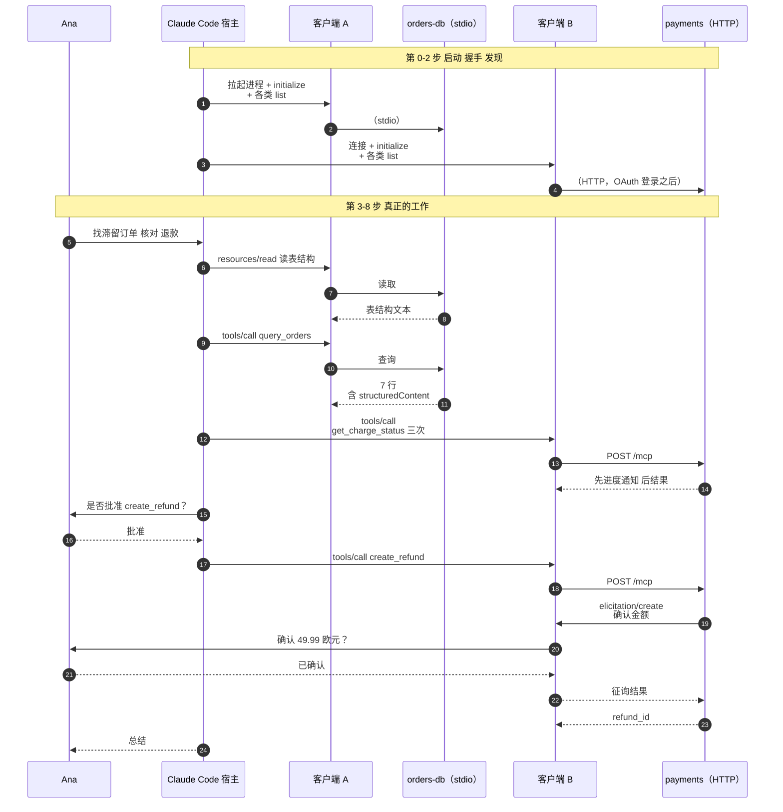

# 第四阶段 贯穿示例：Claude Code 中的滞留订单排查

> 🇬🇧 English version: [mcp-guide/04-running-example.md](../mcp-guide/04-running-example.md) ｜ 📦 GitHub: <https://github.com/geekchow/mcp-explain>

> **你在哪里：** 六个阶段中的第四阶段。地图画好了，现在让一件具体的工作在上面走一遍。
> **读完本文你会知道：** 这个场景本身，以及每一步谁在台上。你**还不会**知道任何组件内部发生了什么——那是第五阶段。

---

## 三句话讲清场景

Ana 是一家网店的后端工程师。客服反馈：有些结账订单在 `PENDING_PAYMENT`（待支付）状态上卡了一天多，退款也没发出去。Ana 在 `shop-backend` 仓库里打开 Claude Code，让它找出这些滞留订单、逐笔去支付网关核对，并对其中最严重的几笔发起退款。

这一个请求，会触及本系列**全部概念和全部关键组件**。

---

## 她已有的环境

这个仓库配置了两个 MCP 服务器，都是用 `claude mcp add` 命令加进去的，命令会把它们写进配置文件：

`shop-backend/.mcp.json`（提交进 git，所以全团队都有）：

```json
{
  "mcpServers": {
    "orders-db": {
      "command": "node",
      "args": ["./tools/orders-db-server/index.js"],
      "env": {
        "ORDERS_DATABASE_URL": "${ORDERS_DATABASE_URL}"
      }
    },
    "payments": {
      "type": "http",
      "url": "https://payments.internal.acme.com/mcp"
    }
  }
}
```

这两个服务器在每一个要紧的维度上都被刻意设计成相反的：

| | `orders-db` | `payments` |
|---|---|---|
| 传输 | **stdio** —— 一个 Node 子进程 | **Streamable HTTP** —— 一个托管服务 |
| 鉴权 | 无；继承 Ana 的环境 | **OAuth 2.1**，浏览器登录，按用户签发令牌 |
| 提供 | 2 个工具、1 个资源、1 个提示 | 2 个工具，其中一个是破坏性的 |
| 归属 | Ana 自己团队，在仓库内 | 支付团队，独立部署 |
| 危险度 | 只读查询 | **会动真金白银** |

`orders-db` 的可运行版本就在 [examples/orders-db-server](../mcp-guide/examples/orders-db-server/)——你可以让 Claude Code 连上它，真刀真枪跟着走一遍。

---

## 浅层走查

先读一遍，掌握编排关系。每个加粗的词，都是某个概念或组件在示例中的首次登场。

**第 0 步 —— 启动。** Ana 在 `shop-backend` 里运行 `claude`。**宿主**（Claude Code）读取 `.mcp.json`，为每一条配置创建一个**客户端**。客户端 A 把 `node ./tools/orders-db-server/index.js` 拉起为子进程——它的**传输层**就是这个进程的 stdin/stdout 管道。客户端 B 则准备好向 `payments` 的 URL 发 HTTP 请求。

**第 1 步 —— 握手。** 每个客户端与自己的**服务器**建立一个**会话**：一个声明协议版本与客户端能力的 `initialize` 请求、一个声明服务器能力的响应，然后是一条 `notifications/initialized`。客户端 B 的第一个请求返回 `401 Unauthorized`；**授权层**接管，打开浏览器，Ana 登录，请求带着 Bearer 令牌重试。

**第 2 步 —— 发现。** 每个客户端依次请求 `tools/list`、`resources/list`、`prompts/list`。宿主把答案合并成一份带命名空间的目录：`mcp__orders-db__query_orders`、`mcp__orders-db__get_order`、`mcp__payments__get_charge_status`、`mcp__payments__create_refund`，外加**资源** `schema://orders/tables` 和**提示** `triage-stuck-orders`。敲 `/mcp` 就能看到全部。

**第 3 步 —— 提问。** Ana 输入：

> `找出在 PENDING_PAYMENT 状态超过 24 小时的订单，逐笔到网关核对扣款状态，对网关显示从未扣款成功的那些发起退款。每次退款前先问我。`

宿主把对话连同四个工具定义一起发给**模型**。

**第 4 步 —— 先读上下文。** 模型想确认字段名，于是读那个**资源**：客户端 A 对 `schema://orders/tables` 发出 `resources/read`，服务器返回表定义文本，它进入对话上下文。没有弹出审批——读不是动作。

**第 5 步 —— 查询。** 模型发出一个**工具**调用：`mcp__orders-db__query_orders({status: "PENDING_PAYMENT", older_than_hours: 24})`。宿主的**审批闸门**检查权限规则：Ana 上周对这个工具选过*"始终允许"*，项目设置里已经有一条规则，所以不弹窗。客户端 A 发出 `tools/call`；服务器执行一条参数化 SQL 查询，返回 7 行——既有人类可读的文本，也有机器可读的 `structuredContent`。

**第 6 步 —— 与网关交叉核对。** 对最老的三笔订单，模型调用 `mcp__payments__get_charge_status`。客户端 B 带着 Bearer 令牌把每个 `tools/call` 通过 HTTP POST 出去；支付服务器通过 **SSE** 流返回，并且因为网关查询较慢，先发了进度**通知**。其中两笔扣款回来是 `never_captured`（从未扣款）。

**第 7 步 —— 危险的那次调用。** 模型调用 `mcp__payments__create_refund({order_id: "ord_88f21", amount_cents: 4999})`。两道闸门依次触发：

1. 宿主向 Ana 弹出审批提示，因为这个工具带着 `destructiveHint: true` 标注，且没有任何权限规则预先放行。Ana 批准。
2. 服务器**自己**通过这条会话反向发出一个请求——`elicitation/create`——要求 Ana 用文字确认金额。宿主把它渲染出来；Ana 确认；答案沿同一条会话回到服务器，服务器这才真正发起退款。

**第 8 步 —— 答案。** 结果作为工具结果回流，模型写出总结，Claude Code 打印出来：7 笔滞留订单、核对 3 笔、退款 2 笔、1 笔按原因搁置。Ana 接着让它开一张工单；那是另一天的故事了。

---



*图注：整个示例浓缩在一页——每一步谁在台上，不涉及任何组件内部细节。*

---

## 覆盖度自检

| 概念 / 组件 | 出现在哪 |
|---|---|
| 宿主 | 第 0–8 步（配置、闸门、渲染） |
| 客户端 | 第 0–7 步（两个：A 和 B） |
| 服务器 | 第 4–7 步（两个） |
| 会话与生命周期 | 第 1 步 |
| 工具 | 第 5、6、7 步 |
| 资源 | 第 4 步 |
| 提示 | 第 2 步（被列出；在完整走查中被调用） |
| 采样 / 征询 / 根目录 | 第 7 步（征询）；根目录在第 1 步；采样在[深入 04](05-deep-dives/04-mcp-server.md)讨论 |
| 传输层 | 第 0 步（stdio）、第 6 步（HTTP + SSE） |
| 授权 | 第 1 步 |

**继续往下读之前，试着凭记忆复述第 0–8 步。** 从这里开始，每一篇深入文章都会说"回想第 *n* 步……"，然后告诉你那一刻内部到底发生了什么。

---

## 📦 配套代码仓库

本文是一个开源指南系列的一部分。整个系列、全部图表源码，以及一个可以直接让 Claude Code 连上去的**可运行 MCP 服务器**，都在同一个仓库里：

### → https://github.com/geekchow/mcp-explain

| | |
|---|---|
| 本页源文件 | [`mcp-guide-zh/04-running-example.md`](https://github.com/geekchow/mcp-explain/blob/main/mcp-guide-zh/04-running-example.md) |
| 英文原版 | [`mcp-guide/04-running-example.md`](https://github.com/geekchow/mcp-explain/blob/main/mcp-guide/04-running-example.md) |
| 可运行示例服务器 | [`mcp-guide/examples/orders-db-server`](https://github.com/geekchow/mcp-explain/tree/main/mcp-guide/examples/orders-db-server) |
| 系列起点 | [`mcp-guide-zh/00-overview.md`](https://github.com/geekchow/mcp-explain/blob/main/mcp-guide-zh/00-overview.md) |

欢迎指正——如果某个协议细节随新版本发生了变化，欢迎提 issue。

→ 下一篇：[05-deep-dives/01-host-claude-code.md](05-deep-dives/01-host-claude-code.md) · ↑ 返回[概念地图](03-concept-map.md)
