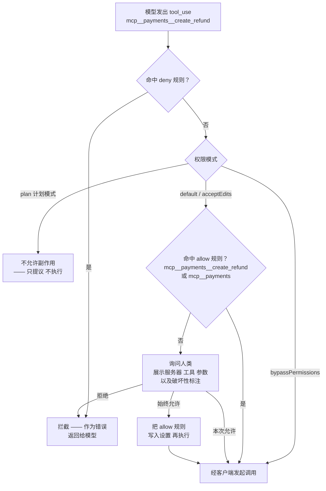

# 深入 01 —— 宿主：Claude Code

> 🇬🇧 English version: [mcp-guide/05-deep-dives/01-host-claude-code.md](../../mcp-guide/05-deep-dives/01-host-claude-code.md) ｜ 📦 GitHub: <https://github.com/geekchow/mcp-explain>

> **你在哪里：** 第五阶段，五篇深入中的第 1 篇。第一次下潜。
> **读完本文你会知道：** Claude Code 如何配置、拉起、命名空间化并拦截 MCP 服务器——以及它在贯穿示例第 0、2、3、5、7 步分别做了什么。

---

## 一、职责回顾

**宿主**掌管与人的关系：服务器配置与生命周期、模型对话、合并后的工具命名空间，以及审批闸门。它自己从不说 MCP——它为每个服务器持有一个**客户端**，让客户端去说。

在[贯穿示例](../04-running-example.md)中，宿主登场于**第 0 步**（读配置、拉起服务器）、**第 2 步**（合并目录）、**第 3 步**（组装模型请求）、**第 5 步**（权限检查）、**第 7 步**（审批弹窗并渲染征询）、**第 8 步**（给出答案）。

---

## 二、内部设计

### 2.1 配置与作用域

Claude Code 从三个作用域解析 MCP 服务器，同名时越靠近本地的优先：

| 作用域 | 存放位置 | 谁能看到 | 用于 |
|---|---|---|---|
| `local`（默认） | 用户设置，按项目路径归档 | 只有你，只在这个项目 | 试验、个人凭据 |
| `project` | 仓库根目录的 `.mcp.json` | 克隆这个仓库的所有人 | 团队共享的服务器——我们的 `orders-db` 和 `payments` |
| `user` | 用户设置，全局生效 | 只有你，但到处都有 | 你希望在任何项目里都有的个人服务器 |

Ana 当初用来搭出示例环境的命令：

```bash
# 本地 stdio 服务器；-- 之后的一切都是要拉起的命令行
claude mcp add orders-db --scope project \
  --env ORDERS_DATABASE_URL='${ORDERS_DATABASE_URL}' \
  -- node ./tools/orders-db-server/index.js

# 走 Streamable HTTP 的远程服务器
claude mcp add payments --scope project --transport http \
  https://payments.internal.acme.com/mcp

claude mcp list          # 配了哪些，连没连上
claude mcp get payments  # 某个服务器解析后的配置
claude mcp remove payments
```

几个容易踩的点：

- **`--` 是有承重作用的。** 它之后的一切都是服务器的 argv；不写它，参数会被 `claude` 自己吃掉。
- **`${VAR}` 展开。** `.mcp.json` 支持环境变量展开（包括 `${VAR:-默认值}`），这正是一个**提交进仓库**的配置能引用一个**没提交**的密钥的办法。永远不要把凭据内联写进 `.mcp.json`。
- **项目作用域的服务器在运行前会先征求同意。** 因为 `.mcp.json` 会随 `git pull` 到达，而且可以执行任意命令，所以 Claude Code 第一次信任某个项目的服务器之前会先问你。（`claude mcp reset-project-choices` 可以重新问。）这是一道供应链闸门，而且这个直觉是对的——见[深入 05](05-auth-and-trust.md)。
- **临时配置。** `--mcp-config <文件或 JSON>` 只为本次运行添加服务器；`--strict-mcp-config` 则**只**用这些，忽略自动发现到的。在 CI（Continuous Integration，持续集成）里很有用。
- 服务器也可以打包在**插件**里，团队常用这种方式把一个服务器连同它的技能和命令作为一个整体分发。

### 2.2 工具命名空间

某个服务器把自己的工具叫 `query_orders`。两个服务器可能都这么叫。因此宿主给每个 MCP 工具加前缀：

```
mcp__<服务器名>__<工具名>      →  mcp__orders-db__query_orders
```

这个字符串就是模型在工具清单里看到的东西、权限规则里写的东西、以及你传给 `--allowedTools` 的东西。同样的命名空间也适用于另外两个原语：

| 原语 | 用户怎么用到它 |
|---|---|
| 工具 | 由模型调用；引用时写 `mcp__server__tool` |
| 资源 | 用户输入 `@server:schema://orders/tables` 挂载，或由模型通过客户端读取 |
| 提示 | 用户输入 `/mcp__orders-db__triage-stuck-orders` 作为斜杠命令，可带参数 |

`/mcp` 打开交互视图：每个服务器的连接状态、能力数量、远程服务器的认证操作，以及重连。

### 2.3 审批闸门

这是宿主内部最重要的机器，也是 MCP 把人放在宿主侧的原因。



*图注：一次 MCP 工具调用是如何被裁决的——这是每个 MCP 宿主都必须做对的那条流程。*

规则写在 `settings.json` 的 `permissions.allow` / `permissions.deny` 下，粒度与命名空间一致：

```jsonc
{
  "permissions": {
    "allow": [
      "mcp__orders-db__query_orders",   // 单个工具
      "mcp__orders-db"                  // 该服务器的全部工具
    ],
    "deny": [
      "mcp__payments__create_refund"    // 永不，弹窗也不行
    ]
  }
}
```

有三条性质值得刻进脑子：

1. **服务器的标注只是建议，裁决权在宿主。** 服务器把某个工具标成 `readOnlyHint: true` 或 `destructiveHint: true`，那是**来自服务器的、未经验证的元数据**。Claude Code 会把它显示在弹窗里让人有判断依据，但恶意服务器无法靠标注绕过你的规则，诚实服务器也无法靠标注降低你的门槛。
2. **deny 压过 allow。** `deny` 条目是绝对的；把那些"必须有人在键盘前"或"在自动化里绝不能跑"的工具放进去。
3. **自动化必须显式授权。** 无人值守运行（`claude -p`）时没有人可问，所以未授权的调用会直接失败而不是挂起。你需要用 `--allowedTools "mcp__orders-db__query_orders"` 预先授权。凡是靠近会写数据的服务器，都请忍住不要用 `--dangerously-skip-permissions`。

### 2.4 上下文预算

**每一轮**对话，来自每个服务器的每个工具定义都会被发给模型。十个服务器、每个二十个工具，就是在用户开口之前先垫进去 200 段描述——而且模型会选得更差，因为选择空间变嘈杂了。宿主给了你几个杠杆：

- 按项目而不是全局配置服务器（`--scope project` 就是干这个的）；
- `MAX_MCP_OUTPUT_TOKENS` 限制单次工具**结果**能注入多少（默认 25000 tokens），这样一次失控的查询不至于把对话挤掉；
- 少而粗的工具优于多而细的工具——这条服务器设计规则在[深入 04](04-mcp-server.md)展开。

---

## 三、交互契约

| 与谁 | 契约 |
|---|---|
| **客户端**（深入 02） | 宿主请求连接/断开，以及"用这些参数调用这个工具"；客户端返回结果或协议错误。宿主从不看见 JSON-RPC 帧。 |
| **模型** | 宿主把合并后的目录渲染成工具定义，并把工具结果作为 tool-result 轮次喂回去。除了工具名字，MCP 对模型是隐形的。 |
| **人类** | 审批弹窗、`/mcp`、`@resource` 挂载、`/mcp__server__prompt` 命令，以及渲染服务器驱动的征询表单。 |

---

## 四、⚓ 回到示例

**第 0 步。** Ana 在 `~/work/shop-backend` 运行 `claude`。宿主读 `.mcp.json`，找到两条配置，这个项目此前已被信任，于是构造两个客户端。对 `orders-db`，它从 Ana 的 shell 环境解析出 `${ORDERS_DATABASE_URL}` 并拉起：

```
node ./tools/orders-db-server/index.js
  cwd=/Users/ana/work/shop-backend
  env=ORDERS_DATABASE_URL=postgres://readonly@db.internal/shop
```

**第 2 步。** 发现完成后，宿主手上是一份扁平目录：

```
$ claude
> /mcp

  orders-db   ✔ 已连接 (stdio)   2 个工具 · 1 个资源 · 1 个提示
  payments    ✔ 已连接 (http)    2 个工具 · 已认证为 ana@acme.com
```

模型的工具清单里现在有 `mcp__orders-db__query_orders`、`mcp__orders-db__get_order`、`mcp__payments__get_charge_status`、`mcp__payments__create_refund`。

**第 5 步。** 模型要调 `mcp__orders-db__query_orders`。闸门沿着上面的流程图走：没有 deny 规则；模式是 `default`；`permissions.allow` 里有 `mcp__orders-db__query_orders`，那是 Ana 当初点"始终允许"留下的。不弹窗。裁决耗时：微秒级。

**第 7 步。** 模型要调 `mcp__payments__create_refund`。没有 allow 规则命中，于是终端里出现：

```
  ⏵ payments — create_refund
    {
      "order_id": "ord_88f21",
      "amount_cents": 4999,
      "reason": "charge never captured; customer waiting 31h"
    }
    ⚠ 服务器将此工具标注为破坏性操作

  是否允许？  [y] 本次允许   [a] 始终允许   [n] 拒绝
```

Ana 按 `y` —— **仅此一次**，而且是有意为之，因为退款绝不该变成一条常驻授权。宿主这才把调用交给客户端 B。片刻之后，服务器通过会话反向推来一个 `elicitation/create`；宿主把它渲染成第二个、由服务器撰写的弹窗，并把 Ana 的回答沿同一条会话送回去。

---

## 五、失败行为

| 失败 | 宿主怎么做 |
|---|---|
| 服务器启动失败（路径错、缺可执行文件） | 标记为未连接，在 `/mcp` 下显示错误，其余服务器的会话继续存活；它的工具是**从模型清单里缺席**，而不是调用时才失败 |
| 服务器中途死掉 | 该次调用报错；Claude Code 把错误显示出来并可以重连。在途结果会丢失——MCP 没有精确一次语义，所以保护你的是**服务器侧**的幂等性（比如 `create_refund` 的幂等键），而不是协议 |
| 服务器疯狂输出 | `MAX_MCP_OUTPUT_TOKENS` 在结果进入对话之前先截断 |
| 远程服务器返回 `401` | 交给授权层：通过 `/mcp` 重新认证，然后重试（[深入 05](05-auth-and-trust.md)） |
| 模型调用了一个已不存在的工具 | 客户端返回方法/工具错误，作为工具结果回到模型；模型通常会重新 list 或换一个工具来自我恢复 |
| 人类拒绝 | 拒绝会作为工具结果返回给模型，说明请求被驳回，模型可以解释或换条路——这不是崩溃 |

---

## 📦 配套代码仓库

本文是一个开源指南系列的一部分。整个系列、全部图表源码，以及一个可以直接让 Claude Code 连上去的**可运行 MCP 服务器**，都在同一个仓库里：

### → https://github.com/geekchow/mcp-explain

| | |
|---|---|
| 本页源文件 | [`mcp-guide-zh/05-deep-dives/01-host-claude-code.md`](https://github.com/geekchow/mcp-explain/blob/main/mcp-guide-zh/05-deep-dives/01-host-claude-code.md) |
| 英文原版 | [`mcp-guide/05-deep-dives/01-host-claude-code.md`](https://github.com/geekchow/mcp-explain/blob/main/mcp-guide/05-deep-dives/01-host-claude-code.md) |
| 可运行示例服务器 | [`mcp-guide/examples/orders-db-server`](https://github.com/geekchow/mcp-explain/tree/main/mcp-guide/examples/orders-db-server) |
| 系列起点 | [`mcp-guide-zh/00-overview.md`](https://github.com/geekchow/mcp-explain/blob/main/mcp-guide-zh/00-overview.md) |

欢迎指正——如果某个协议细节随新版本发生了变化，欢迎提 issue。

→ 下一篇：[02-mcp-client.md](02-mcp-client.md) · ↑ 返回[概念地图](../03-concept-map.md) · ⚓ [贯穿示例](../04-running-example.md)
