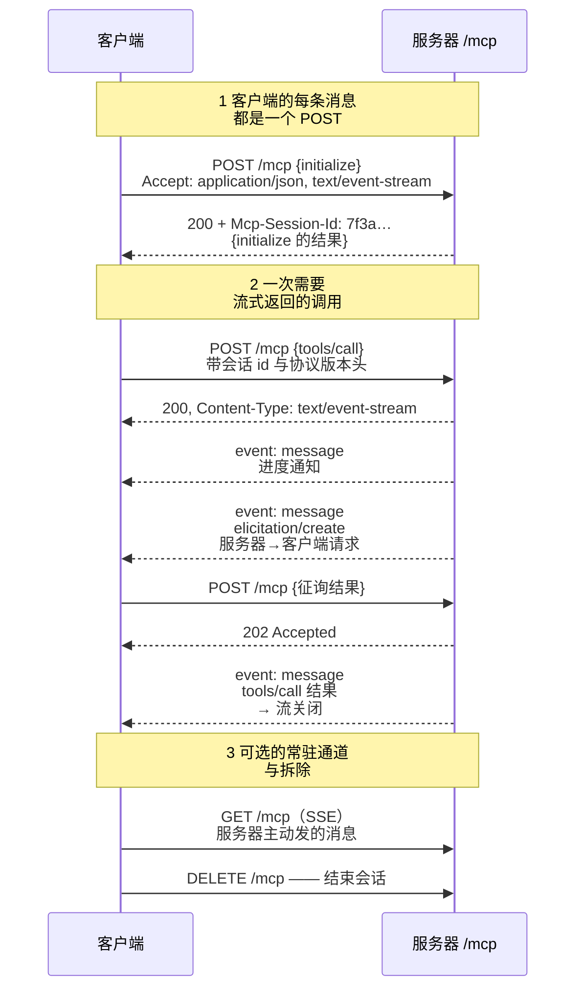

# 深入 03 —— 传输层

> 🇬🇧 English version: [mcp-guide/05-deep-dives/03-transport.md](../../mcp-guide/05-deep-dives/03-transport.md) ｜ 📦 GitHub: <https://github.com/geekchow/mcp-explain>

> **你在哪里：** 第五阶段，五篇深入中的第 3 篇。这一层对 MCP 一无所知。
> **读完本文你会知道：** stdio 和 Streamable HTTP 各自如何给字节分帧、HTTP 传输为什么长成这样、以及各自坏掉时会发生什么——锚定在贯穿示例的第 0 步和第 6 步。

---

## 一、职责回顾

**传输层**掌管投递与分帧：把字节流切成一条条离散的 JSON-RPC 消息，双向皆然。它从不检查方法名。[深入 02](02-mcp-client.md) 里的一切，无论底下换成哪种传输都完全一样——这种无知就是设计目的，也是同一份 `orders-db` 服务器代码今天能作为本地进程部署、下个季度能作为托管服务部署的原因。

在[贯穿示例](../04-running-example.md)中：**第 0 步**创建两个传输；**第 6 步**让 HTTP 那个跑起流式。

---

## 二、内部设计

### 2.1 stdio —— 本地传输

客户端把服务器作为**子进程**拉起，并通过它的管道对话：

```
客户端 stdout ──► 服务器 stdin      请求、通知、对服务器发起请求的响应
客户端 stdin  ◄── 服务器 stdout     响应、通知、服务器发起的请求
                  服务器 stderr ──► 日志，由宿主捕获
```

分帧用的是能用的最简单办法：**一条 JSON 消息一行，以 `\n` 分隔，UTF-8 编码**。因此：

- 一条消息**不得包含裸换行**——要紧凑序列化，永远不要美化打印；
- 服务器**不得向 stdout 写入任何非协议消息**。这是第一次写 MCP 服务器时最常见的 bug：一句多余的 `console.log("connected")` 或者某个库的启动横幅就会污染整条流，客户端随即报出不知从何而来的解析错误。日志请写 **stderr**；
- 没有端口、没有 TLS、没有认证。安全模型就是操作系统的进程边界，加上宿主给它的那套环境和工作目录。

关闭靠约定：客户端关掉服务器的 stdin，等待，然后升级到 `SIGTERM`，最后 `SIGKILL`。写得好的服务器在 stdin 到达文件结尾时就退出——否则宿主崩溃会留下一堆占着数据库连接的孤儿进程。

**什么时候选 stdio：** 能力是本地的（文件、本地数据库、开发服务器）、服务器是每用户一份、或者你想零部署。它是默认选项，也是当今绝大多数真实 MCP 服务器的选择。

### 2.2 Streamable HTTP —— 远程传输

在 `2025-03-26` 修订版引入，取代了更早的双端点 HTTP+SSE 设计。**一个端点**（比如 `/mcp`）处理一切：



*图注：一个 HTTP 端点如何承载一个双向的、流式的 JSON-RPC 会话。*

值得背下来的机制：

| 元素 | 规则 |
|---|---|
| **POST** | 承载一条客户端消息。`Accept` 必须**同时**列出 `application/json` 和 `text/event-stream`，因为选择权在服务器。 |
| **服务器的选择** | 如果答案只有一条消息：`200` + JSON 响应体。如果它需要先流式发进度或发自己的请求：`200` + `text/event-stream`，消息作为 SSE 事件发出，最终响应之后关闭流。 |
| **来自客户端的通知/响应** | 服务器回 `202 Accepted`，无响应体——本来就没什么可答的。 |
| **`Mcp-Session-Id`** | 服务器可选择在 `initialize` 响应上分配；之后客户端必须在每个请求上回带。正是它让有状态会话能跨越多个独立 HTTP 请求存活。 |
| **`MCP-Protocol-Version`** | initialize 之后，客户端在每个请求上带上协商好的版本（`2025-06-18` 起）。服务器据此服务混合版本的客户端。 |
| **`GET /mcp`** | 打开一条长连 SSE 流，用于服务器在任何请求之外主动发起的消息。 |
| **`DELETE /mcp`** | 显式终止会话。 |
| **可恢复性** | SSE 事件可以带 `id`；流断掉之后客户端带 `Last-Event-ID` 重连，服务器重放漏掉的部分。这就是为什么网络抖一下不会让你整场对话重来。 |
| **会话 id 返回 `404`** | 会话过期或被回收了。客户端必须从 `initialize` 重新开始——**不要**重试原来那个调用。 |
| **`Origin` 校验** | 服务器**必须**校验 `Origin` 请求头，本地监听的服务器应绑 `127.0.0.1` 而不是 `0.0.0.0`。没有这一条，你访问的某个网页就能驱动你本地的 MCP 服务器：DNS 重绑定，直接沦陷。 |

无状态也是允许的：服务器可以完全不用 `Mcp-Session-Id`，把每个 POST 当作独立请求处理——这正是 MCP 服务器能跑在负载均衡后面的 Serverless 基础设施上的原因。会话是你在需要按连接保存状态时才选用的特性。

你还会遇到**遗留的 HTTP+SSE 传输**（`2024-11-05` 修订版）：一条 `GET /sse` 流加一个独立的 `POST /messages` 端点。Claude Code 仍通过 `--transport sse` 支持它，你在一些老部署上会见到，但新服务器应该用 Streamable HTTP。

### 2.3 怎么选

| | stdio | Streamable HTTP |
|---|---|---|
| 部署 | 无——一行命令 | 一个服务、TLS、可用性保障 |
| 鉴权 | 进程边界 + 环境变量 | OAuth 2.1（[深入 05](05-auth-and-trust.md)） |
| 用户 | 一个，本地 | 多个，远程 |
| 延迟 | 管道速度 | 网络 |
| 扩缩容 | 每用户一个进程 | 共享，可水平扩展 |
| 失败形态 | 进程死掉 | HTTP 状态码、会话过期 |
| 最适合 | 文件、本地数据库、开发工具 | 共享的公司系统、SaaS 集成 |

两者在规范里都是可选的——你可以定义自定义传输（测试里常用进程内的一对），只要保住 JSON-RPC 的消息语义。

---

## 三、交互契约

向上，传输层只给客户端三样东西，仅此而已：*发这条消息*、*收到了一条消息*、*连接关闭了*。向下，它掌管操作系统或网络资源。客户端的 `id` 表、能力状态和超时全都在这条线之上——这就是为什么换传输不需要改动别处任何一行代码，也是为什么 [examples/orders-db-server](../../mcp-guide/examples/orders-db-server/) 里那个服务器只要改启动处的四行就能套上 HTTP 前端。

---

## 四、⚓ 回到示例

**第 0 步，`orders-db` 走 stdio。** Claude Code 以项目目录为工作目录 fork 出 `node ./tools/orders-db-server/index.js`。Ana 机器上真正看到的第一帧（用 `MCP_DEBUG` 日志抓下来）是长长的一行：

```
{"jsonrpc":"2.0","id":0,"method":"initialize","params":{"protocolVersion":"2025-06-18",…}}
```

服务器的回复也是一行。与此同时，服务器自己的日志——`[orders-db] connected to postgres`——走的是 **stderr**，由宿主捕获，不会被当成协议解析。如果那一行走了 stdout，Ana 的会话会在第 1 步就以 `Unexpected token '[' in JSON` 死掉。

**第 1 步，`payments` 走 HTTP。** 客户端 B 向 `https://payments.internal.acme.com/mcp` POST `initialize`。响应带回 `Mcp-Session-Id: 7f3a91c4…`，客户端 B 之后每个请求都回带它——正是这个请求头，把 Ana 稍后的退款确认，绑回了发起这次退款的那同一个服务端会话。

**第 6 步，流式调用。** 对三笔订单查 `get_charge_status`。每次调用服务器都选了 `text/event-stream`，因为它想上报进度：

```http
POST /mcp HTTP/1.1
Host: payments.internal.acme.com
Accept: application/json, text/event-stream
Content-Type: application/json
Mcp-Session-Id: 7f3a91c4-2f18-4b0f-9a6e-1c2d3e4f5a6b
MCP-Protocol-Version: 2025-06-18
Authorization: Bearer eyJhbGciOi…

{"jsonrpc":"2.0","id":11,"method":"tools/call","params":{"name":"get_charge_status","arguments":{"order_id":"ord_88f21"},"_meta":{"progressToken":"pg-7"}}}
```

```http
HTTP/1.1 200 OK
Content-Type: text/event-stream

id: 1
event: message
data: {"jsonrpc":"2.0","method":"notifications/progress","params":{"progressToken":"pg-7","progress":1,"total":3,"message":"queried gateway"}}

id: 2
event: message
data: {"jsonrpc":"2.0","id":11,"result":{"content":[{"type":"text","text":"charge never captured"}],"structuredContent":{"order_id":"ord_88f21","state":"never_captured","authorized_at":"2026-08-29T04:12:07Z"}}}
```

响应 `id:11` 发出后流即关闭。Ana 的 Wi-Fi 若在这两个事件之间断掉，这次调用也不会丢：客户端 B 带 `Last-Event-ID: 1` 重连，服务器重放事件 2。

**第 7 步，嵌套的请求。** `payments` 在退款过程中发出的 `elicitation/create`，是作为**退款那个 POST 的响应流上的一个 SSE 事件**传过来的。Ana 的回答则作为一个**新的 POST** 发到同一个端点，服务器以 `202 Accepted` 应答。仔细体会：一次逻辑上的交换，用掉了两个方向上的三条 HTTP 消息——这正是普通请求/响应 API 表达不了的东西，也正是 `2025-03-26` 重新设计传输层的原因。

---

## 五、失败行为

| 失败 | stdio | Streamable HTTP |
|---|---|---|
| 对端消失 | 管道关闭 / 子进程退出 → 会话死亡，在途请求失败 | 连接重置或 `5xx` → 同上 |
| 帧被污染 | 多余的 stdout 输出 → 解析错误；**那个**经典 bug | SSE 事件畸形 → 客户端丢弃，可能重连 |
| 对端很慢 | 管道反压 | HTTP 超时、keep-alive、进度通知 |
| 会话丢失 | 没有这个概念——进程死亡**就是**会话死亡 | 会话 id 返回 `404` → 客户端重新 `initialize` |
| 网络抖动 | 不适用 | `Last-Event-ID` 恢复，重放漏掉的事件 |
| 本地恶意调用方 | 不适用（没有端口） | DNS 重绑定——用 `Origin` 校验 + 绑定 `127.0.0.1` 缓解 |
| 僵尸服务器 | 客户端逐级升级：关 stdin → `SIGTERM` → `SIGKILL` | `DELETE /mcp`，外加服务端会话过期 |

---

## 📦 配套代码仓库

本文是一个开源指南系列的一部分。整个系列、全部图表源码，以及一个可以直接让 Claude Code 连上去的**可运行 MCP 服务器**，都在同一个仓库里：

### → https://github.com/geekchow/mcp-explain

| | |
|---|---|
| 本页源文件 | [`mcp-guide-zh/05-deep-dives/03-transport.md`](https://github.com/geekchow/mcp-explain/blob/main/mcp-guide-zh/05-deep-dives/03-transport.md) |
| 英文原版 | [`mcp-guide/05-deep-dives/03-transport.md`](https://github.com/geekchow/mcp-explain/blob/main/mcp-guide/05-deep-dives/03-transport.md) |
| 可运行示例服务器 | [`mcp-guide/examples/orders-db-server`](https://github.com/geekchow/mcp-explain/tree/main/mcp-guide/examples/orders-db-server) |
| 系列起点 | [`mcp-guide-zh/00-overview.md`](https://github.com/geekchow/mcp-explain/blob/main/mcp-guide-zh/00-overview.md) |

欢迎指正——如果某个协议细节随新版本发生了变化，欢迎提 issue。

→ 下一篇：[04-mcp-server.md](04-mcp-server.md) · ↑ 返回[概念地图](../03-concept-map.md) · ⚓ [贯穿示例](../04-running-example.md)
