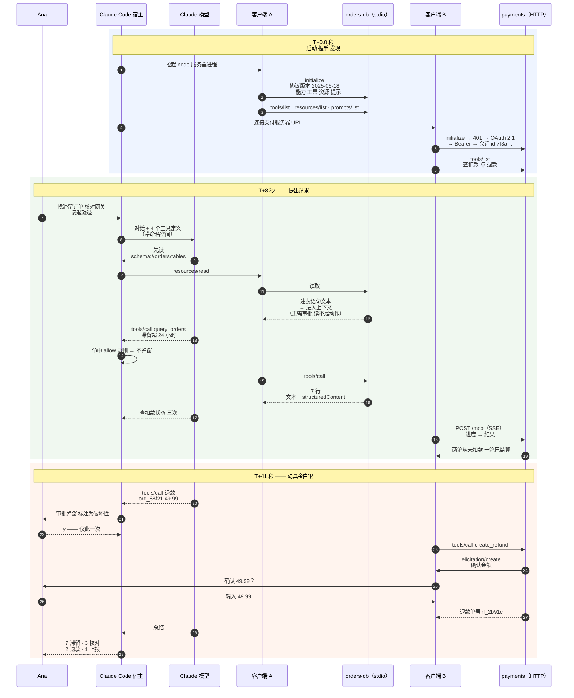

# 第六阶段 完整走查：滞留订单排查，端到端

> 🇬🇧 English version: [mcp-guide/06-walkthrough.md](../mcp-guide/06-walkthrough.md) ｜ 📦 GitHub: <https://github.com/geekchow/mcp-explain>

> **你在哪里：** 六个阶段中的第六阶段，主干的最后一篇。
> **读完本文你会知道：** Ana 那个请求穿过全部五个组件的完整路径，全深度、一气呵成——本系列的每一个概念都会被看见在干它的活。

下面的一切此前都已介绍过：[宿主](05-deep-dives/01-host-claude-code.md)、[客户端](05-deep-dives/02-mcp-client.md)、[传输层](05-deep-dives/03-transport.md)、[服务器](05-deep-dives/04-mcp-server.md)、[授权层](05-deep-dives/05-auth-and-trust.md)。这一篇负责把它们缝起来。

---

## 标注了真实数据的全景图



*图注：贯穿示例，每一跳都标上了真实数据——第三阶段那张协作图，现在具体了。*

---

## 全深度的故事

### T+0.0 秒 —— 启动与两次握手

Ana 在 `~/work/shop-backend` 敲下 `claude`。**宿主**读取 `.mcp.json`，找到 `orders-db` 和 `payments`，这个项目此前已被信任，于是创建两个**客户端**。

**客户端 A** 拉起 `node ./tools/orders-db-server/index.js`，把 Ana shell 里的 `ORDERS_DATABASE_URL` 展开后注入子进程环境，并向它的 stdin 写入一行：

```
{"jsonrpc":"2.0","id":0,"method":"initialize","params":{"protocolVersion":"2025-06-18","clientInfo":{"name":"claude-code"},"capabilities":{"roots":{"listChanged":true},"sampling":{},"elicitation":{}}}}
```

服务器自己的启动日志——`[orders-db] connected to postgres (read-only role)`——走 **stderr**，它该待的地方；这行字只要有一个字符落到 stdout，这一帧就被污染，会话当场死亡。回复里声明了 `tools`、`resources`、`prompts`，还有一段 `instructions` 字符串，被 Claude Code 放进模型的上下文：*"对商城订单数据库的只读访问。探索性问题优先用 query_orders，不要用 get_order。"*

**客户端 B** 把同样的 `initialize` POST 到 `https://payments.internal.acme.com/mcp`，被 `401` 连同一个指向受保护资源元数据的 `WWW-Authenticate` 头挡回。发现、PKCE、浏览器、同意页、受众被绑定到那个确切 URL 的令牌、重放。服务器分配 `Mcp-Session-Id: 7f3a91c4…`，客户端 B 之后每个请求都会回带它——包括四十秒之后那个放行退款的确认。

两条会话上的发现产出了合并目录：

```
$ /mcp
  orders-db   ✔ 已连接 (stdio)  query_orders, get_order · schema://orders/tables · /mcp__orders-db__triage-stuck-orders
  payments    ✔ 已连接 (http)   get_charge_status, create_refund · ana@acme.com
```

### T+8 秒 —— 提出请求，以及"先读再动"

```
> 找出在 PENDING_PAYMENT 状态超过 24 小时的订单，逐笔到网关核对扣款状态，
  对网关显示从未扣款成功的那些发起退款。每次退款前先问我。
```

宿主把对话和四个工具定义发给模型。模型的第一步动作不是查询，而是对 `schema://orders/tables` 发起 `resources/read`——因为猜错一个字段名要赔上一次失败调用，而读是免费的。客户端 A 发出请求；处理函数返回建表语句；它进入上下文。**没有弹出审批**，这是设计决定而非疏漏：资源按定义就是只读的，所以闸门留给动作。

接着是查询。模型发出：

```json
{"name":"mcp__orders-db__query_orders",
 "input":{"status":"PENDING_PAYMENT","older_than_hours":24,"limit":50}}
```

宿主的**审批闸门**开始跑：没有 deny 规则；模式是 `default`；`permissions.allow` 里有 `mcp__orders-db__query_orders`，那是 Ana 当初对这个只读工具选"始终允许"留下的。不弹窗。客户端 A 以 `id:4` 发出 `tools/call`；SDK 在处理函数运行前校验参数；处理函数在只读连接上执行一条参数化 SQL，返回：

```json
{"content":[{"type":"text","text":"7 orders in PENDING_PAYMENT older than 24h:\n  ord_88f21  49.99 EUR  31h  created 2026-08-29T04:12Z\n  ord_88e04  17.50 EUR  29h  …"}],
 "structuredContent":{"count":7,"orders":[{"order_id":"ord_88f21","amount_cents":4999,"currency":"EUR","age_hours":31,…}]}}
```

### T+22 秒 —— 跨越边界，进入另一个团队的系统

模型挑出最老的三笔，逐笔调用 `mcp__payments__get_charge_status`。客户端 B 把每次调用连同 `Mcp-Session-Id`、`MCP-Protocol-Version`、`Authorization: Bearer …` 和一个 `_meta.progressToken` 一起 POST 出去。支付服务器选择了 `text/event-stream`，因为第三方网关查询要好几秒；进度通知作为 SSE 事件到达，Claude Code 把它们实时显示在运行中的工具下方，客户端 B 每收到一条就把超时往后推。

结果：`ord_88f21` → `never_captured`。`ord_88e04` → `never_captured`。`ord_87ff2` → `captured_and_settled`。模型在这些证据上推理——第三笔**根本不是**支付滞留，它是一笔已结算的扣款配上一行过期的订单记录，退款是错的。它把这笔留给人处理。这个判断不是 MCP 做的；MCP 只是让证据可得，推理是模型做的。这种分工正是这个协议的意义。

### T+41 秒 —— 钱前面的两道闸门

模型发出：

```json
{"name":"mcp__payments__create_refund",
 "input":{"order_id":"ord_88f21","amount_cents":4999,
          "reason":"charge never captured; customer waiting 31h"}}
```

**第一道闸门，宿主侧。** 没有 allow 规则命中，工具带着 `destructiveHint: true` 标注，Claude Code 让整个循环停下：

```
  ⏵ payments — create_refund
    { "order_id": "ord_88f21", "amount_cents": 4999,
      "reason": "charge never captured; customer waiting 31h" }
    ⚠ 服务器将此工具标注为破坏性操作

  是否允许？  [y] 本次允许   [a] 始终允许   [n] 拒绝
```

Ana 读了参数——这也正是她能抓住数据外泄或金额错误的地方——然后按 `y`。**仅此一次。**

**第二道闸门，服务器侧。** 客户端 B 发出调用。处理函数自己重新去网关核对（绝不相信模型关于扣款状态的说法），然后通过那条打开着的会话反向发出**它自己的请求**：`elicitation/create`，作为退款 POST 的响应流上的一个 SSE 事件送达。它之所以合法，只因为客户端 B 在 T+0.0 秒声明了 `elicitation` 能力。宿主把它渲染出来：

```
  payments 询问：确认为 ord_88f21 退款 49.99 EUR？
  confirm_amount ▸ 49.99
```

Ana 输入金额。答案作为一个**新的 POST** 发回同一个端点，服务器以 `202 Accepted` 应答，处理函数这才带着幂等键调用网关。原来那次 `tools/call` 的响应终于沿着仍然打开的 SSE 流到达，流随即关闭，支付服务写下一行审计记录，署名是 **ana@acme.com**——不是"Claude"，不是"claude-code"，而是那个用自己的令牌授权了这件事的人。

同样的过程在 `ord_88e04` 上再来一遍。然后模型写道：

```
  已检查 7 笔在 PENDING_PAYMENT 滞留超过 24 小时的订单，并对最老的 3 笔核对了网关。

  • ord_88f21 —— 49.99 EUR，31 小时，从未扣款 → 已退款（rf_2b91c）
  • ord_88e04 —— 17.50 EUR，29 小时，从未扣款 → 已退款（rf_2b91d）
  • ord_87ff2 —— 82.00 EUR，26 小时，已扣款且已结算 → 未退款；这是订单记录过期，
    不是支付出问题。需要走财务冲正流程，不能用 create_refund。

  还有 4 笔滞留订单未核对（26 小时及更新）。需要我继续处理吗？
```

总计：约 70 秒、两次审批、一次确认，以及双侧各一份审计记录。

---

## 每个组件到底贡献了什么

| 组件 | 它在这个故事里唯一的贡献 |
|---|---|
| **宿主**（Claude Code） | 读配置、拉起/连接两个服务器、给四个工具加命名空间、跑了两次审批闸门、渲染服务器的征询、把结果控制在上下文预算内 |
| **客户端**（A 与 B） | 两条独立会话：版本与能力协商、在交错请求间按 id 关联、按进度延长超时，以及把一个**服务器发起的请求**路由给人类 |
| **传输层** | A 用 stdio 管道（以及那条保住会话的 stderr 纪律）；B 用 Streamable HTTP + SSE、会话 id 和断点续传 |
| **服务器** | 类型化、有描述、有标注的能力；执行前校验；最底层的只读授权；动钱之前独立确认一次；写给模型看、便于它自行恢复的错误 |
| **授权层** | 把"Claude Code 在调用"变成"Ana 在调用"，用受众绑定的令牌，加上一次模型永远无法影响的下游角色检查 |

---

## 收尾——回到第一阶段

[01-why](01-why.md) 提出了那个问题：支付团队希望自己的能力能在 IDE、聊天客户端和夜间 Agent 里都被用到，退款要有人把关，而且要按自己的节奏发布——在 MCP 之前，这意味着 N×M 个定制集成，一个都不可被发现，一个都没有共同的权限模型。

在这次走查里，支付团队只发布了**一个**服务器。Ana 的 Claude Code 在运行时发现了它的工具，Claude Code 没改一行代码，也没发布任何插件。那次退款被把关了两次——一次由宿主代表人类，一次由服务器代表支付系统——并以 Ana 的真实身份留下了审计。明天，夜间 Agent 连上同一个 URL，协商出同样的能力，得到同样的保证，而 `create_refund` 会在它的 `deny` 名单里，因为那个点没有人醒着可以审批。

这就是全部的价值主张，而你现在已经见过交付它的每一个组件。

---

## 📦 配套代码仓库

本文是一个开源指南系列的一部分。整个系列、全部图表源码，以及一个可以直接让 Claude Code 连上去的**可运行 MCP 服务器**，都在同一个仓库里：

### → https://github.com/geekchow/mcp-explain

| | |
|---|---|
| 本页源文件 | [`mcp-guide-zh/06-walkthrough.md`](https://github.com/geekchow/mcp-explain/blob/main/mcp-guide-zh/06-walkthrough.md) |
| 英文原版 | [`mcp-guide/06-walkthrough.md`](https://github.com/geekchow/mcp-explain/blob/main/mcp-guide/06-walkthrough.md) |
| 可运行示例服务器 | [`mcp-guide/examples/orders-db-server`](https://github.com/geekchow/mcp-explain/tree/main/mcp-guide/examples/orders-db-server) |
| 系列起点 | [`mcp-guide-zh/00-overview.md`](https://github.com/geekchow/mcp-explain/blob/main/mcp-guide-zh/00-overview.md) |

欢迎指正——如果某个协议细节随新版本发生了变化，欢迎提 issue。

→ 下一篇：[07-next-steps.md](07-next-steps.md) · ↑ 返回[总览](00-overview.md)
