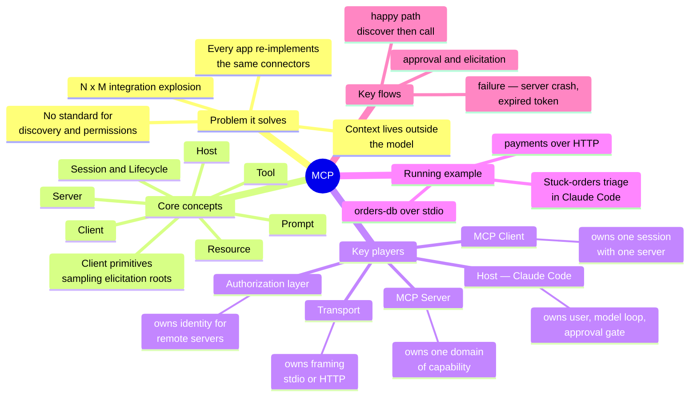

# MCP (Model Context Protocol，模型上下文协议) — A Learning Guide

> **Where you are:** the entry point of the pack.
> **After this file you will know:** what the pack covers, the whole territory in one mindmap, and the order to read it in.

This pack explains **MCP (Model Context Protocol)** by reconstructing *why it had to be invented*, then descending into each moving part — with one realistic piece of work in **Claude Code** as the spine of the whole story.

---

## 缩写对照表 — Abbreviation glossary

| Abbreviation | Full English name | What it means here |
|---|---|---|
| MCP | Model Context Protocol | The protocol this guide is about: a standard way for LLM applications to talk to external tools and data |
| LLM | Large Language Model | The model doing the reasoning (Claude, in our example) |
| JSON-RPC | JavaScript Object Notation — Remote Procedure Call | The message format MCP is built on (version 2.0) |
| API | Application Programming Interface | A program-callable interface exposed by some service |
| SDK | Software Development Kit | The official MCP libraries (TypeScript, Python, …) that implement the protocol for you |
| CLI | Command-Line Interface | The `claude` command you type in a terminal |
| stdio | Standard Input / Standard Output | The local transport: server runs as a child process, messages flow over its stdin/stdout |
| HTTP | HyperText Transfer Protocol | The remote transport's carrier |
| SSE | Server-Sent Events | HTTP streaming format MCP uses to push server→client messages |
| URI | Uniform Resource Identifier | How MCP names a resource, e.g. `schema://orders/tables` |
| OAuth | Open Authorization | The authorization framework (version 2.1) remote MCP servers use |
| RPC | Remote Procedure Call | Calling a function that runs in another process/machine |
| SQL | Structured Query Language | The query language our example server speaks to its database |
| TLS | Transport Layer Security | Encryption for the HTTP transport |
| PKCE | Proof Key for Code Exchange | An OAuth extension that protects the authorization-code flow |
| CI | Continuous Integration | Automated build/test pipeline |

---

## The whole territory in one glance

*Caption: every concept, component, and flow this pack covers — hold this map in mind before descending anywhere.*

---

## Reading order

| # | File | Stage | What you get |
|---|---|---|---|
| 1 | [01-why.md](01-why.md) | WHY | The pain before MCP; why plugins/function-calling alone were not enough |
| 2 | [02-what.md](02-what.md) | WHAT | One-sentence definition, boundaries, position in the ecosystem |
| 3 | [03-concept-map.md](03-concept-map.md) | CONCEPT MAP | All concepts + key players + how they coordinate |
| 4 | [04-running-example.md](04-running-example.md) | RUNNING EXAMPLE | The stuck-orders triage, traced shallowly |
| 5 | [05-deep-dives/](05-deep-dives/) | DEPTH | One dive per key player, each anchored back to the example |
| 6 | [06-walkthrough.md](06-walkthrough.md) | WALKTHROUGH | The same example re-run end to end at full depth |
| 7 | [07-next-steps.md](07-next-steps.md) | — | Exercises, source entry points, further reading |
| — | [examples/](examples/) | — | A **runnable** MCP server + Claude Code config used by the example |

Read 01→06 in order the first time. Afterwards, each deep dive stands alone — it recaps its component and re-anchors to the example.

---

## A note on protocol versions

MCP is versioned by date string. This guide describes the protocol as of revision **`2025-06-18`**, which is what current Claude Code and the official SDKs negotiate by default; where a behavior arrived in a specific revision (Streamable HTTP in `2025-03-26`, elicitation and structured tool output in `2025-06-18`) the text says so. Later revisions exist and add features, but every concept in this pack is stable across them. When a detail matters for your build, check `modelcontextprotocol.io` for the revision your SDK negotiates — and check the `protocolVersion` your own handshake actually returns (see [the client dive](05-deep-dives/02-mcp-client.md)).

→ Next: [01-why.md](01-why.md)
