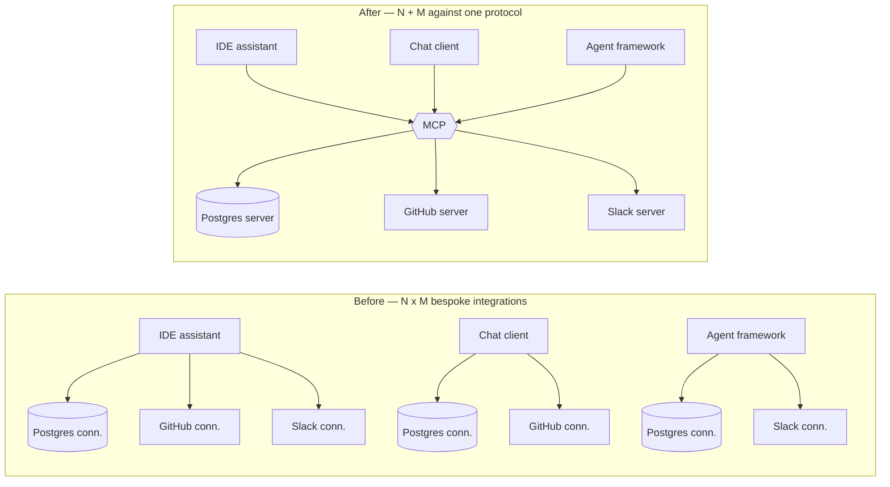

# Stage 1 — WHY: the problem MCP solves

> **Where you are:** stage 1 of 6, before any definition.
> **After this file you will know:** what building an AI integration felt like before MCP, why the obvious predecessors were not enough, and which constraints forced MCP's shape. You should finish able to say *"if MCP didn't exist, someone would have to invent it"*.

---

## 1. The world before

An LLM (Large Language Model) is a text-in / text-out function. It knows nothing about your Postgres database, your Jira board, your payment gateway, or the file you edited ninety seconds ago. Every useful AI application is therefore, underneath, a **context-plumbing** application: fetch the right data, describe the available actions, run the ones the model picks, feed results back.

Around 2023–2024 the industry converged on **tool calling** (also marketed as *function calling*): you hand the model a list of JSON-schema-typed functions, it emits a call, *your application* executes it. That solved the model-side half of the problem. It did nothing for the application-side half, and the application-side half is where the work is.

Concretely, before MCP:

**The integration lived inside the app.** If you wanted Claude in your IDE to read Postgres, you wrote a Postgres connector into the IDE plugin. If your teammate wanted the same in a chat app, they wrote it again, in another language, with another auth story. The connector could not move.

**The N×M explosion.** With *N* AI applications (IDE assistant, chat client, agent framework, internal copilot) and *M* systems to reach (Postgres, GitHub, Slack, Sentry, an internal payments service), the ecosystem needed N×M bespoke integrations. Each one duplicated the same five problems: discovery ("what can I do?"), schemas, invocation, error reporting, and credentials.

**No discovery at runtime.** Tool lists were compiled into the app. Adding a capability meant shipping a new version of the *client*, not the *integration*. A team that owned a service could not simply publish "here is how an AI agent talks to us" and be done.

**Permissions were ad-hoc.** Every app invented its own way to ask "may I run this?", its own idea of which calls are dangerous, and its own place to store secrets — usually the app's config file, which then held credentials for M systems.

**Context was copy-paste.** In practice, huge amounts of real-world usage was humans pasting a schema, a log excerpt, a stack trace into a chat window, because there was no protocol for the model's host to *go get it*.



*Caption: why the pain was quadratic, and what collapsing it to linear requires — one protocol in the middle.*

---

## 2. Why the existing answers were not enough

| Predecessor | What it gave | Where it fell short |
|---|---|---|
| **Raw tool / function calling** (model APIs) | A model-side convention for emitting a typed call | Says nothing about *where tools come from*, how they are discovered, who executes them, or how they are permissioned. Every host still writes every integration. |
| **ChatGPT Plugins / OpenAPI descriptions** | Runtime discovery of remote HTTP APIs | Vendor-specific and one-directional: an HTTP API cannot ask the client anything, cannot stream progress into the conversation, and cannot serve *read-only context* distinct from *actions*. Nothing for local resources (files, a local database) either. |
| **LangChain-style tool abstractions** | A shared vocabulary *within one framework* | An in-process library abstraction, not a wire protocol. A tool written for one framework/language is unusable from another host, and there is no process boundary to isolate credentials or blast radius. |
| **Language Server Protocol (LSP)** | Proof that a JSON-RPC protocol collapses an N×M editor/language problem | Built for a different domain (code intelligence for editors), not for model-driven capability discovery, human approval, or agentic loops. But it is MCP's direct spiritual ancestor — and the shape of the answer. |
| **Bare REST/gRPC APIs** | Everything a service already exposes | Written for programmers, not for models: no natural-language descriptions, no uniform "list what you can do", no distinction between "safe to read" and "destroys money", no notion of a conversational session. |

The gap is precise: everyone had a way to *execute* a tool, and no one had a way to *distribute* one.

---

## 3. Constraints that shaped the solution

MCP's design is not arbitrary — each of these constraints leaves a visible fingerprint on it (the file in brackets is where you will see the fingerprint):

1. **Local-first must be as good as remote.** A huge share of real work is against local things: a working directory, a local database, a running dev server. So the protocol must run over a plain child process, with no ports, no TLS, no auth server. → *stdio transport* [the transport dive](05-deep-dives/03-transport.md)
2. **Remote and multi-tenant must also work.** Enterprises need a hosted server serving many users with real identity. → *Streamable HTTP transport + OAuth 2.1* [the transport dive](05-deep-dives/03-transport.md), [the auth dive](05-deep-dives/05-auth-and-trust.md)
3. **Discovery at runtime, not compile time.** Adding a capability must not require shipping a new host. → *`tools/list`, `resources/list`, `prompts/list` + `list_changed` notifications* [the server dive](05-deep-dives/04-mcp-server.md)
4. **The human stays in the loop.** Models will be wrong; some calls move money. The protocol must leave room for an approval gate the *host* owns, and must let servers mark which calls are destructive. → *tool annotations + host approval* [the host dive](05-deep-dives/01-host-claude-code.md)
5. **Bidirectional, not request/response.** A server may need to ask the *client* something — for a model completion (*sampling*), for a missing input (*elicitation*), for the user's working directories (*roots*). A plain REST API cannot do this. → *JSON-RPC in both directions* [the client dive](05-deep-dives/02-mcp-client.md)
6. **Transport-agnostic and language-agnostic.** The wire format must be trivially implementable anywhere. → *JSON-RPC 2.0, newline-framed or SSE-framed*
7. **Small enough to implement in an afternoon.** Adoption is the entire point; a protocol nobody implements solves nothing. A minimal useful server is ~40 lines with an SDK — see [examples/orders-db-server](examples/orders-db-server/).

---

## 4. The test

Suppose MCP did not exist and you were handed this task:

> "Our payments team wants Claude — in the IDE, in the chat app, and in the nightly agent — to be able to check a charge's status and issue a refund, with refunds requiring a human OK. The payments team should own that integration and ship it independently."

You would end up inventing: a way to *describe* the two operations with typed inputs, a way for any client to *list* them at runtime, a wire format that works both for a local process and a hosted service, a flag saying "refund is destructive so ask a human", and a way for the payments service to ask the user a follow-up question. That is MCP.

That task is not hypothetical here — it is the running example this whole pack is built on.

---

## 📦 Source repository

This page is one part of an open guide pack. The whole serial — every diagram source, and a **runnable MCP server** you can point Claude Code at — lives in one repository:

### → https://github.com/geekchow/mcp-explain

| | |
|---|---|
| This page's source | [`mcp-guide/01-why.md`](https://github.com/geekchow/mcp-explain/blob/main/mcp-guide/01-why.md) |
| Runnable example server | [`mcp-guide/examples/orders-db-server`](https://github.com/geekchow/mcp-explain/tree/main/mcp-guide/examples/orders-db-server) |
| Start of the serial | [`mcp-guide/00-overview.md`](https://github.com/geekchow/mcp-explain/blob/main/mcp-guide/00-overview.md) |

Clone it and follow along:

```bash
git clone https://github.com/geekchow/mcp-explain.git
cd mcp-explain/mcp-guide/examples/orders-db-server && npm install && node index.js
```

Corrections are welcome — open an issue if a protocol detail has drifted with a newer MCP revision.

→ Next: [02-what.md](02-what.md) · ↑ back to [00-overview.md](00-overview.md)
