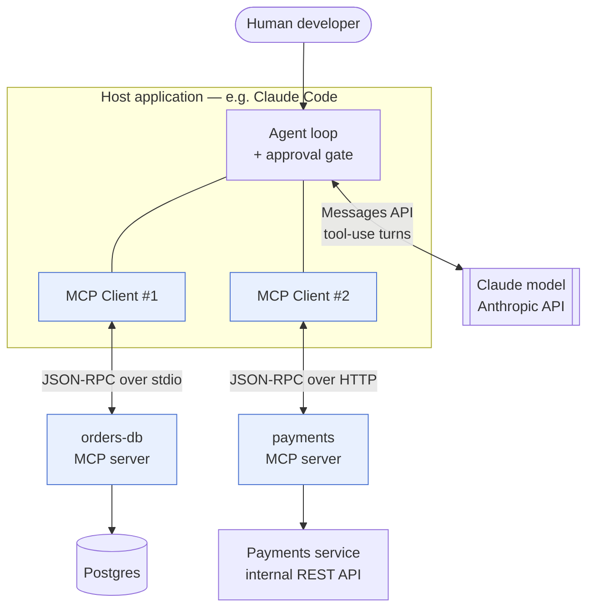

# Stage 2 — WHAT: definition, boundaries, ecosystem position

> **Where you are:** stage 2 of 6. You know the pain; now the definition.
> **After this file you will know:** what MCP *is* in one sentence, what it deliberately is **not**, and where it sits relative to the model API, the agent framework, and the services underneath.

---

## 1. One-sentence definition

> **MCP (Model Context Protocol，模型上下文协议) is an open, JSON-RPC 2.0-based client–server protocol that collapses the N×M integration problem by letting any AI application discover and use any external capability at runtime — through three server-offered primitives (tools, resources, prompts) and three client-offered ones (sampling, elicitation, roots) — over a local stdio or remote HTTP transport.**

Unpacking, in the order the words matter:

- **open protocol, not a product** — a spec plus SDKs (Software Development Kits); there is no MCP company you buy from.
- **client–server** — the AI application is the client; each integration is a server. A server is a small program, not necessarily a network service.
- **JSON-RPC 2.0** — a boring, long-settled message format: `{"jsonrpc":"2.0","id":1,"method":"tools/call","params":{…}}`. Chosen so any language can speak it in an hour.
- **at runtime** — the client asks "what can you do?" *after* connecting; nothing is compiled in.
- **six primitives** — three things a server offers a client (tools, resources, prompts), three things a client offers a server (sampling, elicitation, roots). This symmetry is what makes MCP bidirectional rather than a fancy REST (Representational State Transfer) API.
- **two transports** — stdio for local, Streamable HTTP for remote. Everything above the transport line is identical.

If you remember one sentence, remember: **MCP is USB-C for AI applications** — one connector shape, so any host plugs into any capability. (The analogy is the project's own, and like all analogies it leaks: unlike USB-C, MCP carries *trust* decisions too, which is why a large share of the depth in this pack is about permissions.)

---

## 2. Boundaries — what MCP is not

Getting these wrong is the source of most MCP misuse:

| MCP is **not** | Why people think it is | What it actually means |
|---|---|---|
| **…an agent framework** | It shows up in agent products | MCP has no planning loop, no memory, no orchestration. It never decides *which* tool to call — the host's model does. MCP only makes the tool *available and callable*. |
| **…a model API** | It's "for AI" | It never talks to a model. Claude's API is a separate thing that the host calls. A server can *ask* the host to run a completion (sampling), but MCP itself carries no model. |
| **…a replacement for your REST or gRPC API** | It exposes operations | It is an *adapter layer in front of* your API, shaped for a model's consumption: natural-language descriptions, coarse-grained operations, safety annotations. Your service keeps its real API. |
| **…an authentication system** | Remote servers need auth | MCP *delegates* to OAuth 2.1 for HTTP transports and to the operating system's process boundary for stdio. It specifies how to use them, not a new scheme. |
| **…a data-sync or streaming pipeline** | `resources/subscribe` exists | Resources are for reading context on demand, not for pushing a firehose. Bulk or continuous data belongs in your data platform; MCP fetches the slice a conversation needs. |
| **…a sandbox** | It sits between model and system | A server runs with whatever privileges you gave it. Isolation is the *host's* and the *deployer's* job. This is the single most important row in this table — see [the auth & trust dive](05-deep-dives/05-auth-and-trust.md). |
| **…RPC for humans** | It's an RPC protocol | Operation granularity should match a *task*, not a database row. `query_orders(status, older_than)` beats exposing raw `SELECT`. |

---

## 3. Position in the ecosystem

*Caption: what MCP sits between — the highlighted boxes are MCP; the model API and the underlying services are not.*

**Below MCP:** JSON-RPC 2.0, and under that a transport (a child process's stdin/stdout, or HTTP + SSE + TLS). Under a server: whatever it wraps — a database driver, a REST client, a filesystem.

**Above MCP:** the host application (Claude Code, Claude Desktop, an IDE extension, an agent built on the Claude Agent SDK) and, above that, the model that decides what to call.

**Neighbors, one line each:**

| Neighbor | Relationship |
|---|---|
| **Model tool-calling / function-calling** | Complementary, one layer up. Tool calling is *how the model expresses intent*; MCP is *how the host obtained that tool in the first place*. Every MCP tool becomes an ordinary entry in the model's tool list. |
| **LSP (Language Server Protocol，语言服务器协议)** | The template. Same JSON-RPC shape, same "collapse N×M" motivation, different domain (editors ↔ languages vs. AI hosts ↔ capabilities). |
| **OpenAPI** | Overlapping but different audience. OpenAPI describes an HTTP API for programmers; MCP describes capabilities for a model, adds discovery/session/approval semantics, and covers local processes. Generating an MCP server *from* an OpenAPI spec is common — and then hand-editing it, because one-tool-per-endpoint servers overwhelm a model's context. |
| **Agent-to-agent protocols** | Different axis. MCP connects an agent *downward* to capabilities; agent-to-agent protocols connect agents *sideways* to peers. They compose. |
| **Claude Code plugins / skills / subagents** | Host-local extension mechanisms — they change how *Claude Code* behaves. MCP adds *external capabilities* usable by any host. A plugin can bundle an MCP server; they are not rivals. |

---

## 4. Am I in the right place?

Use MCP when: a capability must be reachable from **more than one** AI host; or the team that owns the underlying system should own the integration and ship it on its own cadence; or you need a process/network boundary between the model's host and the credentials.

Do not reach for MCP when: the logic is a private helper inside one application (just write a function); or you need high-throughput data movement (use your data pipeline); or the "tool" is really a prompt-shaped workflow inside one host (a Claude Code skill or subagent is lighter).

→ Next: [03-concept-map.md](03-concept-map.md) · ↑ back to [00-overview.md](00-overview.md)
