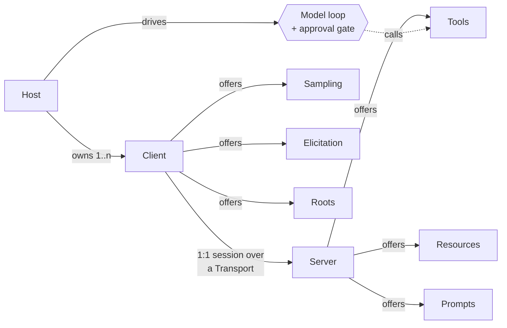
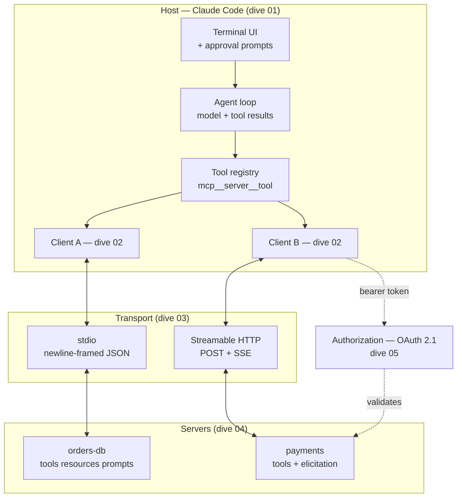
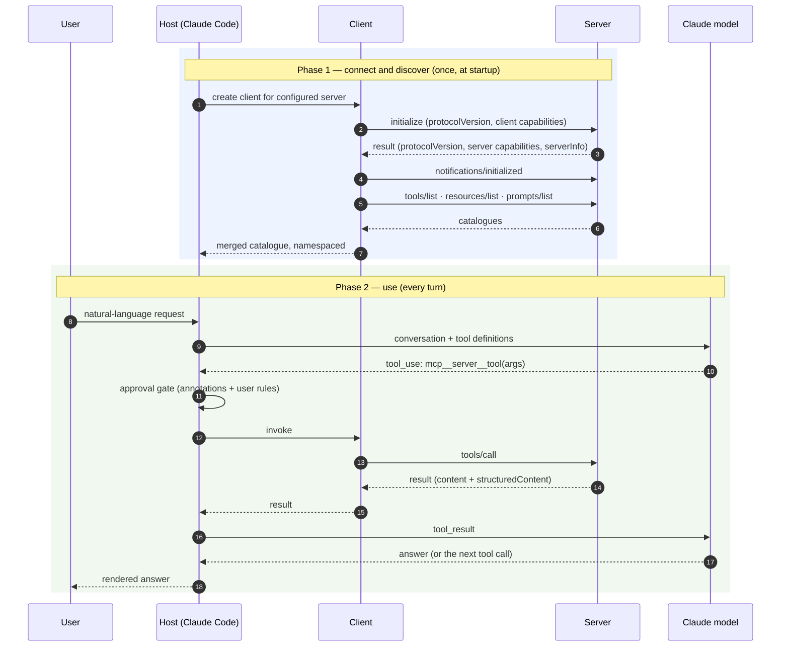

# Stage 3 — CONCEPT MAP: the whole territory, breadth first

> **Where you are:** stage 3 of 6 — the map before the descent.
> **After this file you will know:** every core MCP concept, every key player component (with what each owns, knows, and refuses to do), and how they coordinate end to end. No internals yet — that is stage 5.
> **Quality bar:** you should finish able to sketch the architecture on a whiteboard and justify each box.

---

## 3.1 Domain mapping — from problem to concepts

MCP takes the messy real-world problem from [01-why](01-why.md) and maps it onto eight concepts. Read them top to bottom: each one only uses terms already defined above it.

| Real-world problem element | MCP concept | One-line definition | Why this abstraction |
|---|---|---|---|
| "The AI application the human is actually using" | **Host** | The program that owns the user interaction, the model conversation, and the security decisions | Someone must be accountable to the human. Making that a named role keeps approval and credential policy in *one* place rather than in every integration |
| "One connection to one integration" | **Client** | A protocol connector inside the host that maintains exactly one session with exactly one server | 1:1 pairing means a misbehaving server cannot see or corrupt another server's session; isolation is structural, not a rule |
| "The integration the capability-owning team ships" | **Server** | A standalone program that exposes one domain's capabilities over MCP | Decouples release cycles: the payments team ships the payments server without touching Claude Code |
| "A connected conversation with negotiated features" | **Session & lifecycle** | An initialize → operate → shut-down span with an agreed protocol version and capability set | Two independently versioned programs must agree on what they both support *before* the first real call, or every call needs feature detection |
| "An action with consequences" | **Tool** | A named, JSON-schema-typed operation the model may invoke, with a human-readable description and safety annotations | The model needs types to call correctly and prose to choose correctly; the host needs annotations to know what to gate |
| "Reference material to read" | **Resource** | Addressable read-only content identified by a URI (e.g. `schema://orders/tables`), listable and fetchable | Separating "read this" from "do this" lets the host cache it, let the *user* attach it explicitly, and skip approval — reads are not actions |
| "A known-good way to ask for something" | **Prompt** | A named, parameterized message template the server offers, surfaced to the user as a command | Server authors know the good phrasing for their domain better than the model does; a prompt ships that expertise with the integration |
| "The server needs something back from the client" | **Client primitives:** sampling, elicitation, roots | Server→client requests: run a model completion (*sampling*), ask the user for structured input (*elicitation*), list the user's working directories (*roots*) | Keeps the model and the human on the *host* side. A server never holds an API key for a model and never renders its own UI |

Two derived concepts you will meet later but should not confuse with the core eight: **notification** (a JSON-RPC message with no `id`, so no reply — used for `list_changed`, progress, cancellation, logging) and **capability** (the flags exchanged at initialize that say which of the above a peer supports).



*Caption: which concept belongs to whom — servers offer three primitives outward, clients offer three back.*

---

## 3.2 Key players — the components, and the table of contents for stage 5

Five components do the work. Each gets exactly one deep dive in [05-deep-dives/](05-deep-dives/), in the order they first appear in the running example.

### 1. Host — Claude Code → [dive 01](05-deep-dives/01-host-claude-code.md)

- **Owns:** the human relationship. Server configuration and lifecycle, the model conversation, the tool namespace, and — critically — the **approval gate** in front of every tool call.
- **Knows:** which servers are configured and at what scope, the merged tool/resource/prompt catalogue across all servers, the user's permission rules, the conversation so far.
- **Does not do:** talk MCP itself. It never writes a JSON-RPC frame; it delegates each connection to a Client. It also never decides *what a tool means* — that is the server's business.

### 2. MCP Client → [dive 02](05-deep-dives/02-mcp-client.md)

- **Owns:** one session with one server: the initialize handshake, capability negotiation, request/response correlation by `id`, notifications, cancellation, timeouts, and serving the client-side primitives back to the server.
- **Knows:** the negotiated protocol version, the server's declared capabilities, in-flight request ids, the server's advertised catalogue.
- **Does not do:** multiplex. One client, one server — never a connection pool across servers. It also does not interpret content or ask the user anything; it hands both up to the Host.

### 3. Transport → [dive 03](05-deep-dives/03-transport.md)

- **Owns:** getting bytes across, framed as discrete JSON-RPC messages: process spawn and pipes (stdio) or HTTP requests, SSE streams, and session identity (Streamable HTTP).
- **Knows:** how a message begins and ends, and — for HTTP — the session id and the last event id for resumption.
- **Does not do:** understand a single MCP method name. Swap stdio for HTTP and every layer above is unchanged; that indifference is the design.

### 4. MCP Server → [dive 04](05-deep-dives/04-mcp-server.md)

- **Owns:** one domain's capabilities. Declaring its tools/resources/prompts, validating input, executing against the real system, and shaping results for a model to read.
- **Knows:** its own catalogue and schemas, its connection to the underlying system, per-session state it chose to keep.
- **Does not do:** decide *whether* an action is allowed for this human (it annotates; the host gates), talk to a model directly (it asks via sampling), or render user interface (it asks via elicitation).

### 5. Authorization layer → [dive 05](05-deep-dives/05-auth-and-trust.md)

- **Owns:** proving *who* is calling a remote server: OAuth 2.1 discovery, authorization-code flow with PKCE, token issuance, audience binding, and refresh.
- **Knows:** the protected-resource metadata, the authorization server's endpoints, and the tokens held for this user and this server.
- **Does not do:** exist at all for stdio servers — there, the operating-system process boundary and the environment you launched the server with *are* the security model. Its absence for local servers is itself a design statement.



*Caption: the five key players and the two transports, laid out as they will appear in the running example.*

---

## 3.3 Coordination at a glance

The happy path has two distinct phases, and conflating them is the most common beginner mistake: **connect & discover** happens once at startup; **use** happens per model turn.



*Caption: how the five players cooperate on the happy path — discovery once, then a loop of gated calls.*

Two edge flows are named here and dissected later, not now:

- **Server-initiated turn** — the server sends a request *back* (`elicitation/create` to ask the user a question, or `sampling/createMessage` to borrow the model) in the middle of handling `tools/call`. Traced in [dive 04](05-deep-dives/04-mcp-server.md) and re-run in [the walkthrough](06-walkthrough.md).
- **Failure** — the stdio server dies mid-call, or the HTTP server returns `401 Unauthorized` on an expired token. Traced in [dive 03](05-deep-dives/03-transport.md) and [dive 05](05-deep-dives/05-auth-and-trust.md).

---

## 📦 Source repository

This page is one part of an open guide pack. The whole serial — every diagram source, and a **runnable MCP server** you can point Claude Code at — lives in one repository:

### → https://github.com/geekchow/mcp-explain

| | |
|---|---|
| This page's source | [`mcp-guide/03-concept-map.md`](https://github.com/geekchow/mcp-explain/blob/main/mcp-guide/03-concept-map.md) |
| Runnable example server | [`mcp-guide/examples/orders-db-server`](https://github.com/geekchow/mcp-explain/tree/main/mcp-guide/examples/orders-db-server) |
| Start of the serial | [`mcp-guide/00-overview.md`](https://github.com/geekchow/mcp-explain/blob/main/mcp-guide/00-overview.md) |

Clone it and follow along:

```bash
git clone https://github.com/geekchow/mcp-explain.git
cd mcp-explain/mcp-guide/examples/orders-db-server && npm install && node index.js
```

Corrections are welcome — open an issue if a protocol detail has drifted with a newer MCP revision.

→ Next: [04-running-example.md](04-running-example.md) · ↑ back to [00-overview.md](00-overview.md)
