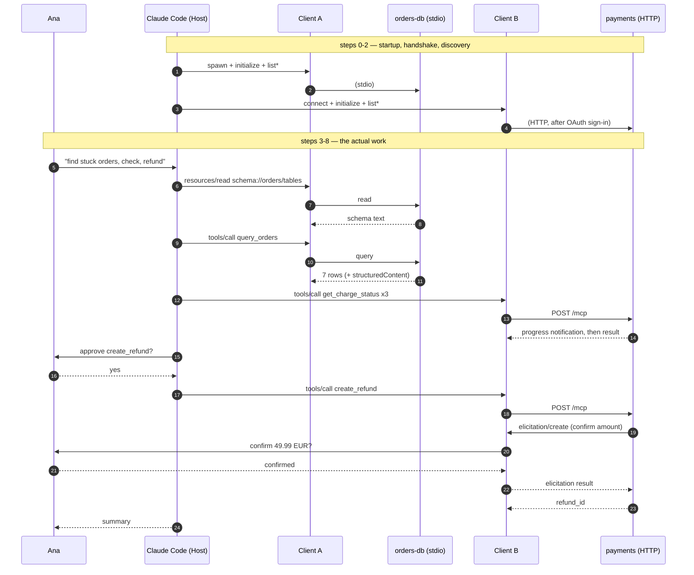

# Stage 4 — RUNNING EXAMPLE: stuck-orders triage in Claude Code

> **Where you are:** stage 4 of 6. The map is drawn; now one concrete piece of work travels across it.
> **After this file you will know:** the scenario by heart, and which component is on stage at each step. You will *not* yet know what happens inside any component — that is stage 5.

---

## The scenario, in three sentences

Ana is a backend engineer at an online shop. Support reports that some checkout orders have been sitting in `PENDING_PAYMENT` for over a day and no refunds have gone out. Ana opens Claude Code in the `shop-backend` repository and asks it to find the stuck orders, check each one against the payment gateway, and refund the worst offenders.

That single request will touch **every concept and every key player** in this pack.

---

## The setup she already has

Two MCP servers are configured for this repository. Both were added with the `claude mcp add` command, which writes them into a config file:

`shop-backend/.mcp.json` (checked into git, so the whole team gets them):

```json
{
  "mcpServers": {
    "orders-db": {
      "command": "node",
      "args": ["./tools/orders-db-server/index.js"],
      "env": {
        "ORDERS_DATABASE_URL": "${ORDERS_DATABASE_URL}"
      }
    },
    "payments": {
      "type": "http",
      "url": "https://payments.internal.acme.com/mcp"
    }
  }
}
```

The two servers are deliberately different in every way that matters:

| | `orders-db` | `payments` |
|---|---|---|
| Transport | **stdio** — a Node child process | **Streamable HTTP** — a hosted service |
| Auth | none; inherits Ana's environment | **OAuth 2.1**, browser sign-in, per-user token |
| Offers | 2 tools, 1 resource, 1 prompt | 2 tools, one of them destructive |
| Owned by | Ana's own team, in-repo | the payments team, deployed separately |
| Danger | read-only queries | **moves real money** |

A runnable version of `orders-db` lives in [examples/orders-db-server](examples/orders-db-server/) — you can start Claude Code against it and follow along for real.

---

## The trace, shallow

Read this once for the choreography. Each bolded term is a concept or component meeting the example for the first time.

**Step 0 — startup.** Ana runs `claude` in `shop-backend`. The **Host** (Claude Code) reads `.mcp.json`, and for each entry creates one **Client**. Client A spawns `node ./tools/orders-db-server/index.js` as a child process — its **Transport** is that process's stdin/stdout pipes. Client B prepares HTTP requests to the `payments` URL.

**Step 1 — handshake.** Each Client opens a **Session** with its **Server**: an `initialize` request stating protocol version and client capabilities, a reply stating server capabilities, then a `notifications/initialized`. Client B's first request comes back `401 Unauthorized`; the **Authorization layer** kicks in, opens a browser, Ana signs in, and the request is retried with a bearer token.

**Step 2 — discovery.** Each Client asks `tools/list`, `resources/list`, `prompts/list`. The Host merges the answers into one namespaced catalogue: `mcp__orders-db__query_orders`, `mcp__orders-db__get_order`, `mcp__payments__get_charge_status`, `mcp__payments__create_refund`, plus the **Resource** `schema://orders/tables` and the **Prompt** `triage-stuck-orders`. Typing `/mcp` shows Ana all of it.

**Step 3 — the ask.** Ana types:

> `Find orders stuck in PENDING_PAYMENT for more than 24 hours, check each one's charge status at the gateway, and refund any where the gateway says the charge never succeeded. Ask me before any refund.`

The Host sends the conversation plus all four tool definitions to the **model**.

**Step 4 — read context first.** The model wants to be sure about column names, so it reads the **Resource**: Client A sends `resources/read` for `schema://orders/tables`, the Server returns the table definitions as text, and it lands in the conversation. No approval prompt — reads are not actions.

**Step 5 — the query.** The model emits a **Tool** call: `mcp__orders-db__query_orders({status: "PENDING_PAYMENT", older_than_hours: 24})`. The Host's **approval gate** checks its permission rules: Ana chose *"always allow"* for this tool last week, so a rule already sits in the project settings and no prompt appears. Client A sends `tools/call`; the Server runs a parameterized SQL query and returns 7 rows — as human-readable text *and* as machine-readable `structuredContent`.

**Step 6 — cross-check the gateway.** For the three oldest orders the model calls `mcp__payments__get_charge_status`. Client B POSTs each `tools/call` over HTTP with the bearer token; the payments Server answers over an **SSE** stream, sending a progress **notification** first because the gateway lookup is slow. Two charges come back `never_captured`.

**Step 7 — the dangerous call.** The model calls `mcp__payments__create_refund({order_id: "ord_88f21", amount_cents: 4999})`. Two gates fire, in this order:
1. The Host shows Ana an approval prompt, because the tool carries the annotation `destructiveHint: true` and no permission rule pre-allows it. Ana approves.
2. The Server itself sends a request *back* through the session — `elicitation/create` — asking Ana to confirm the amount in words. The Host renders that prompt; Ana confirms; the answer travels back to the Server, which only then issues the refund.

**Step 8 — the answer.** Results flow back as tool results, the model writes a summary, and Claude Code prints it: 7 stuck orders, 3 checked, 2 refunded, 1 left alone with a reason. Ana asks it to open a ticket; that is a different day's story.

---



*Caption: the whole example on one page — who is on stage at each step, without any component internals.*

---

## Coverage check

| Concept / player | Where it appears |
|---|---|
| Host | steps 0–8 (config, gate, rendering) |
| Client | steps 0–7 (two of them, A and B) |
| Server | steps 4–7 (two of them) |
| Session & lifecycle | step 1 |
| Tool | steps 5, 6, 7 |
| Resource | step 4 |
| Prompt | step 2 (listed; invoked in the walkthrough) |
| Sampling / elicitation / roots | step 7 (elicitation); roots at step 1; sampling discussed in [dive 04](05-deep-dives/04-mcp-server.md) |
| Transport | step 0 (stdio), step 6 (HTTP + SSE) |
| Authorization | step 1 |

**Try to retell steps 0–8 from memory before continuing.** Every deep dive from here on will say "recall step *n*…" and then show you what actually happened inside.

---

## 📦 Source repository

This page is one part of an open guide pack. The whole serial — every diagram source, and a **runnable MCP server** you can point Claude Code at — lives in one repository:

### → https://github.com/geekchow/mcp-explain

| | |
|---|---|
| This page's source | [`mcp-guide/04-running-example.md`](https://github.com/geekchow/mcp-explain/blob/main/mcp-guide/04-running-example.md) |
| Runnable example server | [`mcp-guide/examples/orders-db-server`](https://github.com/geekchow/mcp-explain/tree/main/mcp-guide/examples/orders-db-server) |
| Start of the serial | [`mcp-guide/00-overview.md`](https://github.com/geekchow/mcp-explain/blob/main/mcp-guide/00-overview.md) |

Clone it and follow along:

```bash
git clone https://github.com/geekchow/mcp-explain.git
cd mcp-explain/mcp-guide/examples/orders-db-server && npm install && node index.js
```

Corrections are welcome — open an issue if a protocol detail has drifted with a newer MCP revision.

→ Next: [05-deep-dives/01-host-claude-code.md](05-deep-dives/01-host-claude-code.md) · ↑ back to [03-concept-map.md](03-concept-map.md)
