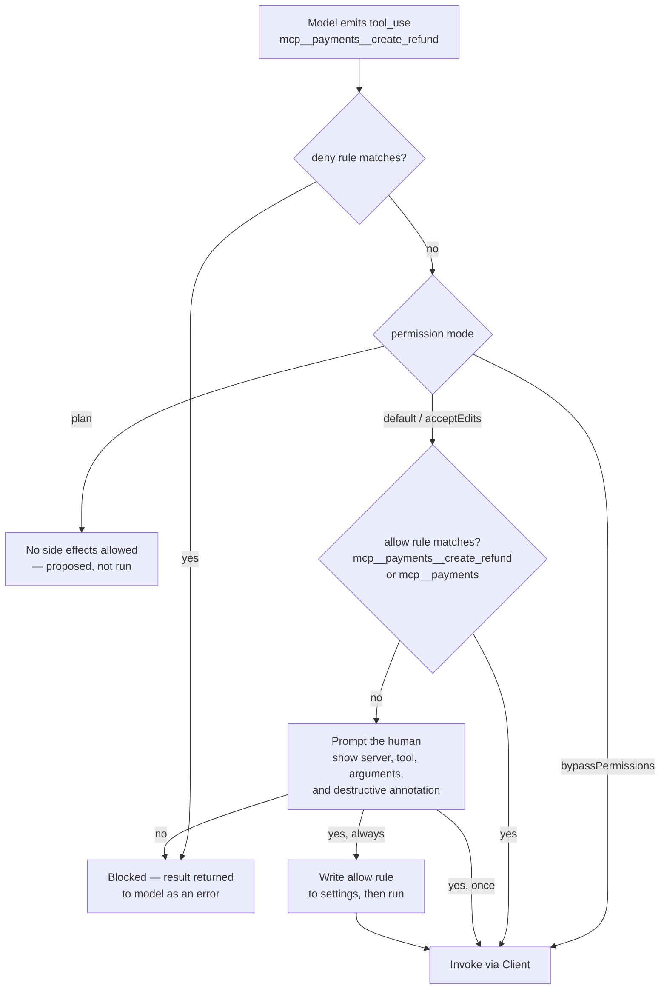

# Dive 01 — The Host: Claude Code

> **Where you are:** stage 5, dive 1 of 5. First descent.
> **After this file you will know:** how Claude Code configures, launches, namespaces and gates MCP servers — and exactly what it did at steps 0, 2, 3, 5 and 7 of the running example.

---

## 1. Role recap

The **Host** owns the human relationship: server configuration and lifecycle, the model conversation, the merged tool namespace, and the approval gate. It never speaks MCP itself — it owns one **Client** per server and lets each Client do that.

In the [running example](../04-running-example.md) the Host is on stage at **step 0** (reads config, spawns servers), **step 2** (merges catalogues), **step 3** (assembles the model request), **step 5** (permission check), **step 7** (approval prompt and rendering the elicitation), and **step 8** (the answer).

---

## 2. Internal design

### 2.1 Configuration and scopes

Claude Code resolves MCP servers from three scopes, most-local winning on name collisions:

| Scope | Stored in | Who sees it | Use for |
|---|---|---|---|
| `local` (default) | user settings, keyed to this project path | only you, only this project | experiments, personal credentials |
| `project` | `.mcp.json` in the repo root | everyone who clones the repo | team-shared servers — our `orders-db` and `payments` |
| `user` | user settings, all projects | only you, everywhere | personal servers you want everywhere |

The commands Ana used to create the setup in the example:

```bash
# a local stdio server; everything after -- is the command line to spawn
claude mcp add orders-db --scope project \
  --env ORDERS_DATABASE_URL='${ORDERS_DATABASE_URL}' \
  -- node ./tools/orders-db-server/index.js

# a remote server over Streamable HTTP
claude mcp add payments --scope project --transport http \
  https://payments.internal.acme.com/mcp

claude mcp list          # what is configured, and whether it connects
claude mcp get payments  # one server's resolved config
claude mcp remove payments
```

Notes that bite people:

- **`--` is load-bearing.** Everything after it is the server's argv; without it, flags get eaten by `claude`.
- **`${VAR}` expansion.** `.mcp.json` supports environment-variable expansion (including `${VAR:-default}`), which is how a *checked-in* config can reference a secret that is not checked in. Never inline a credential in `.mcp.json`.
- **Project-scoped servers ask before running.** Because `.mcp.json` arrives with a `git pull` and can execute arbitrary commands, Claude Code prompts before trusting a project's servers the first time. (`claude mcp reset-project-choices` re-asks.) This is a supply-chain gate, and it is the right instinct — see [dive 05](05-auth-and-trust.md).
- **Ad-hoc configs.** `--mcp-config <file-or-json>` adds servers for one run; `--strict-mcp-config` uses *only* those, ignoring the discovered ones. Useful in CI (Continuous Integration).
- Servers can also arrive bundled inside a **plugin**, which is how teams distribute a server plus its skills and commands as one unit.

### 2.2 The tool namespace

A server calls its tool `query_orders`. Two servers may both do that. The Host therefore prefixes every MCP tool as:

```
mcp__<server-name>__<tool-name>      →  mcp__orders-db__query_orders
```

That string is what the model sees in its tool list, what appears in permission rules, and what you pass to `--allowedTools`. The same namespacing applies to the other primitives:

| Primitive | How the user reaches it |
|---|---|
| Tool | model-invoked; referenced as `mcp__server__tool` |
| Resource | user types `@server:schema://orders/tables` to attach it, or the model reads it via the client |
| Prompt | user types `/mcp__orders-db__triage-stuck-orders` as a slash command, with arguments |

`/mcp` opens the interactive view: connection status per server, capability counts, authentication actions for remote servers, and reconnect.

### 2.3 The approval gate

This is the Host's most important internal machine, and the reason MCP puts the human on the host side.



*Caption: how a single MCP tool call is decided — the one flow every MCP host must get right.*

Rules live in `settings.json` under `permissions.allow` / `permissions.deny`, at the same granularity as the namespace:

```jsonc
{
  "permissions": {
    "allow": [
      "mcp__orders-db__query_orders",   // one tool
      "mcp__orders-db"                  // every tool on that server
    ],
    "deny": [
      "mcp__payments__create_refund"    // never, not even with a prompt
    ]
  }
}
```

Three properties worth internalising:

1. **Server annotations advise; the host decides.** A server marking a tool `readOnlyHint: true` or `destructiveHint: true` is *unverified metadata from the server*. Claude Code surfaces it in the prompt so the human has context, but a hostile server cannot annotate its way past your rules — and an honest server cannot lower your gate.
2. **Denies beat allows.** A `deny` entry is absolute; use it for the tools that must always require a human at the keyboard, or must never run at all in automation.
3. **Automation must be explicit.** In headless runs (`claude -p`), there is no human to prompt, so unapproved calls fail rather than hang. You pre-authorise with `--allowedTools "mcp__orders-db__query_orders"`. Resist `--dangerously-skip-permissions` anywhere near a server that writes.

### 2.4 Context budget

Every tool definition from every server is sent to the model on **every** turn. Ten servers with twenty tools each is 200 descriptions of prompt overhead before the user says anything — and a model that chooses worse, because the choice space is noisy. The host gives you levers:

- configure servers per project instead of globally (that is what `--scope project` is for);
- `MAX_MCP_OUTPUT_TOKENS` caps how much a single tool *result* may inject (default 25,000 tokens) so one runaway query cannot evict the conversation;
- prefer few coarse tools over many fine ones — a server design rule covered in [dive 04](04-mcp-server.md).

---

## 3. Interactions

| With | Contract |
|---|---|
| **Client** (dive 02) | The Host asks for connect/disconnect and "invoke this tool with these arguments"; the Client returns results or protocol errors. The Host never sees a JSON-RPC frame. |
| **Model** | The Host renders the merged catalogue as tool definitions and feeds tool results back as tool-result turns. MCP is invisible to the model beyond the tool names. |
| **Human** | Approval prompts, `/mcp`, `@resource` attachment, `/mcp__server__prompt` commands, and rendering server-driven elicitation forms. |

---

## 4. ⚓ Back to the example

**Step 0.** Ana runs `claude` in `~/work/shop-backend`. The Host reads `.mcp.json`, finds two entries, has already been trusted for this project, and constructs two Clients. For `orders-db` it resolves `${ORDERS_DATABASE_URL}` from Ana's shell environment and spawns:

```
node ./tools/orders-db-server/index.js
  cwd=/Users/ana/work/shop-backend
  env=ORDERS_DATABASE_URL=postgres://readonly@db.internal/shop
```

**Step 2.** After discovery, the Host holds one flat catalogue:

```
$ claude
> /mcp

  orders-db   ✔ connected (stdio)   2 tools · 1 resource · 1 prompt
  payments    ✔ connected (http)    2 tools · authenticated as ana@acme.com
```

and the model's tool list now includes `mcp__orders-db__query_orders`, `mcp__orders-db__get_order`, `mcp__payments__get_charge_status`, `mcp__payments__create_refund`.

**Step 5.** The model asks for `mcp__orders-db__query_orders`. The gate walks the flowchart above: no deny rule; mode is `default`; `permissions.allow` contains `mcp__orders-db__query_orders` from the day Ana clicked *"yes, always"*. No prompt. Elapsed decision time: microseconds.

**Step 7.** The model asks for `mcp__payments__create_refund`. No allow rule matches, so the terminal shows:

```
  ⏵ payments — create_refund
    {
      "order_id": "ord_88f21",
      "amount_cents": 4999,
      "reason": "charge never captured; customer waiting 31h"
    }
    ⚠ server marks this tool as destructive

  Allow?  [y] yes, once   [a] yes, always   [n] no
```

Ana presses `y` — *once*, deliberately, because refunds should never become a standing allowance. Only then does the Host hand the call to Client B. Moments later the server pushes an `elicitation/create` back through the session; the Host renders it as a second, server-authored prompt and returns Ana's answer down the same session.

---

## 5. Failure behavior

| Failure | What the Host does |
|---|---|
| Server fails to start (bad path, missing binary) | Marks it disconnected, shows the error under `/mcp`, keeps the session alive with the remaining servers; its tools are absent from the model's list rather than failing at call time |
| Server dies mid-session | The call errors; Claude Code surfaces it and can restart the connection. In-flight results are lost — MCP has no exactly-once semantics, so *server-side* idempotency (an idempotency key on `create_refund`) is your protection, not the protocol's |
| Server floods output | `MAX_MCP_OUTPUT_TOKENS` truncates the result before it reaches the conversation |
| Remote server returns `401` | Handed to the authorization layer: re-authenticate via `/mcp`, then retry ([dive 05](05-auth-and-trust.md)) |
| Model calls a tool that no longer exists | The Client returns a method/tool error, which goes back to the model as a tool result; the model normally recovers by re-listing or choosing another tool |
| Human denies | The denial is returned to the model as a tool result saying it was rejected, so the model can explain or take another route — it is not a crash |

---

→ Next: [02-mcp-client.md](02-mcp-client.md) · ↑ back to [the concept map](../03-concept-map.md) · ⚓ [the example](../04-running-example.md)
