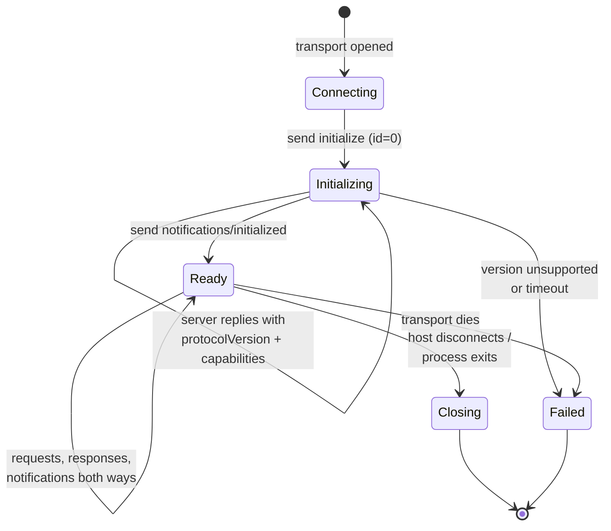
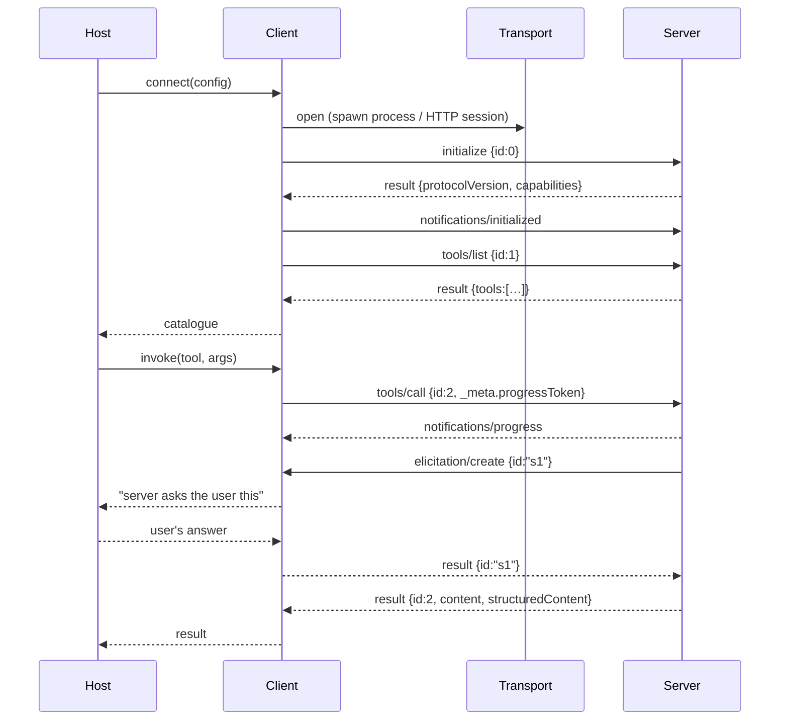

# Dive 02 — The MCP Client

> **Where you are:** stage 5, dive 2 of 5.
> **After this file you will know:** the exact lifecycle of an MCP session, what capability negotiation buys you, how requests are correlated and cancelled, and what the client offers *back* to a server — with the real frames from step 1 of the running example.

---

## 1. Role recap

A **Client** owns exactly one session with exactly one server: the handshake, the negotiated feature set, request/response correlation, notifications, cancellation and timeouts — and it serves the three client-side primitives (roots, sampling, elicitation) when the server asks.

In the [running example](../04-running-example.md) Client A appears at steps 0, 1, 2, 4, 5; Client B at steps 0, 1, 2, 6, 7. They never talk to each other, and neither knows the other exists. That 1:1 rule is not tidiness — it is the isolation boundary: a compromised server sees only its own session.

---

## 2. Internal design

### 2.1 The message vocabulary — all of JSON-RPC 2.0 in one table

| Kind | Shape | Meaning |
|---|---|---|
| **Request** | has `id`, `method`, optional `params` | expects exactly one response with the same `id` |
| **Response** | has `id`, and either `result` or `error` | the answer |
| **Notification** | has `method`, **no `id`** | fire-and-forget; no reply may be sent |

Rules that cause real bugs when broken: an `id` must be unique within a session and must never be reused, `null` is not a legal `id`, and every request must eventually get a response — including on failure. As of the `2025-06-18` revision, JSON-RPC *batching* is removed: one message per frame.

Both directions carry all three kinds. That is the whole reason MCP can do sampling and elicitation, and the single biggest structural difference from a REST API.

### 2.2 Lifecycle



*Caption: the four states of an MCP session — nothing but `initialize` and `ping` may cross before Ready.*

**Phase 1, `initialize`.** The client proposes the newest protocol version it supports and declares its own capabilities:

```json
{
  "jsonrpc": "2.0", "id": 0, "method": "initialize",
  "params": {
    "protocolVersion": "2025-06-18",
    "clientInfo": { "name": "claude-code", "version": "…" },
    "capabilities": {
      "roots": { "listChanged": true },
      "sampling": {},
      "elicitation": {}
    }
  }
}
```

The server answers with the version *it* will use — the same one, or the newest it supports if that is older. If the client cannot live with the answer, it disconnects; there is no partial-compatibility mode. (Over HTTP, that negotiated version is then echoed on every subsequent request in the `MCP-Protocol-Version` header — see [dive 03](03-transport.md).)

```json
{
  "jsonrpc": "2.0", "id": 0,
  "result": {
    "protocolVersion": "2025-06-18",
    "serverInfo": { "name": "orders-db", "version": "1.4.0" },
    "capabilities": {
      "tools":     { "listChanged": true },
      "resources": { "subscribe": false, "listChanged": false },
      "prompts":   { "listChanged": false },
      "logging":   {}
    },
    "instructions": "Read-only access to the shop orders database…"
  }
}
```

**Phase 2, `notifications/initialized`.** A notification, so no reply. Only after sending it may the client issue normal requests.

**Why negotiate at all?** Because the two programs version independently. Capabilities turn "does this server support resource subscriptions?" from a runtime guess (call it and see what breaks) into a compile-time-ish fact known before the first real call. Notice `instructions` in the result too: free-form guidance the server wants placed in the model's context — a server's one chance to teach the model how to use it well.

### 2.3 Discovery, and keeping it fresh

```
tools/list · resources/list · resources/templates/list · prompts/list
```

Each takes an optional `cursor` and may return a `nextCursor`; large catalogues paginate. If a server declared `listChanged: true`, it may later send `notifications/tools/list_changed`, and the client re-lists — this is how a server whose backing system changed (a new database view, a feature flag flipped) updates a live session without a restart.

### 2.4 Correlation, progress, cancellation, timeouts

The client keeps a table of in-flight requests keyed by `id`, each with a deadline and an optional progress token.

- **Progress.** Attach `_meta.progressToken` to a request and the server may stream `notifications/progress` with `progress`/`total`/`message` while it works. A well-behaved client resets the request's timeout on each progress notification — that is the point of it.
- **Cancellation.** The client sends `notifications/cancelled` with the `requestId` and a reason. It is advisory: the server should stop and must not send a late response, but a cancellation racing a completion is normal and must not crash either side.
- **Timeouts.** Every request gets one, with a hard ceiling regardless of progress, or a chatty server could keep a request alive forever.
- **`ping`.** Either side may send it; used as a liveness check for long-idle sessions.

### 2.5 The three client-side primitives

This is what the client *serves*, and it is the half of MCP most people never read:

| Primitive | Direction | Method | What it is for | Why it lives on the client |
|---|---|---|---|---|
| **Roots** | server asks client | `roots/list` | "Which directories/URIs is the user working in?" | The server should operate on the user's actual workspace without the host hard-coding paths into its config |
| **Sampling** | server asks client | `sampling/createMessage` | "Run this completion for me" | So a server can use a model *without holding a model API key or picking a model* — the host does both, and can gate the request |
| **Elicitation** | server asks client | `elicitation/create` | "Ask the user this structured question" (JSON-schema-typed; answer is accept / decline / cancel) | So a server can get missing input mid-operation without inventing its own user interface. Added in `2025-06-18` |

All three are **capability-gated**: a server may only send them if the client declared support at initialize. And all three are host-mediated — the client hands them up to the Host, which decides whether to show a human anything. A server can *ask*; it can never *compel*.

> Security note carried into [dive 05](05-auth-and-trust.md): sampling and elicitation are the channels through which a malicious server reaches your model and your user. Hosts should show what a server asked for, and never auto-approve sampling requests.

---

## 3. Interactions



*Caption: one full request/response pair, including the server-initiated request nested inside it — the shape prose cannot convey.*

Note `id:2` and `id:"s1"` overlapping in time. Requests are asynchronous and interleaved in both directions; a client that assumes strict request/response ordering will deadlock the moment a server elicits.

---

## 4. ⚓ Back to the example

**Step 1, Client A.** The process is spawned and the first bytes over its stdin are the `initialize` frame above. Run the real server in [examples/](../examples/) and it answers with exactly this capability set:

```json
{"resources":{"listChanged":true},"tools":{"listChanged":true},"prompts":{"listChanged":true}}
```

Three primitives declared, `listChanged` on each — and note what is **absent**: no `resources.subscribe`, which is precisely why nothing in our example ever subscribes to schema changes, and the client knows that before it makes a single call rather than discovering it through a failure.

**Step 1, Client B.** Same frames, different journey: the first POST returns `401 Unauthorized` before `initialize` is even processed. The Client does not retry blindly — it hands off to the authorization layer, gets a token, and replays `initialize` on a fresh HTTP session ([dive 05](05-auth-and-trust.md)).

**Step 2.** Client A issues `tools/list`, `resources/list`, `prompts/list` as ids 1, 2, 3, without waiting for each other. Three responses come back in whatever order the server finishes them; the `id` field is what makes that safe.

**Step 6.** `get_charge_status` is slow (the gateway is a third party). Client B sent `_meta.progressToken: "pg-7"` with the call, so `payments` sends:

```json
{"jsonrpc":"2.0","method":"notifications/progress",
 "params":{"progressToken":"pg-7","progress":1,"total":3,
           "message":"queried gateway for ord_88f21"}}
```

Claude Code shows this as live status under the running tool, and Client B pushes its timeout back on each one.

**Step 7.** Mid-`tools/call` (`id:2`), `payments` sends **its own request** `elicitation/create` with `id:"s1"`. Client B is only allowed to receive it because it declared `elicitation` at initialize in step 1 — the capability handshake from six minutes earlier is what makes step 7 legal. It routes the request to the Host, which prompts Ana, and returns `{"action":"accept","content":{"confirm_amount":"49.99"}}`. Only then does the response to `id:2` arrive.

---

## 5. Failure behavior

| Failure | Client behavior |
|---|---|
| Server proposes an unsupported protocol version | Disconnect immediately; report to the Host. Do not try to guess compatibility |
| Response never arrives | Timeout fires → send `notifications/cancelled` → surface an error upward. The Host turns it into a tool-result error for the model |
| Malformed JSON / unknown method | Reply with a JSON-RPC error (`-32700` parse error, `-32601` method not found). Never crash the session over one bad frame |
| Late response after cancellation | Discard silently; the id is no longer in the table |
| Server sends `elicitation/create` although the client never declared it | Reject with an error — capability violations are protocol errors, not negotiations |
| Transport dies | Fail every in-flight request with an error, mark the session dead, tell the Host. Reconnection is a *new* session with a *new* handshake — MCP sessions are not resumable across a dead transport (the HTTP transport can resume a dropped *stream* within a live session; that is different, see [dive 03](03-transport.md)) |

---

## 📦 Source repository

This page is one part of an open guide pack. The whole serial — every diagram source, and a **runnable MCP server** you can point Claude Code at — lives in one repository:

### → https://github.com/geekchow/mcp-explain

| | |
|---|---|
| This page's source | [`mcp-guide/05-deep-dives/02-mcp-client.md`](https://github.com/geekchow/mcp-explain/blob/main/mcp-guide/05-deep-dives/02-mcp-client.md) |
| Runnable example server | [`mcp-guide/examples/orders-db-server`](https://github.com/geekchow/mcp-explain/tree/main/mcp-guide/examples/orders-db-server) |
| Start of the serial | [`mcp-guide/00-overview.md`](https://github.com/geekchow/mcp-explain/blob/main/mcp-guide/00-overview.md) |

Clone it and follow along:

```bash
git clone https://github.com/geekchow/mcp-explain.git
cd mcp-explain/mcp-guide/examples/orders-db-server && npm install && node index.js
```

Corrections are welcome — open an issue if a protocol detail has drifted with a newer MCP revision.

→ Next: [03-transport.md](03-transport.md) · ↑ back to [the concept map](../03-concept-map.md) · ⚓ [the example](../04-running-example.md)
