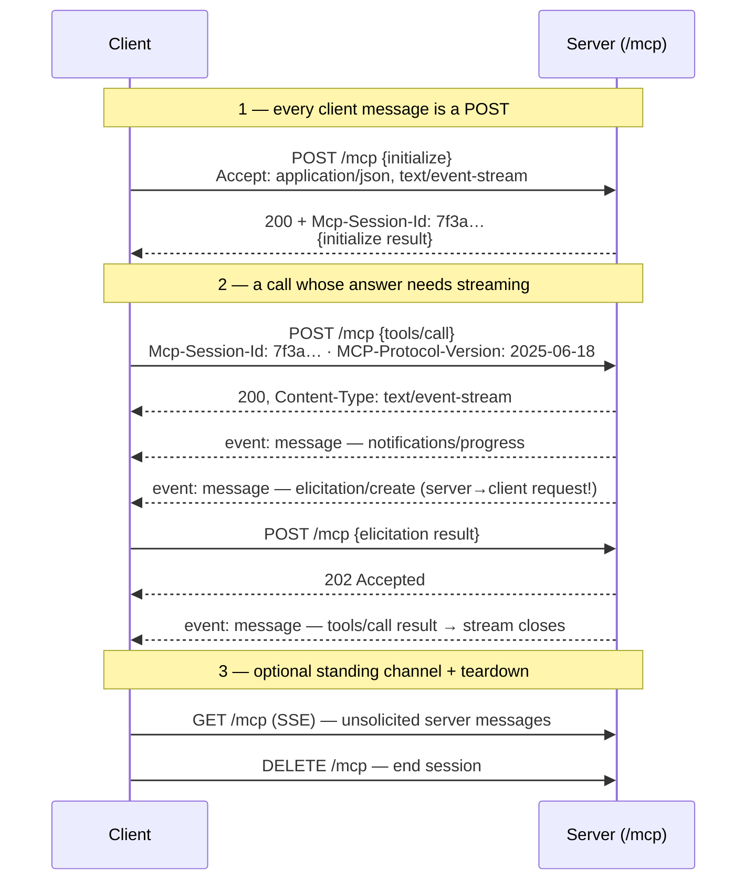

# Dive 03 — The Transport

> **Where you are:** stage 5, dive 3 of 5. The layer that knows nothing about MCP.
> **After this file you will know:** exactly how bytes are framed for stdio and for Streamable HTTP, why the HTTP transport looks the way it does, and what each one does when it breaks — anchored to steps 0 and 6 of the running example.

---

## 1. Role recap

The **Transport** owns delivery and framing: turning a stream of bytes into discrete JSON-RPC messages, in both directions. It never inspects a method name. Everything in [dive 02](02-mcp-client.md) is identical whichever transport is underneath — that indifference is the whole point, and it is why the same `orders-db` server code can be deployed as a local process today and a hosted service next quarter.

In the [running example](../04-running-example.md): **step 0** creates both transports; **step 6** exercises the HTTP one, streaming.

---

## 2. Internal design

### 2.1 stdio — the local transport

The client spawns the server as a **child process** and speaks over its pipes:

```
client stdout ──► server stdin      requests, notifications, responses to server-initiated requests
client stdin  ◄── server stdout     responses, notifications, server-initiated requests
                  server stderr ──► logs, for the host to capture
```

Framing is the simplest thing that works: **one JSON message per line, `\n`-delimited, UTF-8**. Therefore:

- a message **must not contain an embedded raw newline** — serialize compactly, never pretty-print;
- the server **must not write anything that is not a protocol message to stdout**. This is the single most common bug in first MCP servers: a stray `console.log("connected")` or a library's banner corrupts the stream and the client reports parse errors that seem to come from nowhere. Log to **stderr**;
- there are no ports, no TLS, no authentication. The security model is the operating-system process boundary plus whatever environment and working directory the host gave it.

Shutdown is by convention: the client closes the server's stdin, waits, then escalates to `SIGTERM` and finally `SIGKILL`. A well-written server exits when stdin reaches end-of-file — otherwise a crashed host leaves orphaned processes holding database connections.

**Choose stdio when** the capability is local (files, a local database, a dev server), the server is per-user, or you want zero deployment. It is the default and the majority of real MCP servers today.

### 2.2 Streamable HTTP — the remote transport

Introduced in revision `2025-03-26`, replacing an earlier two-endpoint HTTP+SSE design. **One endpoint** (say `/mcp`) handles everything:



*Caption: how one HTTP endpoint carries a bidirectional, streaming JSON-RPC session.*

The mechanics worth memorising:

| Element | Rule |
|---|---|
| **POST** | Carries one client message. `Accept` must list **both** `application/json` and `text/event-stream`, because the server picks. |
| **Server's choice** | If the answer is one message: `200` with a JSON body. If it needs to stream progress or send its own requests first: `200` with `text/event-stream` and messages as SSE events, closing the stream after the final response. |
| **Notifications/responses from client** | Server replies `202 Accepted` with no body — there is nothing to answer. |
| **`Mcp-Session-Id`** | Optionally assigned by the server on the `initialize` response; the client must echo it on every subsequent request. This is what makes stateful sessions survive across separate HTTP requests. |
| **`MCP-Protocol-Version`** | Sent by the client on every request after initialize, carrying the negotiated version (`2025-06-18` onward). Servers use it to serve mixed-version clients. |
| **`GET /mcp`** | Opens a long-lived SSE stream for messages the server initiates outside any request. |
| **`DELETE /mcp`** | Explicit session termination. |
| **Resumability** | SSE events may carry an `id`; after a dropped stream the client reconnects with `Last-Event-ID` and the server replays what was missed. This is why a flaky network does not restart your whole conversation. |
| **`404` on session id** | The session expired or was reaped. The client must start over from `initialize` — do not retry the original call. |
| **`Origin` validation** | Servers **must** validate the `Origin` header, and a locally bound server should bind `127.0.0.1`, not `0.0.0.0`. Without this, a web page you visit can drive your local MCP server: DNS-rebinding as a total compromise. |

Statelessness is allowed: a server may skip `Mcp-Session-Id` entirely and treat each POST independently, which is what lets an MCP server run on serverless infrastructure behind a load balancer. Sessions are a feature you opt into when you need per-connection state.

You will also meet the **legacy HTTP+SSE transport** (revision `2024-11-05`): a `GET /sse` stream plus a separate `POST /messages` endpoint. Claude Code still supports it via `--transport sse`, and you will see it on older deployments, but new servers should use Streamable HTTP.

### 2.3 Choosing

| | stdio | Streamable HTTP |
|---|---|---|
| Deployment | none — a command line | a service, TLS, uptime |
| Auth | process boundary + env | OAuth 2.1 ([dive 05](05-auth-and-trust.md)) |
| Users | one, local | many, remote |
| Latency | pipe-speed | network |
| Scaling | one process per user | shared, horizontally scalable |
| Failure mode | process dies | HTTP status codes, expiring sessions |
| Best for | files, local databases, dev tooling | shared corporate systems, software-as-a-service integrations |

Both are optional in the spec — you may define a custom transport (an in-process pair for tests is common) as long as JSON-RPC message semantics are preserved.

---

## 3. Interactions

Upward, the transport offers the Client three things and nothing more: *send this message*, *here is a received message*, *the connection closed*. Downward it owns the operating-system or network resource. The Client's `id` table, capability state and timeouts sit entirely above this line — which is why a transport swap requires zero changes anywhere else, and why the same server binary in [examples/orders-db-server](../examples/orders-db-server/) can be given an HTTP front end by changing four lines of its bootstrap.

---

## 4. ⚓ Back to the example

**Step 0, `orders-db` over stdio.** Claude Code forks `node ./tools/orders-db-server/index.js` with the project as working directory. The first frame Ana's machine actually sees (captured with `MCP_DEBUG` logging) is one long line:

```
{"jsonrpc":"2.0","id":0,"method":"initialize","params":{"protocolVersion":"2025-06-18",…}}
```

and the server's reply is one line back. Meanwhile the server's own logging — `[orders-db] connected to postgres` — goes to **stderr** and is captured by the host, not parsed as protocol. If that line had gone to stdout, Ana's session would have died at step 1 with `Unexpected token '[' in JSON`.

**Step 1, `payments` over HTTP.** Client B POSTs `initialize` to `https://payments.internal.acme.com/mcp`. The response carries `Mcp-Session-Id: 7f3a91c4…`, which Client B now echoes on every request — that header is what ties Ana's later refund confirmation to the same server-side session that started the refund.

**Step 6, the streaming call.** `get_charge_status` for three orders. For each call, the server chooses `text/event-stream` because it wants to report progress:

```http
POST /mcp HTTP/1.1
Host: payments.internal.acme.com
Accept: application/json, text/event-stream
Content-Type: application/json
Mcp-Session-Id: 7f3a91c4-2f18-4b0f-9a6e-1c2d3e4f5a6b
MCP-Protocol-Version: 2025-06-18
Authorization: Bearer eyJhbGciOi…

{"jsonrpc":"2.0","id":11,"method":"tools/call","params":{"name":"get_charge_status","arguments":{"order_id":"ord_88f21"},"_meta":{"progressToken":"pg-7"}}}
```

```http
HTTP/1.1 200 OK
Content-Type: text/event-stream

id: 1
event: message
data: {"jsonrpc":"2.0","method":"notifications/progress","params":{"progressToken":"pg-7","progress":1,"total":3,"message":"queried gateway"}}

id: 2
event: message
data: {"jsonrpc":"2.0","id":11,"result":{"content":[{"type":"text","text":"charge never captured"}],"structuredContent":{"order_id":"ord_88f21","state":"never_captured","authorized_at":"2026-08-29T04:12:07Z"}}}
```

The stream closes after the response to `id:11`. Ana's Wi-Fi dropping between those two events would not lose the call: Client B reconnects with `Last-Event-ID: 1` and the server replays event 2.

**Step 7, the nested request.** The `elicitation/create` that `payments` sends mid-refund travels as an SSE event *on the response stream of the refund POST*. Ana's answer travels back as a **new POST** to the same endpoint, answered `202 Accepted`. Follow that carefully: a single logical exchange used three HTTP messages in two directions — this is exactly what a plain request/response API cannot express, and precisely why the transport was redesigned in `2025-03-26`.

---

## 5. Failure behavior

| Failure | stdio | Streamable HTTP |
|---|---|---|
| Peer disappears | Pipe closes / child exits → session dead, in-flight requests fail | Connection reset or `5xx` → same |
| Corrupted frame | Stray stdout output → parse errors; **the** classic bug | Malformed SSE event → client discards, may reconnect |
| Slow peer | Pipe back-pressure | HTTP timeouts, keep-alive, progress notifications |
| Session lost | No such concept — process death *is* session death | `404` on `Mcp-Session-Id` → client re-`initialize`s |
| Network blip | Not applicable | `Last-Event-ID` resumption replays missed events |
| Hostile local caller | Not applicable (no port) | DNS rebinding — mitigated by `Origin` validation + binding to `127.0.0.1` |
| Zombie server | Client escalates stdin-close → `SIGTERM` → `SIGKILL` | `DELETE /mcp`, plus server-side session expiry |

---

→ Next: [04-mcp-server.md](04-mcp-server.md) · ↑ back to [the concept map](../03-concept-map.md) · ⚓ [the example](../04-running-example.md)
