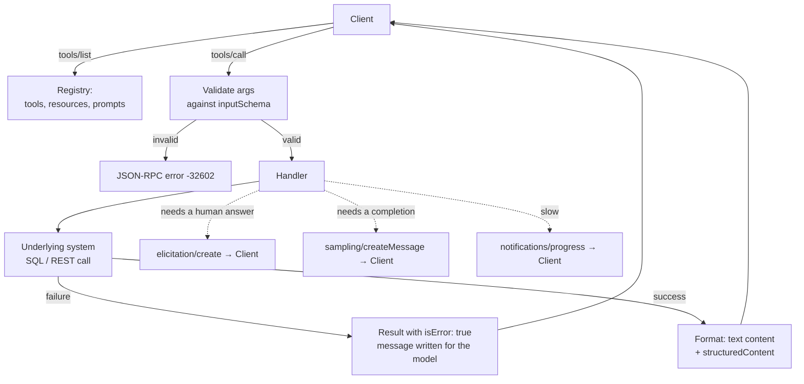

# Dive 04 — The MCP Server

> **Where you are:** stage 5, dive 4 of 5 — the longest dive, because this is the component you will most often write.
> **After this file you will know:** how the three server primitives are declared and answered, what distinguishes a tool a model uses well from one it misuses, and the real code behind steps 4–7 of the running example.

---

## 1. Role recap

A **Server** owns one domain's capabilities: declaring its tools, resources and prompts; validating input; executing against the real system; and shaping results for a model to consume. It does not decide whether *this human* may do a thing (it annotates; the Host gates), it does not hold a model (it asks via sampling), and it renders no user interface (it asks via elicitation).

In the [running example](../04-running-example.md), `orders-db` is on stage at steps 4 and 5; `payments` at steps 6 and 7.

---

## 2. Internal design

### 2.1 The three primitives, and who each is *for*

This is the design axis people miss, and it comes straight from the spec's own framing:

| Primitive | Controlled by | Meaning |
|---|---|---|
| **Tools** | the **model** | The model decides when to call. Give it accurate descriptions and safety annotations. |
| **Resources** | the **application/user** | The host or the human decides what to attach (`@orders-db:schema://orders/tables`). Passive context, not an action. |
| **Prompts** | the **user** | The human explicitly invokes it (`/mcp__orders-db__triage-stuck-orders`). Server-authored expertise, offered rather than injected. |

A server that exposes everything as tools has thrown away two thirds of the protocol — and typically floods the model's context in the process.

### 2.2 Tools

A tool declaration is four things: a name, prose for the model, an input schema, and (optionally) an output schema plus annotations.

```jsonc
{
  "name": "query_orders",
  "title": "Query orders",                    // human-facing label
  "description": "Find orders by status and age. Returns at most `limit` rows, newest first. Use this for questions about how many/which orders are in a state; use get_order for one known order id.",
  "inputSchema": {                            // JSON Schema — the model must satisfy this
    "type": "object",
    "properties": {
      "status": { "type": "string", "enum": ["PENDING_PAYMENT","PAID","SHIPPED","CANCELLED","REFUNDED"] },
      "older_than_hours": { "type": "number", "minimum": 0 },
      "limit": { "type": "number", "minimum": 1, "maximum": 200, "default": 50 }
    },
    "required": ["status"]
  },
  "outputSchema": { /* shape of structuredContent — 2025-06-18 onward */ },
  "annotations": {
    "readOnlyHint": true,        // does not modify its environment
    "destructiveHint": false,    // (only meaningful when readOnlyHint is false)
    "idempotentHint": true,      // repeat calls with same args = same effect
    "openWorldHint": false       // touches only a closed system, not the open internet
  }
}
```

**Annotations are hints, not enforcement.** They come from the server and nothing verifies them; a host displays them and may key policy off them, but must never treat `readOnlyHint: true` as proof. Their honest purpose is to let an *honest* server communicate danger.

A `tools/call` result carries content the model reads, and optionally structured data:

```jsonc
{
  "content": [                        // what the model sees; blocks may be text, image, audio, or resource_link
    { "type": "text", "text": "7 orders in PENDING_PAYMENT older than 24h:\n ord_88f21  49.99 EUR  31h  …" }
  ],
  "structuredContent": { "count": 7, "orders": [ /* … */ ] },   // machine-readable, validated against outputSchema
  "isError": false
}
```

**Two kinds of failure, and the distinction matters.**

| | Protocol error (JSON-RPC `error`) | Tool error (`isError: true`) |
|---|---|---|
| Means | The call could not happen at the protocol level: unknown method, unknown tool, server broken | The tool could not do its job: bad arguments, no such order, gateway timeout, permission denied downstream |
| Who handles it | The Client / Host | The **model** — it is returned as a tool result |
| Design rule | Reserve for protocol-level faults | Use for everything the model could plausibly recover from, and **write the message for the model**: `"No order 'ord_9x'. Order ids look like 'ord_' + 5 hex chars. Try query_orders to list candidates."` |

Worth knowing where the line actually falls in practice: **schema-validation failures land on the right-hand column.** Verified against the example server, passing `status: "pending"` comes back not as a JSON-RPC error but as a tool result:

```json
{"jsonrpc":"2.0","id":8,"result":{
  "content":[{"type":"text","text":"MCP error -32602: Input validation error: Invalid arguments for tool query_orders: Invalid enum value. Expected 'PENDING_PAYMENT' | 'PAID' | 'SHIPPED' | 'CANCELLED' | 'REFUNDED', received 'pending' at status"}],
  "isError":true}}
```

That is the SDK choosing deliberately: a protocol error would go to the *client* and abort the call, whereas this goes to the **model**, which reads the allowed values and corrects itself on the next turn. Keep that instinct in your own handlers — an error the model can see is an error the model can fix.

A tool error that says "Error: 500" teaches the model nothing and it will retry identically. A tool error that names the constraint gets a corrected call on the next turn. Error messages are prompt engineering.

### 2.3 Resources

Read-only content addressed by URI (Uniform Resource Identifier), listed with `resources/list` and fetched with `resources/read`:

```jsonc
{ "uri": "schema://orders/tables", "name": "orders-schema",
  "title": "Orders database schema", "mimeType": "text/plain" }
```

Extras worth knowing: **templates** (`resources/templates/list`) advertise parameterized URIs like `orders://order/{order_id}` so a client can construct addresses; **subscriptions** (`resources/subscribe` + `notifications/resources/updated`) let a client watch content that changes, if the server declared `subscribe: true`; content may be text or base64 `blob`. And a tool result may return a `resource_link` block instead of inlining a large payload — "here is where it is" rather than 200 kilobytes in the conversation.

Rule of thumb: **if the model needs it to decide, it is a tool result; if the human or host chooses to attach it, it is a resource.** Schemas, style guides, dashboards and log files are resources. Anything with a side effect never is.

### 2.4 Prompts

A named, parameterized template the server offers; `prompts/get` returns actual conversation messages, which may embed resources:

```jsonc
{ "name": "triage-stuck-orders",
  "description": "Standard triage procedure for orders stuck in payment",
  "arguments": [ { "name": "hours", "description": "age threshold", "required": false } ] }
```

This is where domain expertise ships with the integration: the payments team knows the correct triage order (check gateway *before* refunding, never refund a captured charge), and encodes it once instead of hoping every user's prose gets it right.

### 2.5 Asking the client for help

Inside a request handler, a server may send its own requests back — **if** the client declared the capability at initialize:

- `elicitation/create` — a JSON-schema-typed question for the human. The answer is `accept` (with content), `decline`, or `cancel`, and a server must handle all three. Only flat objects with primitive fields; it is a form field, not an arbitrary interface.
- `sampling/createMessage` — borrow the host's model. Lets a server do "summarize this log in the user's own model" without shipping an API key or choosing a model.
- `roots/list` — learn the user's working directories.

### 2.6 Server design rules that decide whether the model succeeds

1. **Task-granularity, not endpoint-granularity.** `query_orders(status, older_than_hours)` beats `list_orders` + `filter_by_status` + `sort_by_date`. Every extra tool costs context on every turn and adds a way to be wrong.
2. **Fewer than ~20 tools per server**, and split domains into separate servers rather than growing one.
3. **The description is the API.** The model has only the prose and the schema. Say what it does, when to use it *instead of* the neighbouring tool, and what it returns.
4. **Budget your output.** Paginate, cap `limit`, truncate with a marker. Claude Code will otherwise truncate for you at `MAX_MCP_OUTPUT_TOKENS`.
5. **Push filtering into the server.** Returning 5,000 rows so the model can filter is a bug, not flexibility.
6. **Least privilege at the bottom.** `orders-db` connects with a **read-only** database role. If the model, or a prompt injection, asks for a `DELETE`, the *database* refuses. Annotations are advisory; grants are not.
7. **Be idempotent where it counts.** Networks retry. `create_refund` takes an idempotency key so a retried refund is not a second refund.

---

## 3. Interactions



*Caption: the inside of one `tools/call`, including the three ways a handler can reach back to the client.*

---

## 4. ⚓ Back to the example

Here is the actual `orders-db` code behind steps 4 and 5, using the TypeScript SDK (the runnable version, with seed data, is in [examples/orders-db-server](../examples/orders-db-server/)):

```js
const server = new McpServer({ name: "orders-db", version: "1.4.0" });

// ── step 4: the resource the model reads before querying ──────────────
server.registerResource(
  "orders-schema",
  "schema://orders/tables",
  { title: "Orders database schema", mimeType: "text/plain" },
  async (uri) => ({ contents: [{ uri: uri.href, text: SCHEMA_DDL }] })
);

// ── step 5: the tool the model calls ──────────────────────────────────
server.registerTool(
  "query_orders",
  {
    title: "Query orders",
    description:
      "Find orders by status and age. Returns at most `limit` rows, oldest first. " +
      "Use for questions about which/how many orders are in a state; " +
      "use get_order when you already know one order id.",
    inputSchema: {
      status: z.enum(["PENDING_PAYMENT", "PAID", "SHIPPED", "CANCELLED", "REFUNDED"]),
      older_than_hours: z.number().min(0).optional(),
      limit: z.number().min(1).max(200).default(50),
    },
    outputSchema: {
      count: z.number(),
      orders: z.array(z.object({
        order_id: z.string(), status: z.string(), amount_cents: z.number(),
        currency: z.string(), created_at: z.string(), age_hours: z.number(),
      })),
    },
    annotations: { readOnlyHint: true, idempotentHint: true, openWorldHint: false },
  },
  async ({ status, older_than_hours = 0, limit }) => {
    const rows = await db.query(                       // parameterized — never string-concatenated
      `SELECT order_id, status, amount_cents, currency, created_at
         FROM orders
        WHERE status = $1
          AND created_at < now() - ($2 || ' hours')::interval
        ORDER BY created_at ASC
        LIMIT $3`,
      [status, older_than_hours, limit]
    );
    const orders = rows.map(toOrder);
    return {
      content: [{ type: "text", text: renderTable(orders, status, older_than_hours) }],
      structuredContent: { count: orders.length, orders },
    };
  }
);
```

**Step 4 in full depth.** Client A sends `{"method":"resources/read","params":{"uri":"schema://orders/tables"}}`. The handler returns the table DDL as text. It reaches the conversation as context — no approval prompt, because a read is not an action. The model now knows the column is `created_at`, not `placed_at`, and that `status` is an enum; both facts prevent a failed call at step 5.

**Step 5 in full depth.** Arguments `{"status":"PENDING_PAYMENT","older_than_hours":24}` are validated against the input schema before the handler runs — had the model passed `"status":"pending"`, it would have got back the `isError` result shown in §2.2 naming the five allowed values, and corrected itself on the next turn without a single row being read. The handler runs one parameterized query over a **read-only** connection and returns both a rendered table (for the model to reason over) and `structuredContent` (for anything downstream that wants the data typed).

**Steps 6–7, the `payments` side.** `create_refund` is the mirror image of `query_orders`:

```jsonc
{
  "name": "create_refund",
  "description": "Refund a charge. Only for charges the gateway reports as authorized-but-not-captured or captured-in-error.",
  "inputSchema": { "type": "object",
    "properties": {
      "order_id": {"type":"string"},
      "amount_cents": {"type":"integer","minimum":1},
      "reason": {"type":"string"},
      "idempotency_key": {"type":"string"}
    },
    "required": ["order_id","amount_cents","reason"] },
  "annotations": { "readOnlyHint": false, "destructiveHint": true, "idempotentHint": true, "openWorldHint": true }
}
```

and its handler does the thing this whole pack has been building toward — the server refuses to act on the model's word alone:

```js
async ({ order_id, amount_cents, reason, idempotency_key }) => {
  const charge = await gateway.getCharge(order_id);
  if (charge.state === "captured_and_settled") {
    return { isError: true, content: [{ type: "text", text:
      `Refusing: charge for ${order_id} is settled. Settled charges go through the ` +
      `finance reversal process, not create_refund. No action taken.` }] };
  }

  // server-side confirmation — independent of whatever the host already asked
  const answer = await server.server.elicitInput({
    message: `Confirm refund of ${(amount_cents/100).toFixed(2)} ${charge.currency} for ${order_id}?`,
    requestedSchema: { type: "object",
      properties: { confirm_amount: { type: "string", description: "type the amount to confirm" } },
      required: ["confirm_amount"] },
  });

  if (answer.action !== "accept" ||
      answer.content.confirm_amount !== (amount_cents/100).toFixed(2)) {
    return { content: [{ type: "text", text: "Refund cancelled by the user; nothing was charged back." }] };
  }

  const refund = await gateway.refund({ order_id, amount_cents, reason,
                                        idempotency_key: idempotency_key ?? `${order_id}:${amount_cents}` });
  return {
    content: [{ type: "text", text: `Refunded ${(amount_cents/100).toFixed(2)} ${charge.currency} → ${refund.id}` }],
    structuredContent: { refund_id: refund.id, order_id, amount_cents, state: refund.state },
  };
}
```

Note the two independent gates on the same call: the Host's approval prompt ([dive 01](01-host-claude-code.md) §4) protects *Ana from the model*, and this elicitation protects *the payments system from anyone* — including a host that was configured to auto-approve. Defence in depth exists here because the two gates are owned by different parties.

---

## 5. Failure behavior

| Failure | Server behavior |
|---|---|
| Invalid arguments | SDK rejects before the handler ever runs and returns an `isError` result carrying the `-32602` validation message, so the **model** sees the constraint and retries correctly |
| Underlying system down | `isError: true` with a message the model can act on ("gateway unreachable, retry in a minute; no refund was issued") — never a raw stack trace, which leaks internals into the conversation |
| Handler throws | SDK converts to an error result; the session survives. A server that crashes on one bad call takes the whole session with it |
| Client declined elicitation | Treat as "no": abort the operation cleanly, and say so in the result. Never proceed on `decline` or `cancel` |
| Client never declared elicitation | Fall back: require the confirming argument in the tool input instead. A server must work against a minimal client |
| Result too large | Paginate or truncate with an explicit marker, so the model knows there is more rather than silently reasoning over a partial set |
| Session ends mid-operation | Nothing rolls back — MCP has no transactions. Idempotency keys and server-side records are the recovery mechanism |

---

## 📦 Source repository

This page is one part of an open guide pack. The whole serial — every diagram source, and a **runnable MCP server** you can point Claude Code at — lives in one repository:

### → https://github.com/geekchow/mcp-explain

| | |
|---|---|
| This page's source | [`mcp-guide/05-deep-dives/04-mcp-server.md`](https://github.com/geekchow/mcp-explain/blob/main/mcp-guide/05-deep-dives/04-mcp-server.md) |
| Runnable example server | [`mcp-guide/examples/orders-db-server`](https://github.com/geekchow/mcp-explain/tree/main/mcp-guide/examples/orders-db-server) |
| Start of the serial | [`mcp-guide/00-overview.md`](https://github.com/geekchow/mcp-explain/blob/main/mcp-guide/00-overview.md) |

Clone it and follow along:

```bash
git clone https://github.com/geekchow/mcp-explain.git
cd mcp-explain/mcp-guide/examples/orders-db-server && npm install && node index.js
```

Corrections are welcome — open an issue if a protocol detail has drifted with a newer MCP revision.

→ Next: [05-auth-and-trust.md](05-auth-and-trust.md) · ↑ back to [the concept map](../03-concept-map.md) · ⚓ [the example](../04-running-example.md)
