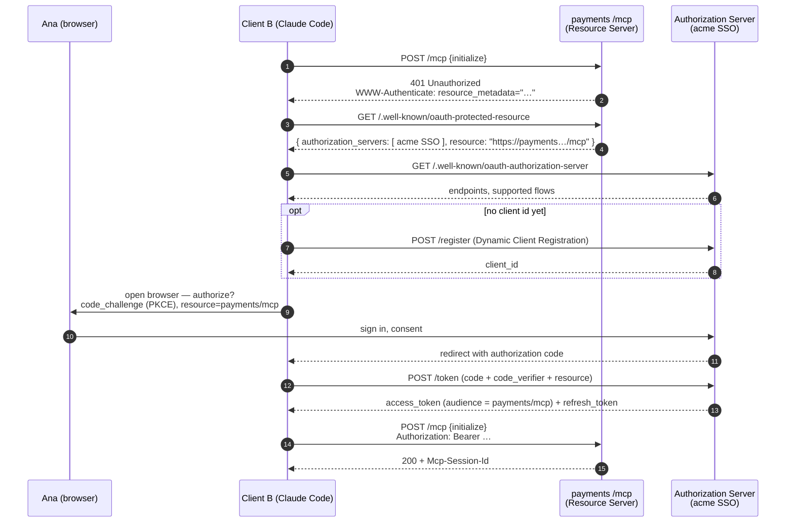

# Dive 05 — Authorization and the trust boundary

> **Where you are:** stage 5, dive 5 of 5 — the shortest dive to describe and the easiest to get catastrophically wrong.
> **After this file you will know:** how a remote MCP server authenticates a user with OAuth 2.1, why local servers have no auth at all and what protects them instead, and the attack classes MCP deployments actually suffer — anchored to step 1 of the running example.

---

## 1. Role recap

The **Authorization layer** owns proving *who* is calling a remote server: discovery of the authorization server, the authorization-code flow with PKCE (Proof Key for Code Exchange), token issuance and refresh, and — the part most often skipped — binding a token to the specific server it was issued for.

For **stdio** servers it does not exist. That is a deliberate design decision, not an omission: a local child process runs as you, with your environment. The security boundary is the operating system's, and the relevant question moves from *"is this request authenticated?"* to *"should I have installed this server at all?"*

In the [running example](../04-running-example.md), this layer is the reason step 1 pauses to open a browser.

---

## 2. Internal design

### 2.1 The remote flow

MCP does not invent authentication. It says: an MCP server over HTTP is an **OAuth 2.0 Resource Server**, an MCP client is an **OAuth client**, and identity comes from a separate **authorization server** the resource server points at. Since the `2025-06-18` revision that plumbing is specified rather than improvised:



*Caption: how a Claude Code session gets a token scoped to exactly one MCP server — the flow behind "a browser window opened".*

The five load-bearing details:

1. **`401` is the discovery trigger.** The client does not need pre-configuration; the `WWW-Authenticate` header points at the metadata (RFC 9728, Protected Resource Metadata) that names the authorization server.
2. **PKCE is mandatory.** OAuth 2.1 removes the implicit and password grants and requires PKCE on authorization-code flows. A stolen authorization code is useless without the verifier.
3. **Dynamic Client Registration** (RFC 7591) is what lets an arbitrary client — a `claude` CLI on a laptop the payments team never heard of — obtain a `client_id` without a human filing a ticket. Optional but transformative for adoption.
4. **Resource indicators** (RFC 8707) bind the token's audience to *this* MCP server. This is the fix for the **confused-deputy** problem: without it, a token minted for one server could be replayed against another that trusts the same issuer.
5. **Token passthrough is forbidden.** An MCP server must **not** accept a token that was not issued for it, and must **not** forward the user's token to downstream services as if it were its own. It validates the audience, then uses its *own* credentials downstream. This one rule prevents an entire class of privilege-escalation chains.

### 2.2 What protects a stdio server instead

| Control | What it does |
|---|---|
| **Process boundary** | The server sees only the environment, arguments and working directory the host gave it. Pass a narrow read-only `ORDERS_DATABASE_URL`, never your admin credentials |
| **Least-privilege grants** | `orders-db` connects as a read-only Postgres role. No annotation, no prompt and no model behavior can turn that connection into a `DELETE` |
| **Install-time trust** | Project-scoped `.mcp.json` arrives with `git pull` and can execute anything. Claude Code prompting before it trusts a project's servers is a **supply-chain** control: review the command line before approving, especially `npx some-package@latest`, which is remote code execution by design |
| **The `deny` list** | Host-side, absolute, and the right place for tools that must never run unattended |

### 2.3 The attack classes worth naming

The protocol is only part of your threat model. These are the ones that show up in practice:

| Attack | Shape | Mitigation |
|---|---|---|
| **Prompt injection via tool results** | Content returned by a server (a database row, a web page, an issue title) contains instructions; the model reads it as direction | Treat every tool result as **untrusted data, never instructions**. Keep the human gate on destructive tools. Never auto-approve a chain that reads external content and then writes |
| **Rug pull** | A server passes review, then changes a tool's description or behavior after being trusted | Pin server versions; re-review on change; prefer servers you or your org build for anything privileged |
| **Tool shadowing / name collision** | Two servers offer similarly named tools; the model picks the wrong one | The `mcp__server__tool` namespace makes the source explicit — read the *server* in an approval prompt, not just the tool name |
| **Confused deputy** | A token for server A replayed against server B | Audience-bound tokens (RFC 8707), audience validation on every request |
| **Over-broad blast radius** | One server holds credentials for everything | One server per domain, minimum grants, separate tokens |
| **Sampling / elicitation abuse** | A server elicits something that looks like a system prompt, or samples to exfiltrate context | Host mediates both, shows the server's name and the exact text, and never auto-approves. Ana knowing *which server* asked her to confirm an amount is the entire defence |
| **Exfiltration through arguments** | A tool call's arguments carry conversation content off-machine | Review arguments in the approval prompt — Claude Code prints them in full for exactly this reason |

### 2.4 A deployment checklist

- [ ] Remote servers over TLS only; validate `Origin`; bind local HTTP servers to `127.0.0.1`
- [ ] Validate token audience on every request; never forward the user's token downstream
- [ ] One MCP server per trust domain, each with least-privilege credentials
- [ ] `deny` rules for anything irreversible; no `--dangerously-skip-permissions` near a writing server
- [ ] Review `.mcp.json` diffs in code review like you would review a CI script — because that is what it is
- [ ] Log every tool call server-side with the authenticated user; the host's transcript is not your audit trail
- [ ] Secrets via environment/`${VAR}` expansion or a secret manager, never inline in a checked-in config

---

## 3. Interactions

Upward: the Client asks for a token and retries on `401`; the Host owns the browser hand-off and the token store (Claude Code keeps tokens in the operating system's credential store and exposes re-authentication under `/mcp`). Downward: the server validates the token and then uses its *own* credentials against the payments gateway. Two credential domains, deliberately never mixed.

---

## 4. ⚓ Back to the example

**Step 1, in full depth.** Client B POSTs `initialize` to `https://payments.internal.acme.com/mcp` and gets:

```http
HTTP/1.1 401 Unauthorized
WWW-Authenticate: Bearer realm="payments",
  resource_metadata="https://payments.internal.acme.com/.well-known/oauth-protected-resource"
```

Claude Code prints one line in the terminal —

```
  payments  ⚠ authentication required — opening browser…
```

— Ana's browser lands on the company SSO, she is already signed in, she clicks *Allow* on a consent screen naming **Claude Code** and the scopes `payments.read` and `payments.refund`. The code comes back to a loopback redirect, is exchanged (with the PKCE verifier and `resource=https://payments.internal.acme.com/mcp`) for an access token, and `initialize` is replayed. Total elapsed time: about eight seconds, once, this month.

**At step 7 the token earns its keep.** The refund request carries `Authorization: Bearer …`; the payments server validates the audience, resolves it to `ana@acme.com`, checks that *Ana* holds the `payments.refund` role — a check that has nothing to do with the model, the host, or MCP — and writes an audit row naming her. The model never had permission to refund anything; **Ana** did, and the model acted within a session that carried her identity.

That sentence is the whole security posture of MCP in one line: **the model does not have permissions; the user does, and the host and server each independently gate what is done in their name.**

**If Ana's token had expired mid-session** (step 6 or 7): the server answers `401`, Client B does not retry blindly, the host shows `payments  ⚠ token expired — run /mcp to re-authenticate`, and the pending tool call comes back to the model as an error result rather than a hang. Ana re-authenticates and asks it to continue; the refund's idempotency key means a re-run cannot double-refund.

---

## 5. Failure behavior

| Failure | Behavior |
|---|---|
| `401` on any request | Discover metadata → authorize → retry once. Repeated `401` means a real permission problem, not a token problem — surface it, do not loop |
| `403` | The user is authenticated but lacks the role. Report it to the model as a tool error so it can explain rather than retry |
| Refresh token expired | Full re-authorization via `/mcp`; sessions stay usable for the servers that are still authenticated |
| Authorization server unreachable | That one server is marked unauthenticated; the rest of the session continues — never take down a whole Claude Code session for one integration |
| Token audience mismatch at the server | Reject with `401`. This is the confused-deputy defence firing; log it, it may be an attack |
| Untrusted `.mcp.json` appears in a pull | Claude Code prompts before running the new servers; treat approving it as approving code execution |

---

## 📦 Source repository

This page is one part of an open guide pack. The whole serial — every diagram source, and a **runnable MCP server** you can point Claude Code at — lives in one repository:

### → https://github.com/geekchow/mcp-explain

| | |
|---|---|
| This page's source | [`mcp-guide/05-deep-dives/05-auth-and-trust.md`](https://github.com/geekchow/mcp-explain/blob/main/mcp-guide/05-deep-dives/05-auth-and-trust.md) |
| Runnable example server | [`mcp-guide/examples/orders-db-server`](https://github.com/geekchow/mcp-explain/tree/main/mcp-guide/examples/orders-db-server) |
| Start of the serial | [`mcp-guide/00-overview.md`](https://github.com/geekchow/mcp-explain/blob/main/mcp-guide/00-overview.md) |

Clone it and follow along:

```bash
git clone https://github.com/geekchow/mcp-explain.git
cd mcp-explain/mcp-guide/examples/orders-db-server && npm install && node index.js
```

Corrections are welcome — open an issue if a protocol detail has drifted with a newer MCP revision.

→ Next: [06-walkthrough.md](../06-walkthrough.md) · ↑ back to [the concept map](../03-concept-map.md) · ⚓ [the example](../04-running-example.md)
