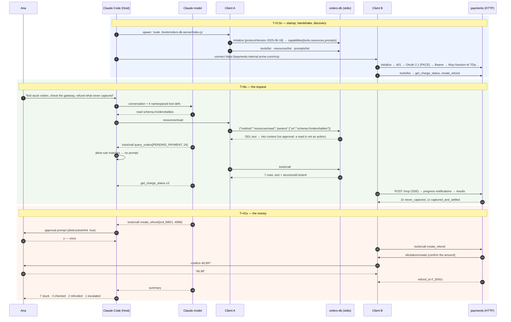

# Stage 6 — FULL WALKTHROUGH: the stuck-orders triage, end to end

> **Where you are:** stage 6 of 6. The last file of the trunk.
> **After this file you will know:** the complete path of Ana's request through all five components at full depth, as one continuous story — every concept in this pack seen doing its job.

Everything below has been introduced somewhere: the [host](05-deep-dives/01-host-claude-code.md), the [client](05-deep-dives/02-mcp-client.md), the [transport](05-deep-dives/03-transport.md), the [server](05-deep-dives/04-mcp-server.md), the [auth layer](05-deep-dives/05-auth-and-trust.md). This is the stitching.

---

## The annotated map



*Caption: the running example with real data on every hop — the Stage-3 coordination diagram, now concrete.*

---

## The story, at full depth

### T+0.0s — Startup and the two handshakes

Ana types `claude` in `~/work/shop-backend`. The **Host** reads `.mcp.json`, finds `orders-db` and `payments`, and — the project having been trusted previously — creates two **Clients**.

**Client A** spawns `node ./tools/orders-db-server/index.js` with `ORDERS_DATABASE_URL` expanded from Ana's shell into the child's environment, and writes one line to its stdin:

```
{"jsonrpc":"2.0","id":0,"method":"initialize","params":{"protocolVersion":"2025-06-18","clientInfo":{"name":"claude-code"},"capabilities":{"roots":{"listChanged":true},"sampling":{},"elicitation":{}}}}
```

The server's own startup log — `[orders-db] connected to postgres (read-only role)` — goes to **stderr**, where it belongs; a single character of that on stdout would corrupt the frame and kill the session. The reply declares `tools`, `resources` and `prompts`, plus an `instructions` string that Claude Code places in the model's context: *"Read-only access to the shop orders database. Prefer query_orders over get_order for exploratory questions."*

**Client B** POSTs the same `initialize` to `https://payments.internal.acme.com/mcp` and is refused with `401` plus a `WWW-Authenticate` header pointing at the protected-resource metadata. Discovery, PKCE, browser, consent screen, token bound by audience to that exact URL, replay. The server assigns `Mcp-Session-Id: 7f3a91c4…`, which Client B will echo on every subsequent request — including, forty seconds from now, the confirmation that lets a refund proceed.

Discovery on both sessions yields the merged catalogue:

```
$ /mcp
  orders-db   ✔ connected (stdio)   query_orders, get_order · schema://orders/tables · /mcp__orders-db__triage-stuck-orders
  payments    ✔ connected (http)    get_charge_status, create_refund · ana@acme.com
```

### T+8s — The request, and reading before acting

```
> Find orders stuck in PENDING_PAYMENT for more than 24 hours, check each one's charge
  status at the gateway, and refund any where the gateway says the charge never
  succeeded. Ask me before any refund.
```

The Host sends the conversation and four tool definitions to the model. The model's first move is not the query — it is `resources/read` on `schema://orders/tables`, because guessing a column name costs a failed call and reading is free. Client A sends the request; the handler returns the DDL; it lands in context. **No approval prompt fires**, and that is a design decision, not an oversight: resources are read-only by definition, so the gate is reserved for actions.

Now the query. The model emits:

```json
{"name":"mcp__orders-db__query_orders",
 "input":{"status":"PENDING_PAYMENT","older_than_hours":24,"limit":50}}
```

The Host's **approval gate** runs: no deny rule; mode `default`; `permissions.allow` contains `mcp__orders-db__query_orders` from the day Ana chose *"yes, always"* for this read-only tool. No prompt. Client A sends `tools/call` as `id:4`; the SDK validates the arguments against the input schema before the handler runs; the handler executes one parameterized SQL statement over the read-only connection and returns:

```json
{"content":[{"type":"text","text":"7 orders in PENDING_PAYMENT older than 24h:\n  ord_88f21  49.99 EUR  31h  created 2026-08-29T04:12Z\n  ord_88e04  17.50 EUR  29h  …"}],
 "structuredContent":{"count":7,"orders":[{"order_id":"ord_88f21","amount_cents":4999,"currency":"EUR","age_hours":31,…}]}}
```

### T+22s — Crossing the boundary to a different team's system

The model picks the three oldest and calls `mcp__payments__get_charge_status` on each. Client B POSTs each call with `Mcp-Session-Id`, `MCP-Protocol-Version`, `Authorization: Bearer …`, and a `_meta.progressToken`. The payments server chooses `text/event-stream` for its response because the third-party gateway lookup takes seconds; progress notifications arrive as SSE events and Claude Code renders them live under the running tool, while Client B pushes its timeout back on each one.

Results: `ord_88f21` → `never_captured`. `ord_88e04` → `never_captured`. `ord_87ff2` → `captured_and_settled`. The model reasons over these — the third one is *not* a stuck payment at all, it is a settled charge with a stale order row, so refunding it would be wrong. It sets that one aside for a human. Nothing in MCP made that decision; MCP made the evidence available and the model did the reasoning. That division of labour is the point of the protocol.

### T+41s — The two gates in front of the money

The model calls:

```json
{"name":"mcp__payments__create_refund",
 "input":{"order_id":"ord_88f21","amount_cents":4999,
          "reason":"charge never captured; customer waiting 31h"}}
```

**Gate one, host-side.** No allow rule matches, the tool is annotated `destructiveHint: true`, and Claude Code stops the loop:

```
  ⏵ payments — create_refund
    { "order_id": "ord_88f21", "amount_cents": 4999,
      "reason": "charge never captured; customer waiting 31h" }
    ⚠ server marks this tool as destructive

  Allow?  [y] yes, once   [a] yes, always   [n] no
```

Ana reads the arguments — this is also where she would catch an exfiltration attempt or a wrong amount — and presses `y`. *Once.*

**Gate two, server-side.** Client B sends the call. The handler re-checks the gateway itself (never trusting the model's claim about the charge's state), then sends its **own request back through the open session**: `elicitation/create`, carried as an SSE event on the refund POST's response stream. It is legal only because Client B declared `elicitation` in its capabilities at T+0.0s. The Host renders it:

```
  payments asks: Confirm refund of 49.99 EUR for ord_88f21?
  confirm_amount ▸ 49.99
```

Ana types the amount. The answer travels back as a **new POST** to the same endpoint, answered `202 Accepted`, and only then does the handler call the gateway with an idempotency key. The response to the original `tools/call` finally arrives on the still-open SSE stream, the stream closes, and the payments service writes an audit row naming **ana@acme.com** — not "Claude", not "claude-code", but the human whose token authorized it.

The same sequence repeats for `ord_88e04`. Then the model writes:

```
  Checked 7 orders stuck in PENDING_PAYMENT >24h; the 3 oldest against the gateway.

  • ord_88f21 — 49.99 EUR, 31h, never captured → refunded (rf_2b91c)
  • ord_88e04 — 17.50 EUR, 29h, never captured → refunded (rf_2b91d)
  • ord_87ff2 — 82.00 EUR, 26h, captured and settled → NOT refunded; the order row is
    stale, not the payment. This needs the finance reversal process, not create_refund.

  4 remaining stuck orders unchecked (26h and younger). Want me to work through them?
```

Total: about 70 seconds, two approvals, one confirmation, and an audit trail on both sides.

---

## What each player actually contributed

| Player | Its one contribution to this story |
|---|---|
| **Host** (Claude Code) | Read config, spawned/connected two servers, namespaced four tools, ran the approval gate twice, rendered the server's elicitation, kept results inside the context budget |
| **Client** (A and B) | Two independent sessions: version and capability negotiation, id correlation across interleaved requests, progress-driven timeout extension, and routing a *server-initiated* request up to the human |
| **Transport** | stdio pipes for A (and stderr discipline that kept the session alive); Streamable HTTP with SSE, a session id, and resumability for B |
| **Server** | Typed, described, annotated capabilities; validation before execution; a read-only grant at the bottom; an independent confirmation before moving money; errors written for a model to recover from |
| **Authorization** | Turned "Claude Code is calling" into "Ana is calling", with an audience-bound token and a downstream role check the model could never influence |

---

## The recap — back to Stage 1

[01-why](01-why.md) posed the problem: the payments team wanted their capability usable from the IDE, the chat client and the nightly agent, with refunds gated by a human, and shipped on their own schedule — and before MCP, that meant N×M bespoke integrations, none of them discoverable, none of them permissioned in a common way.

In this walkthrough the payments team shipped **one** server. Ana's Claude Code discovered its tools at runtime, with no code change to Claude Code and no plugin release. The refund was gated twice — once by the host on behalf of the human, once by the server on behalf of the payments system — and audited under Ana's real identity. Tomorrow the nightly agent connects to the same URL, negotiates the same capabilities, and gets the same guarantees, with `create_refund` on its `deny` list because nobody is awake to approve it.

That is the entire value proposition, and you have now seen every component that delivers it.

→ Next: [07-next-steps.md](07-next-steps.md) · ↑ back to [00-overview.md](00-overview.md)
